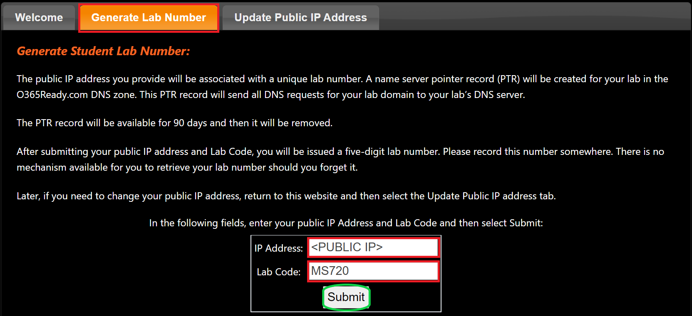
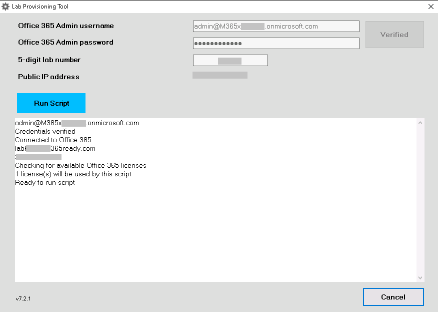
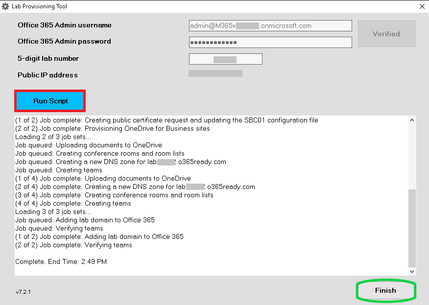
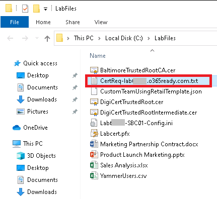
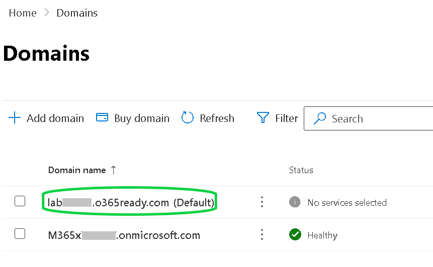
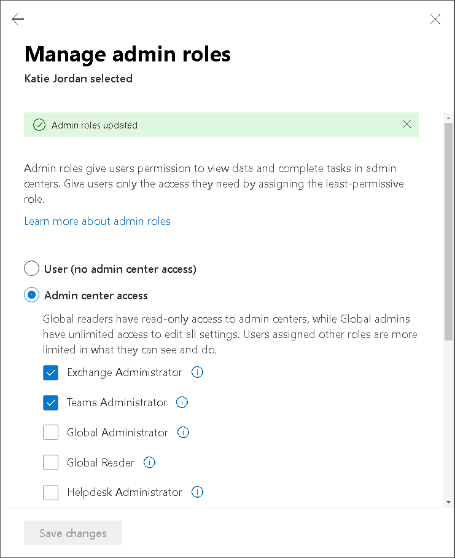
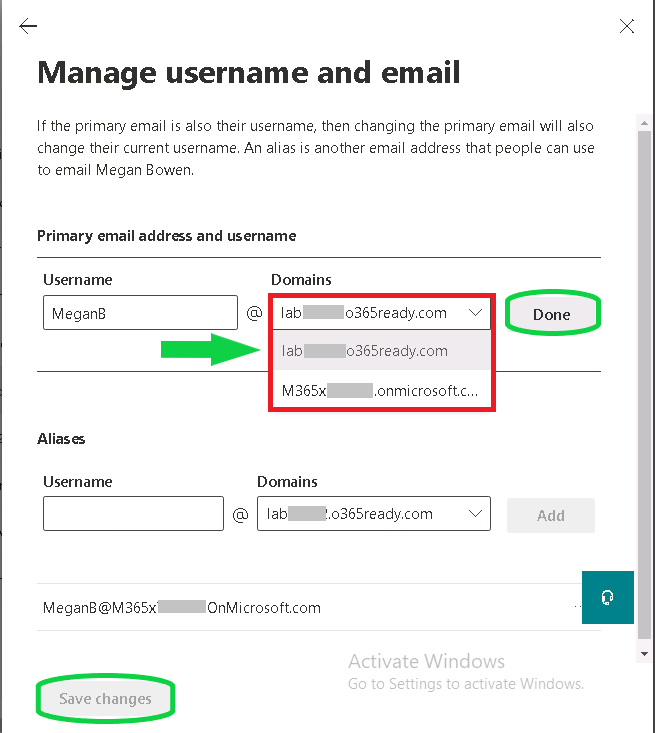
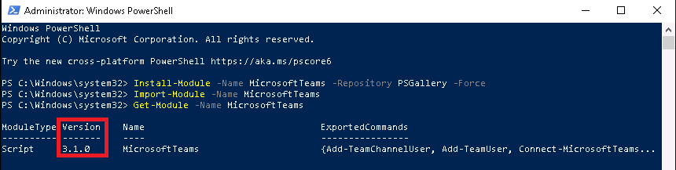
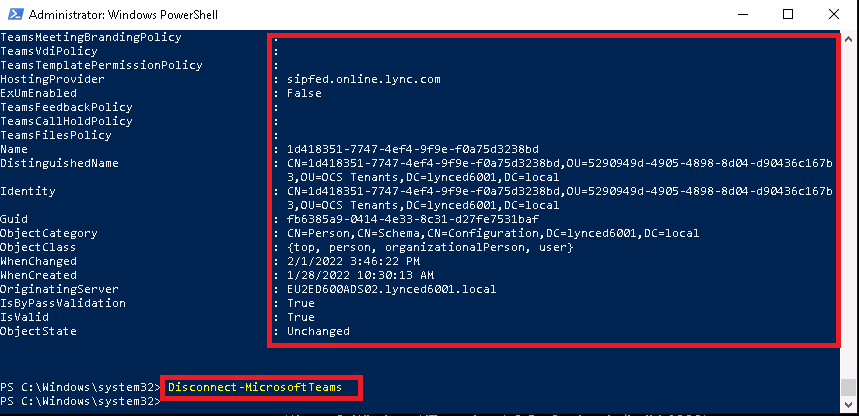

---
lab:
    title: 'Lab 01: Configure the lab environment'
    type: 'Answer Key'
    module: 'Module 01: Plan and configure Teams Phone'
---

# Lab 01: Configure the lab environment
# Student lab answer key

## Lab scenario

In the labs for this course, you are taking on the role of Katie Jordan, Contoso Ltd.’s Teams Voice Engineer. You have deployed Microsoft 365 in a virtualized lab environment, and you have been tasked with completing a pilot project that tests the Voice and Phone device management features in Microsoft Teams as they relate to Contoso's business requirements.

You have just started the pilot project; therefore, in this first lab you will set up a personalized Microsoft 365 user account for Katie that will be used throughout all the labs in this course. This first exercise also requires that you perform several setup tasks that will initialize your trial tenant for the remaining labs in this course. You must configure your trial tenant, create a personalized Teams Service user account in Microsoft 365 for Kate, configure several test users and groups that will be used throughout the remaining labs, and request a certificate signed by a public certificate authority.

## Lab Duration

  - **Estimated Time to complete**: 65 minutes

## Instructions

## Exercise 1: Configure your lab environment

### Exercise Duration

  - **Estimated Time to complete**: 25 minutes

In this exercise, you will run scripts designed to provision user accounts, groups, teams, and other resources used by the labs in this course. This script will also add your lab's custom domain to Office 365. If you have already added your lab's custom domain, the script will verify that it exists. 

### Task 1 - Identify your lab's public IP address

In the following task you will sign identify your lab’s public IP address to ensure that you can regain access to your lab environment at a later date.

1. Sign in to MS720-CLIENT01 as “Admin” with the password provided to you. You can find the password in the “Resource” section on the right side of the lab window.

1. Open Microsoft Edge and then browse to **http://www.bing.com**.

1. In the **Search** box, enter **What is my IP** and then press Enter.

1. The first result box with the label **Your public IP address** is your IP retrieved by Bing.

1. Copy or write down your public IP address. 

You have successfully identified and stored your IP address. When you restart your lab environment, you will possibly be assigned a new public IP address and need to perform the first task again.

### Task 2 - Retrieve your lab number

The lab number task, updates the o365ready.com DNS server with your lab's public IP address and creates a DNS delegation zone for your lab domain pointing to the DNS server running on MS720-RRAS01. Requests for hosts in your lab domain will be resolved by the DNS server running on MS720-RRAS01.

**Note**: If you have restarted this lab or if it expired and the virtual machines were reset, perform the steps in the knowledge section at the end of this task. You do not need to be issued a new lab number.  

1. You are still signed in to MS720-CLIENT01 as “Admin” with the password provided to you.

1. In Microsoft Edge, browse to **http://www.o365ready.com**.

1. On the Welcome page, select the **Generate Lab Number** tab.

1. In the **IP address** box, enter your public IP address from the previous task.

1. In the **Lab Code** box, enter **MS720**, press Enter or select **Submit**.

1. This lab code will expire 90 days after the start of this course.

1. When the process is completed, you will see a **Student Lab Number** dialog, followed by a 5 digit number. Note this number down and remember it. You will refer to this five-digit number throughout the labs.

1. You will be using all five digits as part of your organization's on-premises domain.

1. Leave the browser window open and continue with the next task.

    

> [!NOTE]
> If you have restarted this lab or if the lab timer has expired and the virtual machines were reset, you will likely have a new public IP address. Perform the following steps to update your lab domain delegation zone's public IP address.

1. In Microsoft Edge, browse to [http://www.o365ready.com](http://www.o365ready.com/).

1. On the Welcome page, select the **Update Public IP Address** tab.

1. In the **Student Lab Number** box, type your five-digit lab number. If you did not write down your original lab number, you can find it by signing in to Microsoft 365 and browsing to the **Domains** feature.

1. In the **Old public IP address** box, type the previously used public IP address. If you did not write down your original public IP address, open a command prompt and try to ping your lab domain name. Although you will not receive a response, the domain name should resolve to IP.

1. In the **New public IP address** box, type the new public IP address retrieved from Bing and then press Enter.

1. Select **Submit** and wait for the update to complete. This may take a couple of minutes.

You have successfully identified your lab number and updated your public IP address.

### Task 3 - Run the CallandMeetLabs.exe script

In the following task you will execute a script to setup your lab environment.

1. You are still signed in to MS720-CLIENT01 as “Admin” with the password provided to you.

1. Open File Explorer and then browse to **C:\Scripts**.

1. Select **CallandMeetLabs.exe**.

1. In the **User Account Control** dialog box, select **Yes**.

1. In the **Office 365 Admin username** box, enter your M365 tenant MOD Administrators account name. You can find your tenant username in the resource section on the right side of the lab window.

1. In the **Office 365 Admin password** box, enter the MOD Administrators password, provided to you.

1. In the **5-digit lab number** box, enter your lab number from the previous task and select **Verify**.

1. The script tries to use the delivered credentials to access your tenant. Ensure the credentials were verified and review the identified public IP address in the blank window.

    **Note**: If the reported public IP address is not the same as your lab's **&lt;public IP&gt;**, verify your public IP address is correct using the steps found earlier in this exercise. If the public IP addresses do not match, cancel and run the script again. If the public IP address you have identified and the public IP found by the script still do not match, contact a lab proctor.

    

1. If you see a **Ready to run script message**, select **Run Script** to prepare your lab tenant.

1. When the script has completed and you can see a **Complete** message, select **Finish**.

    

As soon as the script finishes successfully, you have successfully configured your lab environment with the provided scripts.

### Task 4 - Request your public certificate from DigiCert

In the following task you will request your public certificate for the SBC (Session Border Controller) so you can use it later in the labs. This is used to authenticate connections to multiple tenants and networks served from a single SBC.

1. You are still signed in to MS720-CLIENT01 as “Admin” with the password provided to you.

1. Open File Explorer and then browse to **C:\LabFiles**.

1. Select **CertReq-lab&lt;customlabnumber&gt;.o365ready.com.txt**. This certificate request was created by the configuration script.

    

1. In Notepad, select all the text in the file and then press Ctrl+C or right-click or tap and hold and select **Copy** to copy the contents to the clipboard.

1. Open Microsoft Edge, open a new tab and then browse to **https://www.digicert.com/friends/exchange.php**.

1. On the Microsoft Event CSR Submission page, in the **Paste CSR** box, right-click or tap and hold inside the box, and then select **Paste**.

1. Verify that you have pasted the contents of your certificate request.

1. Under **Certificate Details**, review the common name and subject alternative names (SAN) information that will be assigned to the certificate. Ensure that all SAN entries are lowercase. All SAN entries may not be used for this lab.

1. Under Certificate Delivery, in the **Email Address** and **Email Address (again)** boxes, enter the MOD Administrators account name, which is also used as the users email address.

1. Select the **I agree to the Terms of Service above** check box.

1. Select **Submit**.

    

1. Close File Explorer.

You have successfully requested the certificate from DigiCert and will download it later.

## Exercise 2: Assign permissions

### Exercise Duration

  - **Estimated Time to complete**: 15 minutes

In this exercise, you will assign the required admin permissions to continue with the other labs and exercises in this course.

### Task 1 - Verify the custom domain has been added to your Microsoft 365 subscription

In this task you will verify your custom domain so you can work with it and assign it to users.

1. You are still on MS720-CLIENT01 where you are still signed in as “Admin”. 

1. In **Microsoft Edge**, browse to the Microsoft 365 admin center at [**https://admin.microsoft.com**](https://admin.microsoft.com/).

1. On the **Sign in** screen, enter the credentials of the Global Admin account of the **MOD Administrator** with the username and password provided to you.

1. When a **Save password** dialog is displayed, select **Never**.

1. When a **Stay signed in?** dialog is displayed, select **No**.

1. In the left navigation, select the three dashes and select **… Show all**.

1. Select **Settings** then select **Domains**.

1. Verify your custom domain has been added to Office 365 and is set as Default. This domain starts with a **Lab** string and your five digits lab number, followed by the **o365ready.com** domain. The domain may still be listed as Incomplete setup, this will not cause problems in the lab.

1. Leave the browser window open.

    

You have successfully verified the custom domain created from the script is set as default domain to your tenant, which is important for later tasks.

### Task 2 - Assign Katie Jordan to the Teams Administrator

In the following task you will use the global administrator account MOD Administrator to assign Teams Service Administrator permissions to a personalized account for Katie Jordan.

1. You are still signed in to MS720-CLIENT01 as “Admin” and to the **Microsoft 365 admin center** as **MOD Administrator**.

1. In the upper left navigation, select the three dashes to the left of the organization name to open the full left-side menu.

1. Select **Users** and **Active users** from the menu below.

1. In the **Active users** list, select **Katie Jordan** to open the right-side panel.

1. Under **Roles**, select **Manage roles**.

1. In the **Manage admin roles** pane, select **Admin center access**.

1. In the list, select **Exchange Administrator** and **Teams Administrator**.

1. At the bottom of the card, select **Save changes**. Admin roles are updated.

      

1. Return to the **Katie Jordan** card by pressing the **left arrow**, and then select **Reset Password**.

1. Deselect **Automatically create a password** and **Require this user to change their password when they first sign in**.

1. Enter a password that meets the complexity requirements and you will remember for later in the lab, e.g. the password of your Microsoft 365 tenant administrator.

1. Press **Reset password**.

1. Press **Close**.

1. Leave the browser window open for the next task.

You have successfully assigned the Teams Service administrator permission to Katie Jordan.

### Task 3 - Assign the custom lab domain to Megan Bowen

In the following task you will add the custom domain to Megan Bowen.

1. You are still on MS720-CLIENT01 where you are still signed in as “Admin”, and you are still in the **Microsoft 365 admin center** as **MOD Administrator**.

1. In the left navigation, select **Users** and **Active users**.

1. In the **Active users** list, select **Megan Bowen** to open the right-side menu.

1. In the Megan Bowen user card, select the **Account** tab under **Username and email** select **Manage username and email**.

1. Below **Primary email address and username**, you can see the default UPN of Megan Bowen. Select the pencil symbol, select the textbox under **Domains** and select **lab&lt;customlabnumber&gt;.o365ready.com**.

1. Select **Done**, then select **Save changes**.

    

1. Close the **Manage username and email** pane and then close the Megan Bowen user card.

1. Leave the browser open for the next task.

You have successfully added the custom domain to Megan Bowen.

## Exercise 3: Validate and manage licenses

### Exercise Duration

  - **Estimated Time to complete**: 15 minutes

In this exercise, you will review the overall number of licenses and the number of active users who have been assigned a license.

### Task 1 - Validate licenses in the admin portal

In this task you will sing into the clients provided by your training provider and run a certain script also provided by the lab hoster, to understand what licenses are inside the tenant and what licenses are applied.

1. You are still signed in to MS720-CLIENT01 as “Admin” and in the **Microsoft 365 admin center** as **MOD Administrator**.

1. On the upper left side, select the **Navigation menu** with the three dashes then select **Billing** and then select **Licenses**. 

1. When the Licenses Panel is shown, validate you can see 5 of the **Office 365 E5** licenses are now applied to users.

1. Select **Office 365 E5** to see who have the licenses applied.

1. Leave the browser open at the end of the task.

You have successfully signed into your test clients and reviewed the overall number of licenses applied to the Office 365 tenant.

### Task 2 - Add the Domestic Calling Plan trial license to your tenant

As an admin, you can enable users to make phone calls with a Domestic Calling Plan or an International Calling Plan in Office 365. Isaiah Langer recently joined Contoso and his job requires him to make domestic phone calls. In this task you will activate the trial for domestic calling.

1. You are still signed in to MS720-CLIENT01 as “Admin” and in the **Microsoft 365 admin center** as **MOD Administrator**.

1. On the Microsoft 365 admin center page, select the three dashed in the upper left-side, select **Billing**, then **Purchase services**.

1. Under **View by category**, select **Add-ons**.

1. In the **Add-ons** list, locate and then select **Microsoft Teams Domestic Calling Plan for US and Canada Trial**, note you may need to expand the list to see all the add-ons and be sure to select the trial version.

1. Select **Details** and select **Start free trial**. 

1. On the Check out page, select **Try now**.

1. On the order receipt page, select **Continue**.

1. Leave the browser window open at the end of the task.

You have successfully activated the Calling Plan trial in your tenant.

### Task 3 - Assign the Domestic Calling Plan license to Isaiah Langer

As an admin, you can assign the calling plan license that gives users the right to be assigned a phone number and make and receive PSTN calls. This is a Domestic Calling Plan or an International Calling Plan in Office 365. Isaiah Langer recently joined Contoso and his job requires him to make domestic phone calls. In this task you will activate the Calling Plan license for Isaiah Langer. Isaiah already has an E5 license, so has a Teams Phone System license, but requires a calling plan license.

1. You are still signed in to MS720-CLIENT01 as “Admin” and in the **Microsoft 365 admin center** as **MOD Administrator**.

1. On the Microsoft 365 admin center page, in the left navigation, select **Users**, then **Active users**.

1. In the **Active users** list, select **Isaiah Langer**.

1. In the **Isaiah Langer** card, select **Reset Password**.

1. Deselect **Automatically create a password** and **Require this user to change their password when they first sign in**.

1. Enter a password that meets the complexity requirements and you will remember for later in the lab, e.g. the password of your Microsoft 365 tenant administrator.

1. Press **Reset password**.

1. Press **Close**.

1. In the **Active users** list, again select **Isaiah Langer**.

1. In the **Isaiah Langer** card, select **Licenses and apps** tab.

1. In the **Licenses** list, select the **Microsoft 365 Domestic Calling Plan** check box.

1. Select **Save changes** and then close the user card.

1. Sign out the **MOD Administrator** with the MA initials in the circle in the upper right-side corner and select **Sign out**.

1. Close the browser window at the end of the task.

You have successfully assigned the license to Isaiah Langer, activated additional features for this account and reset his password. Remember or write down the password. You will continue with additional tasks for assigning phone numbers in a later exercise. 

## Exercise 4: Setup PowerShell for Microsoft Teams administration

### Exercise Duration

  - **Estimated Time to complete**: 10 minutes

Several configuration steps of Microsoft Teams in this lab can also be done or must be done through the Microsoft Teams PowerShell module. In this exercise, you will install the Microsoft Teams PowerShell module and validate the correct version number for being ready for Teams Administration tasks during your lab.

### Task 1 – Install the latest Teams PowerShell module

In this task you will install the latest Teams PowerShell module on your lab client and check the correct version number.

1. You are still signed in to MS720-CLIENT01 as “Admin” with the password provided to you.

1. Select the start button, enter **Windows PowerShell** and select **Run as administrator** below PowerShell from the start menu.

1. Confirm the **User Account Control** message with **Yes** to open a window with elevated permissions.

1. When Windows PowerShell window has opened, enter the following cmdlet to download the Microsoft Teams PowerShell module from the PSGallery and Install it:

    ```powershell
    Install-Module -Name MicrosoftTeams -Repository PSGallery -Force
    ```

1. Once the module is installed you will see the command prompt again.

1. Enter the following cmdlet to import the newly installed Microsoft Teams PowerShell module:

    ```powershell
    Import-Module -Name MicrosoftTeams
    ```

1. After importing the module, you are back on the command prompt again. Enter the following cmdlet to get the module version and available commands:

    ```powershell
    Get-Module -Name MicrosoftTeams
    ```

1. You should see a version number of 4.9.1 or above and a multi value field with different cmdlets available.

    

1. Now login to Microsoft Teams via PowerShell to confirm you can connect. At the command prompt type the following cmdlet:

    ```powershell
    Connect-MicrosoftTeams
    ```

1. When the **Sign in to your account** window opens, enter the credentials of Katie Jordan (KatieJ@M365x&lt;tenantnumber&gt;.onmicrosoft.com) to sign in with your Teams Administrator user.

    

1. When you are successfully signed in you will be returned to the command prompt.

1. To check you are signed in correctly, you will be able to retrieve objects from your tenant. To get a list of users, run the following command:

    ```powershell
    Get-CSOnlineUser
    ```

1. You should see some users and their attributes scroll across the screen. If you see this, you have signed in successfully and can interact with Teams in your tenant.

1. Create a new Team to be used throughout the labs in this course by running the following command:

    ```powershell
    New-Team -DisplayName "Contoso All Company" -Description "Team for the entire Contoso Company" -Visibility Public
    ```

1. Disconnect your session by running the following command at the command prompt.

    ```powershell
    Disconnect-MicrosoftTeams
    ```

1. You can close the Windows PowerShell window by selecting the **X** in the top right.

    

You have successfully installed the Teams PowerShell Module, signed into Teams and tested a PowerShell command.
