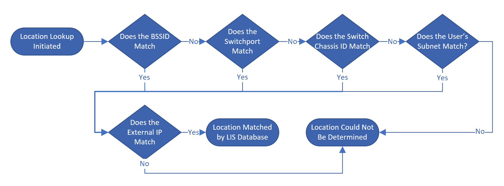

---
lab:
    title: 'Lab 02: Configure your environment for Teams Voice Usage'
    type: 'Answer Key'
    module: 'Learning Path 01: Plan and design Teams collaboration communications systems'
---

# Lab 02: Configure your environment for Teams Phone
# Student lab answer key

## Lab scenario

Contoso wants to set up Teams Phone for their users. 

Firstly, our administrator wants to ensure the network is capable of running Microsoft teams, we will do this by completing the following tasks:

- Evaluate our network bandwidth with Network Planner

- Test our network performance with the Teams Network Assessment

Next, we need to configure our tenant ready for acquiring phone numbers and assigning them to users, before we can acquire and assign phone numbers we need to configure our network topology and emergency calling addresses

- Configure a basic network topology and emergency calling addresses

Voice Policies allow us to configure specific parts of Teams Phone. We require extension dialing and call park and some of our users do not want their numbers presented when making outbound calls. Finally, there is a number we wish to block from making inbound calls to Contoso. 

- Configure Voice policies to meet Contoso requirements

Now we will acquire and assign phone numbers to a user and perform a test call and configure audio conferencing for our users

- Assign licenses and phone numbers to a user for calling

- Configure audio conferencing

Finally, we will configure Call Queues and Auto Attendants for inbound calls to Contoso

- Configure Call Queues and Auto Attendants 

## Lab Setup

  - **Estimated Time to complete**: 155 minutes

## Instructions

## Exercise 1: Evaluate your network with the Network Planner

### Exercise Duration

  - **Estimated Time to complete**: 20 minutes

In this exercise, you will determine if your organization's network has enough bandwidth to run Microsoft Teams successfully using Network Planner.

We will input our network details and review the output report.

### Task 1 - Create Personas

In the following task, you will create a custom user persona of a network user. In our scenario, we have some users that are expected to only use audio for peer-to-peer calls and PSTN calls. They will not use video or desktop sharing as part of their role. We need to create a persona to reflect their use when planning our network.

1. Sign into **MS721-CLIENT01** as **Admin** with the password provided to you.

1. Open Microsoft Edge from the taskbar and browse to the **Microsoft Teams admin center** at [**https://admin.teams.microsoft.com**](https://admin.teams.microsoft.com/).

1. To adhere the zero-trust security principle of _least privileged access_, you will use **Allan Deyoung** going forward, since you don't need **Global Administrator** permissions for most of the remaining labs. Select the circle in the upper right-side corner and select **Sign in with a different account**.

1. Sign in with the credentials of **Allan Deyoung**, the Teams Administrator for this lab.

1. Expand the left navigation menu by selecting **Show all** and expand **Planning** and select **Network planner**.

1. Select **Personas**, you will see the default personas provided by Microsoft.

1. Select **Add**.

1. Enter a Persona name as **Audio Only User**.

1. Enter Description as **Audio Only User**.

1. Toggle **Audio**, **Conference audio** and **PSTN** to **On**.

1. Select **Apply**.

1. Leave this window open for the next Network planner task.

You have successfully created our Audio Only User network persona.

### Task 2 - Create Network and Network Sites

In this task, you will set up your network and sites in Teams Network Planner. Contoso has 2 offices, Tacoma and Bellevue, so 2 network sites, we need to add to the planner

1. You are in **Network Planner** in the **Microsoft Teams admin center** on **MS721-CLIENT01** as **Admin** and signed in as **Allan Deyoung**.

1. Select **Network plans**.

1. You will see a prompt: “You haven't added any network plans yet.” Select **Add**.

1. Enter **Plan 1** for your name and **Plan 1** for your description and select **Apply**.

1. Once created select **Plan 1** in the list.

1. You will be prompted “You haven't added any network sites yet.” Select **Add a network site**.

1. Enter the **Network Site Name** as **Tacoma Site**..

1. Enter the description as **Tacoma Office**.

1. You do not need to enter a street address, so skip **Create an address**.

1. Enter the **network users** as **50**, as we have 50 users in the Tacoma office.

1. Network subnets are just for reference in the report, our Tacoma offices network subnet is **10.10.10.0** with a network range of **24**. Enter these values.

1. Tacoma has local internet breakout, enter **50** for **Internet link capacity**.

1. It is not **connected to a WAN** or **ExpressRoute**, so leave those at the default of **off**.

1. There is no local PSTN on the Tacoma site, so leave **PSTN egress** as **Use VoIP only**.

1. Select **Save**.

1. Now select **Add network site** to add our second site, Bellevue.

1. Enter the **Network Site Name** as **Bellevue Site**.

1. Enter the description as **Bellevue Office**.

1. You do not need to enter a street address, so skip **Create an address**.

1. Enter the **network users** as **90**, as we have 90 users in the Bellevue office.

1. Network subnets are just for reference in the report, our Bellevue offices network subnet is **10.10.20.0** with a network range of **24**. Enter these values.

1. Bellevue has local internet breakout, enter **20** for **Internet link capacity**.

1. It is not **connected to a WAN** or **ExpressRoute**, so leave those at the default of **off**.

1. There is no local PSTN on the Tacoma site, so leave **PSTN egress** as **Use VoIP only**

1. Select **Save**.

1. Leave this window open for the next Network planner task.

You have successfully added our two sites, user numbers and bandwidth details to network planner.

### Task 3 - Run Reports

In the following task, you will run the Network Planner report and review the results.

1. You are in **Network Planner** in the **Microsoft Teams admin center** on MS721-CLIENT01 as “Admin” and signed in as Allan Deyoung.

1. Select **Report**.

1. You will be prompted with “You haven't generated any reports yet.” Select **Start a report**.

1. Enter the **Report Name** as **Network Report 1**.

1. Enter a description of **Network report for Tacoma and Bellevue**.

For each site, we must now define the number of users of each profile type. 

1. For **Bellevue Site**, in the **Office Worker** row, set Network users to **80**.

1. Remove the **Remote Worker** row by selecting the **X** at the end of the row.

1. Click **+Add** and choose **Audio Only User**

1. In the  **Audio Only User** row, set Network Users to **10**.

1. For **Tacoma Site**, in the **Office Worker** row, set Network users to **30**.

1. Remove the **Remote Worker** row by selecting the **X** at the end of the row.

1. Click **+Add** and choose **Audio Only User** 

1. In the **Audio Only User** row, set Network Users to **20**.

1. Now select **Generate report**.

1. Close the browser window at the end of the task.

You have successfully generated a Network Planner Report. We can see from the results that, at the default of 30% allowed bandwidth for Microsoft Teams reserved for real-time communications the Tacoma site is fine for bandwidth, but the Bellevue site does not have enough, as we can see by the figure highlighted in red. It would be recommended to increase the internet bandwidth at the Bellevue site.

## Exercise 2: Use the Teams Network Assessment Tool

### Exercise Duration

  - **Estimated Time to complete**: 20 minutes

In this exercise, you will install and run the Teams Network Assessment Tool to check the connectivity and performance from a client machine. This is an important task to understand if any network issues could probably degrade the user experience for Teams in your company and to develop strategies for optimizing your network.

### Task 1 - Install the Tool

In this task, you will sign into a client machine provided by your training provider and install the Teams Network Assessment Tool which is required to perform different tests.

1. Sign into **MS721-CLIENT01** as **Admin** with the password provided to you.

1. Open Microsoft Edge from the task bar and browse to the following site: [**https://www.microsoft.com/en-us/download/details.aspx?id=103017**](https://www.microsoft.com/en-us/download/details.aspx?id=103017).

1. Select **download** to download the installer.

1. Go to **Start**, enter **Run** and select **Run**, and enter **Shell:Downloads** in the open dialog and select **OK**, this will open the **Downloads** folder.

1. Find **MicrosoftTeamsNetworkAssessmentTool.exe**, right select it and **Run as administrator**.

1. In the **User Account Control** window that asks “Do you want to allow this app to make changes to your device?”, select **Yes**.

1. The Microsoft Teams Network Assessment Tool Setup will start, select to tick **I agree to license terms and conditions** and select **Install**.

1. Select **Next** on the installer.

1. **Tick** to accept the terms in the license agreement and select **Next**.

1. Change the **destination folder** install path to **C:\NetworkTest**, select **next**.

1. Select **Install**.

1. Once the installer completes, select **Finish** to exit.

1. At the **Install successfully completed** prompt, select **Close**.

You have successfully installed the Teams Network Assessment Tool onto Client01.

### Task 2 - Run the Network Connectivity Check

The Teams Network Assessment Tool is run from the command line. We will now run the network connectivity check, which requires no command line switches. Firstly, the tool will check if it has connectivity to the Teams media relay. These are used to relay audio and video when direct connection between clients is not possible. The checker also checks whether the load-balancer relay is QoS (Quality of Service) capable, which means the load-balancer redirects packets to relay instance ports 3479-3481 (instead of 3478) depending on modality (audio = 3479, video = 3480, screenshare/data = 3481).

1. You are still signed in to **MS721-CLIENT01** as **Admin** with the password provided to you.

1. Select **Start**, enter command prompt, find **Command Prompt** and right select it and chose **Run as administrator**.

1. At the “do you want to allow this app to make changes to your device” prompt, select **Yes**.

1. The command prompt will appear.

1. Type **cd C:\NetworkTest** and press enter, this changes our directory to the NetworkTest Directory.

1. Enter **NetworkAssessmentTool.exe** and press enter to run that program.

1. You will get a **Windows Defender Firewall Prompt;** Ensure Public networks is checked and select **Allow Access**.

1. The test will complete, and you will see *"Service connectivity result has been written to:"* and a file path, and be put back at the command prompt.

You have started the Network Assessment Tool for the first time.

### Task 3 - Interpret the results of the Network Connectivity Check

In the following task, you will read the results from the network connectivity check.:

1. You are still signed in to MS721-CLIENT01 as “Admin” and with the Network Assessment Tool open.

1. You can see from the command prompt output that the tests have been completed successfully, you can see:

	- Relay connectivity and QoS (Media Priority) check is successful for all relays.

	- Service verifications completed successfully.

You have successfully reviewed the results of the network connectivity check.

### Task 4 - Run the Network Quality Check

The network quality check (performance test) is run with the NetworkAssessmentTool.exe /qualitycheck switch. This will test sending real packets across the network.

1. You are still signed in to MS721-CLIENT01 as **Admin** with the command prompt running.

1. Enter **cd C:\NetworkTest** and press enter, this changes our directory to the NetworkTest Directory.

1. Enter **NetworkAssessmentTool.exe /qualitycheck** and press enter to run that program.

1. Select **Allow** on any Windows Firewall popups that appear, to let the Network Assessment Tool through the firewall.

1. This will now run the test, you will see output come up on the command prompt, note you can see the **Loss Rate**, **Latency** and **Jitter** as the tests are performed.

1. The test will run for 300 seconds with tests every 5 seconds, we will finish the test early. After 10 or more tests have been completed, press **Ctrl+C** to stop the test.

1. When the test is complete, you will see the output *"Call Quality Check Has Finished Call Quality Check result has been written to:"* and a file path, and be put back at the command prompt.

### Task 5 - Interpret Results of the Network Quality Check

In the following task, you will review the results of the Network Quality Check.

- **Packet loss**: This is often defined as a percentage of packets that are lost in a given window of time. Packet loss directly affects audio quality—from small, individual lost packets having almost no impact to back-to-back burst losses that cause audio to cut out completely.

- **Latency:** This is the time it takes to get an IP packet from point A to point B on the network. This network propagation delay is essentially tied to the physical distance between the two points and the speed of light, including additional overhead taken by the various routers in between. Latency is measured as one-way or round-trip time.

- **Inter-packet arrival jitter, or simply jitter:** This is the average change in delay between successive packets. Most modern VoIP software, including Skype for Business, can adapt to some levels of jitter through buffering. It's only when the jitter exceeds the buffering that a participant will notice the effects of jitter.

Review Packet Loss, Latency and Jitter by following these steps:

1. You are still signed in to MS721-CLIENT01 as **Admin** and at the command prompt.

1. Enter the following into the command prompt:

    ```console
    cd %userprofile%"\AppData\Local\Microsoft Teams Network Assessment Tool\"
    ```

1. Press **Tab** to tab through files in that directory, when you see a file name ending in **_quality_check_results.csv** press **Enter** to open the file. 

1. Select the top right X to close the activation prompt when excel loads. You can now see your test results in Excel.

1. Close Excel and the command prompt when complete

Microsoft’s performance targets for Teams are:

- **LossRate %**, also called Packet loss <0.1% during any 15s interval – the tests are 5 seconds each, so we should not be breaching this threshold

- **AverageLatency-Ms, (one way)** **&lt; 50ms**

- **AverageJitter-Ms, &lt;30ms during any 15s interval**

Note, due to performing the test on a lab VM, you may see unusual or high results, especially with latency.

At the end of this task, you have successfully reviewed the results of the Network Quality Check.

## Exercise 3: Configure a basic network topology for dynamic emergency calling 

### Exercise Duration

  - **Estimated Time to complete**: 20 minutes

Network sites are used for Dynamic emergency calling. Before configuring dynamic emergency calling we must map the relevant Network Regions, Network sites, network subnets and Trusted IP addresses. In this exercise, we will configure a network region and sites

### Task 1 - Add Network Region and sites to Network Topology

In this task, you will sign into client01 and the Teams Admin Center and add our two offices as Network Sites in Network Topology

1. Sign in to **MS721-CLIENT01** as **Admin** with the password provided to you.

1. Open Microsoft Edge from the task bar and browse to the **Microsoft Teams admin center** at [**https://admin.teams.microsoft.com**](https://admin.teams.microsoft.com/).

1. Sign in with the credentials of the Teams Administrator for this lab, **Allan Deyoung**.

1. Expand the left navigation menu and select to expand **Locations**, then select **Network topology**.

1. You will be prompted with **You haven't created any network sites yet**. Select **Add**.

1. Enter the **Name** for the first Network Site as **Tacoma Network Site** and **Description** as **Tacoma Office**.

1. Select **Add a Network Region**, enter **US** and select **Add**.

1. Select **US** and then select **Link**.

1. Select **Add subnets**.

1. Leave IP version as IPv4 and enter IP address as **10.10.10.0** with network range as **24**.

1. For Description enter **Tacoma Subnet**.

1. Select **Apply**.

1. You have now added a subnet for the Tacoma site, select **Save** to save the Tacoma site.

1. You can now see the Tacoma Network Site in the Network Sites List.

1. To add the Bellevue site select **Add**.

1. Enter the **Name** for the second Network Site as **Bellevue Network Site** and **Description** as **Bellevue Office**.

1. Select **Add a Network Region**, select **US** and select **Link**.

1. Select **Add subnets**.

1. Leave IP version as IPv4 and enter IP address as **10.10.20.0** with network range as **24**.

1. For Description enter **Bellevue Subnet**.

1. Select **Apply**.

1. You have now added a subnet for the Bellevue site, select **Save** to save the Bellevue site.

1. You can now see both the Bellevue Network Site and Tacoma Network Site in the Network Sites List.

1. Leave the browser open in the **Microsoft Teams admin center** at the end of this task.

You have now added our network sites; Tacoma, and Bellevue.

### Task 2 - Add a trusted IP address

In this task, you will add a trusted IP addresses for each of the Tacoma and Bellevue Offices. Trusted IP addresses are the enterprise's public external IP addresses that a Teams user will show as routing from on the public internet. These are important as they validate that the user is on an enterprise network and the system should check if they are on a mapped subnet. We have two offices, each with its own internet connection and therefore its own public IP address. You do not need to map Trusted IPs to specific networks.

1. From the last task, you are still signed in to MS721-CLIENT01 as “Admin” and have the **Microsoft Teams Admin Center** open as **Allan Deyoung**.

1. On **Network topology**, select the **Trusted IPs** tab.

1. You will see “You haven't added any trusted IP addresses yet”. Select **Add**

1. You can add a specific IP or a subnet of public IPs, For the Bellevue office add **151.101.128.81** and **32** as the network range and in the description enter **Bellevue Office Public IP Addresses**.

1. Select **Apply**.

1. Select **Add** to add our second Public IP address.

1. For the Tacoma office add **151.101.128.91** and **32** as the network range and in the description enter **Tacoma Office Public IP Addresses**.

1. Select **Apply**.

1. Leave the browser open in the **Microsoft Teams admin center** at the end of this task.

You have successfully added the public IP that clients will appear from for the Tacoma and Bellevue Offices as Trusted IPs.

### Task 3 - Add an emergency address

In this task, you will create an emergency location. This is needed before you can order calling plan numbers.

1. From the last task, you are still signed in to MS721-CLIENT01 as “Admin” and have the **Microsoft Teams Admin Center** open as **Allan Deyoung**.

1. Select the **Locations** then **Emergency addresses**.

1. On the toolbar, select the **Add**.

1. In the New Address pane, add a name for your Emergency address, **Bellevue Office Address**.

1. Select the **Country or region** menu and then select **United States**.

1. Switch **Input address manually** to **On**.

1. In the **Street Number** box, enter **700**.

1. In the **Street Name** box, enter **Bellevue Way Northeast**.

1. In the **City** box, enter **Bellevue**.

1. In the **State** box, select **Washington**.

1. In the **Zip code** box, enter **98004**.

1. For Latitude enter **47.61676**.

1. For Longitude enter **-122.20083**.

1. Leave organization name as Contoso.

1. For ELIN enter **425-555-1200**.

1. Tick the **I acknowledge and agree…** checkbox under **Emergency calling disclaimer**.

1. On the new **Important Information** window select **Cancel**.

1. Select **Save**.

1. In the **Emergency locations** list verify your emergency location is listed and has been validated.

1. Leave the browser open in the **Microsoft Teams admin center** at the end of this task.

You have successfully added an emergency address

### Task 4 - Mapping a network to a physical location (emergency address)

Now that we have added our network Region, Sites and Subnets we can map our network locations to physical office addresses for emergency calling. 

> [!TIP]
> This configuration refers to Emergency Locations, but when you are defining them, the Teams Admin Center calls them Emergency Addresses. They are the same thing.

You can map emergency location\addresses to:

- Wireless Access Point (WAP) by BSSID (Basic Service Set Identifier) - Each AP radio has its own unique BSSID per SSID.

- Ethernet switch port, which maps both the Chassis ID and the port ID. This allows a switch that spans multiple locations to be more accurately mapped down to the port.

- Ethernet switch by Chassis ID. Each network switch is stamped with a Chassis ID that is used to identify a specific switch on a network.

- Subnet. Not tied to any physical equipment address, this is the network address the user has. Unlike mapped subnets in the Teams Network topology, The Location Information Service (LIS) doesn’t maintain a list of Networks and Subnet masks, it relies on the NetworkID of the subnet.

Microsoft Teams utilizes the following flowchart of determining a user's network location:

  

Perform the following steps.

1. From the last task, you are still signed in to MS721-CLIENT01 as “Admin” and have the **Microsoft Teams Admin Center** open as **Allan Deyoung**.

1. Navigate to **Locations** and **Networks &amp; locations**.

1. We are going to map our office **Subnets;** ensure you are on the Subnets tab and select **Add** to add a subnet and Emergency Location.

1. Leave IPv4 Selected for **IP Version**.

1. Enter the Bellevue Subnet network ID, since our Bellevue Office subnet is 10.10.20.0/24, the network ID is **10.10.20.0**. Additionally also add **192.168.0.0** for a later task.

1. Enter **Bellevue Subnet** as the **Description**.

1. Under Emergency location, **Search by City** enter **Bellevue** and select our Bellevue emergency address.

1. Select **Apply**.

1. Leave the browser open in the **Microsoft Teams admin center** at the end of this task.

You have aligned a network subnet to a physical emergency address.

### Task 5 - Configure Emergency Calling Policies

In this task, you will configure an emergency calling policy. Emergency calling policies define what happens when a user in your organization makes an emergency call. We would like Alex Wilber to receive a notification whenever an emergency call is made.

1. From the last task, you are still signed in to MS721-CLIENT01 as “Admin” and have the **Microsoft Teams Admin Center** open as **Allan Deyoung**.

1. In the left navigation pane select **Voice** and **Emergency polices**.

1. Select **Add** to add an Emergency Policy.

1. For **Name** enter **Contoso Emergency Policy**.

1. For **Description** enter **Contoso Emergency Policy**.

1. Turn on **External location lookup mode**.

1. Under **Emergency numbers**, select **+ Add**

1. Enter **999** as the **Emergency dial string**.

1. Under **Notification mode**, select **Send notification only**: A Teams chat message is sent to the users and groups that you specify.

1. Under **Users and groups for emergency calls notifications**, enter Alex and then select Alex Wilber and select **Add**.

1. Select **Apply** and then **Save** to finish creating your emergency calling policy.

1. Leave the browser open in the **Microsoft Teams admin center** at the end of this task.

You have successfully set up notifications for Alex Wilber whenever emergency calls are made.

## Exercise 4: Configure voice policies

### Exercise Duration

  - **Estimated Time to complete**: 20 minutes

In this exercise, you will configure some key voice settings and policies required for the Contoso users to utilize voice services in context with the company policies.

### Task 1 - Create a Dial Plan for extension dialing

In this task, you will sign into the Client01 and the Teams Admin Center and configure a dial plan. Our Tacoma office users are used to using 3 digit short codes to call users internally, from 500 to 550. These 3 digit codes map 1:1 to the last 3 digits of their PSTN number. In Tacoma, the numbers are +44208 566 5xx. XX represents 00 to 99, We own this number range for the Tacoma users.

So, for example, if a user’s phone number is +44208 566 511, employees are used to being able to dial 511 to ring that user.

We need to create a dial plan for Tacoma users to enable that scenario. While it is primarily Tacoma users who use this 5xx extension dialing, the organization has asked that Bellevue users should also be able to use the same extensions to dial Tacoma users. 

Since we want all users to be able to do 5xx extension dialing, we will add a new normalization rule to the Global dial plan, as this applies to all tenant users by default. If you only wanted to have the rule apply to selected users, you could create a specific dial plan and assign it to those users.

1. You are still signed in to MS721-CLIENT01 as “Admin” and have the **Microsoft Teams admin center** open as **Allan Deyoung**.

1. In the left navigation pane expand **Voice** then select **Dial plans**. 

1. Select the **Global (org wide default)** dial plan.

1. Under Normalization rules, you will see “You don't have any normalization rules yet”, select **Add** to get to the add new rule dialogue.

1. For **Name** enter **Tacoma 5xx extension dialing**.

1. For **Description** enter **Converts 5xx dialed extensions to full E.164 +142555515xx numbers**.

1. Ensure **Basic** rule is selected, it should be by default.

1. Check **The number dialed begins with** and enter **5**.

1. Check **The length of the number being dialed is** and enter **3**.

1. Ensure **Exactly** is selected for length of number to be dialed.

1. Check **Remove this many digits from the start of the number** and enter **1**.

1. Check **Add this number to the beginning** and enter **+142555515**.

1. Test the rule by entering **503** and selecting **Test**. The output should be +14255551503, if the output is correct select **Save**.

1. You will see your rule as rule 1 in the global dial plan, select **Save**.

1. Leave the browser open in the **Microsoft Teams admin center** at the end of this task.

You have successfully added a normalization rule to a dial plan to meet the extension dialing organizational requirement.

### Task 2 - Configure Calling policies

Calling policies are used to control which features are available to users. By default, when a user is on a Call in Teams, a second call coming in will alert them with a toast, giving them the option to pick up the second incoming call. Our organization does not want users interrupted when they are on calls. This feature is called “busy on busy”.

At Contoso, you need to enable the option of convenience recording 1:1 calls, which is disabled by default. Your labs Teams Administrator, Allan Deyoung will create a custom calling policy and apply it to all users via a Group policy assignment.

1. You are still signed in to MS721-CLIENT01 as “Admin” and have the **Microsoft Teams admin center** open as **Allan Deyoung**.

1. In the left navigation menu select **Voice** and **Calling policies**. 

1. Select **Add** to add a new policy.

1. Under **Add a name for your calling policy** enter **Busy on busy and call recording**.

1. Under add a **description** enter **Busy on busy and allow call recording**.

1. Switch **Cloud recording for calling** to **On**.

1. For **Busy on busy during calls** to **On**.

1. Select **Save**.

1. While still in Voice and calling policies, select the **Group policy assignment** tab.

1. Select **Add** to open the **Assign policy to group** dialogue.

1. Under **Select a group** search for **Sales Group** and when **Sales Group** appears, select **Add**.

1. Leave rank as **1**.

1. For select a policy select the new **Busy on busy and call recording** policy.

1. Select **Apply**.

1. Leave the browser open in the Microsoft Teams admin center at the end of this task.

The policy is now applied to all users in the **Sales Group** group. If a user is directly assigned a policy (either individually or through a batch assignment), that policy takes precedence over a policy inherited by being a member of a group. This leaves the option for specific users to be directly assigned a different policy should they want busy on busy disabled.

You have successfully created and assigned a calling policy.

### Task 3 - Configure Call Park policies

Call Park and retrieve lets users put calls on hold and enables the same user or someone else to retrieve and continue the call. Call Park is disabled by default. Our organization would like the option to use call park so we will enable it.

1. You are still signed in to MS721-CLIENT01 as “Admin” and have the **Microsoft Teams admin center** open as **Allan Deyoung**.

1. In the left navigation menu select **Voice** and **Call park policies**. 

1. Select the **Global (org wide default)** policy.

1. Switch **Call park** to **On**.

1. Select **Save**.

1. Leave the browser open in the **Microsoft Teams admin center** at the end of this task.

The call pickup range is from 10 to 99 but can be customized here. You have successfully enabled call park for all users.

### Task 4 - Configure Caller ID policies

Caller ID policies are used to change or block the Caller ID or phone number presented when making or receiving PSTN calls.

By default, the user's phone number is displayed when an outbound call is made to a PSTN phone number such as a landline or mobile phone. In most cases, most companies will be happy with this default. Some users in our organization do not want their number presented when they make outbound PSTN calls. In this task, we will create a Caller ID policy to block the presentation of any PSTN number, ready to be assigned to those users.

1. You are still signed in to MS721-CLIENT01 as “Admin” and have the **Microsoft Teams admin center** open as **Allan Deyoung**.

1. Select **Voice** and **Caller ID policies**.

1. Select **Add**.

1. For **Name** enter **Block outbound caller ID**.

1. For **description** enter **Block outbound caller ID**.

1. Switch **Override the caller ID policy** to **On**.

1. For **Replace the caller ID with** select **Anonymous**.

1. Select **Save**.

1. Leave the browser window open at the end of this task.

You have successfully created a caller ID policy to block the outgoing caller ID for users.

### Task 5 - Configure Inbound call blocking

There is a persistent nuisance caller calling users in the Bellevue office and we need to block all inbound calls from that number for the organization. The calling number is 1 (412) 555-1111.

1. You are still signed in to MS721-CLIENT01 as “Admin” with the password provided to you.

1. Press the start button and enter **PowerShell**.

1. Windows PowerShell will appear on the start menu, right click on it and select **Run as administrator**.

1. Windows PowerShell will load, enter the following at the command to connect to Microsoft Teams.

    ```powershell
    Connect-MicrosoftTeams
    ```

1. It may take around a minute to connect, when prompted enter the username of **Allan Deyoung** and select **Next**.

1. When signed in you will be returned to the command prompt.

1. Run the following to block incoming calls.

    ```powershell
    New-CsInboundBlockedNumberPattern -Name "BlockNuisance1" -Enabled $True -Description "Block Fabrikam" -Pattern "^\+?14125551111"
    ```

1. Leave the PowerShell window open and/or minimize it, you will use it in future exercises.

You have successfully blocked all inbound calls from 1 (412) 555-1111 via PowerShell to end the unwanted calls from that number. 

## Exercise 5: Prepare for calling

### Exercise Duration

  - **Estimated Time to complete**: 20 minutes

In this exercise, you will set up a user for Teams Phone with a Microsoft Calling plan. 

### Task 1 - Order a service number

In this task, you will order a phone number in the Teams Admin Center to assign to an auto attendant in a future lab.

1. You are still signed in to MS721-CLIENT01 as “Admin” and in the **Microsoft Teams admin center** as **Allan Deyoung**

1. In the **Microsoft Teams admin center**, select **Voice** on the left menu, then select **Phone numbers**.

1. Under **Numbers**, select **Add**.

1. At the top of the page, enter a name for your order **New service number for Sales Group**.

1. For **description** enter **New service number for Shared Calling users in the Sales Group**.

1. Select **United States** as **Country or region**.

1. For Number Type, select **Auto Attendant (Toll)**.

1. For Operator, select **Microsoft**.

1. The Quantity field will now appear, enter **1**.

1. For **Search for new numbers** select **Search by area code** and enter **206**.

> [!NOTE]
> The phone numbers that are available in different regions will vary and **206** numbers may not be available. Try other area codes in the US and Canada, such as **308** in Nebraska.  The area code of the phone number does not need to match the emergency address location.

1. When all fields are complete, select **Next**. Microsoft will now reserve phone numbers in the chosen area code. If there are no numbers available for your selected State/City combination, select another State/City and try again.

1. Verify the area code and phone number, then select **Place Order**.

1. You will see “Thank you, your order has been placed!”, select **Finish**.

1. In the voice, under **phone numbers**, you should see your number. Note in some cases this may take 5-10 minutes to appear.

1. Leave the browser window open at the end of the task.

You have successfully ordered an auto attendant service number through the Teams admin center.

### Task 2 - Order a user (subscriber) number

In this task, you will order a phone number in the Teams Admin Center to assign to Isaiah Langer.

1. You are still signed in to MS721-CLIENT01 as “Admin” and in the **Microsoft Teams admin center** as **Allan Deyoung**

1. In the **Microsoft Teams admin center**, select **Voice** on the left menu, then select **Phone numbers**.

1. Under **Numbers**, select **Add**.

1. At the top of the page, enter a name for your order **New user (subscriber) number for Isaiah Langer**.

1. For **description** enter **New user (subscriber) number for Isaiah Langer**.

1. Select **United States** as **Country or region**.

1. For Number Type, select **User (subscriber)**.

1. For Operator, select **Microsoft**.

1. The Quantity field will now appear, enter **1**.

1. For **Search for new numbers** select **Search by area code** and enter **206**.

> [!NOTE]
> The phone numbers that are available in different regions will vary and **206** numbers may not be available. Try other area codes in the US and Canada, such as **308** in Nebraska.  The area code of the phone number does not need to match the emergency address location.

1. When all fields are complete, select **Next**. Microsoft will now reserve phone numbers in the chosen area code. If there are no numbers available for your selected State/City combination, select another State/City and try again.

1. Verify the area code and phone number, then select **Place Order**.

1. You will see “Thank you, your order has been placed!”, select **Finish**.

1. In the voice, under **phone numbers**, you should see your number. Note in some cases this may take 5-10 minutes to appear.

1. Leave the browser window open at the end of the task.

You have successfully ordered a User (subscriber) phone number through the Teams admin center.

### Task 3 - Assign a phone number to Isaiah Langer

Before a user can make calls, they need a phone number. In this task, you will assign the phone number you ordered earlier to Isaiah Langer.

1. You are still signed in to MS721-CLIENT01 as “Admin” and have the **Microsoft Teams admin center** open as **Allan Deyoung**.

1. Select **Voice** and the **Phone numbers** tab.

1. Select the new user phone number we ordered in Task 2 for Isaiah Langer.

1. Select **Edit** from the top table menu.

1. Enter **Isaiah Langer** in the **Assigned To** field, then select **Assign**.

1. Under **Emergency location**, select **Search by city**, and then enter **Bellevue** and select the address you verified earlier.

1. Select **Apply** and close any additional windows.

1. The phone number is now assigned to Isaiah.

You have successfully assigned a phone number to Isaiah Langer.

### Task 4 - Test phone calls

Now Isaiah has a calling plan and phone number and we will perform a test call to validate the functionality of the configuration.

1. Switch to **MS721-CLIENT02** and sign in as **Admin** with the credentials provided to you.

1. Open the Edge browser and navigate to [https://teams.microsoft.com](https://teams.microsoft.com/). Sign in with the credentials of Isaiah.

1. Log in as Isaiah Langer (*IsaiahL@<TenantName>.onmicrosoft.com*) using the password you assigned in the previous lab. When a **Save password** dialog is displayed, select **Never**.

1. When a **Stay signed in?** dialog is displayed, select **Yes**.

1. Close any popup or welcome messages until you are at the Teams main screen..

1. Select the **Calls** button on the left rail.

1. Dial **+18776967786** and press call.

1. If your lab machine prompted, you to use your microphone select **Allow**.

1. If you are prompted by Windows Defender Firewall for Microsoft Teams select **Allow Access**

1. Note the call connects.

1. Press the red hang-up button to disconnect the call.

Now we confirmed that Isaiah can make a PSTN call in Teams.

## Exercise 6: Configure audio conferencing settings

### Exercise Duration

  - **Estimated Time to complete**: 10 minutes

In this exercise, you will configure Microsoft PSTN audio conferencing to meet the organization's requirements.

### Task 1 - Set a default Audio Conferencing Bridge

The default phone number of your conference bridge defines the caller ID that will be used when an outbound call is placed by a participant or the organizer from within a meeting. E.g., they are dialing out to either connect themselves via PSTN or to “dial in” another participant on PSTN.

Contoso does a lot of work with companies in New York and would prefer a New York number as their default audio conference bridge.

1. Switch back to **MS721-CLIENT01** and sign in as **Admin** with the password provided to you.

1. Open Microsoft Edge from the task bar and browse to the **Microsoft Teams admin center** at [**https://admin.teams.microsoft.com**](https://admin.teams.microsoft.com/).

1. You are still signed in as the Teams Administrator **Allan Deyoung**.

1. Navigate to **Meetings** on the left menu then **Conference bridges**.

1. You will see all the conference bridge numbers listed; one number will have (Default) beside it. That is the current default.

1. Select Location in the top table menu to sort the Locations in the table alphabetically, scroll down and choose any one of the bridges in the US and select the **Set as default** on the top menu.

1. Leave the browser window open at the end of the task.

You have successfully set a New York City, United States number as the default audio conference number.

### Task 2 – Order a new Conference Bridge Number

Contoso would like to have a conference number for their customers to dial specifically in the United States 920 area code. In this task, we will order that number and add it to our tenant.

In this task, you will order a new Dedicated conference bridge toll number. This will be a dedicated number for people to dial into Contoso conferences.

1. You are still signed in to MS721-CLIENT01 as “Admin” and have the **Microsoft Teams admin center** open as **Allan Deyoung**.

1. Navigate and select **Voice** on the left menu, then select **Phone numbers**.

1. Under **Phone numbers**, select the **Add**.

1. At the top of the page, enter a name for your order **Dedicated conference number**.

1. For **description** enter **Dedicated conference number**.

1. Select United States as **Country or region**.

1. For **Number Type**, select **Dedicated conference bridge (Toll)**.

1. Select **Microsoft** in the Operator field, the Quantity field will now appear, enter **1**.

1. For **Search for new numbers** select **search by area code** and enter **920**.

1. When all fields are complete, select **Next**, Microsoft will now reserve and present some numbers for you. If you see “We can't find any phone numbers for the area code you entered.” Try another US area code for this exercise. If you really did want a specific city, you would contact the PSTN service desk to find out if/when there is availability.

1. You should see 1 reserved number, select **Place Order**.

1. You will see “Thank you, your order has been placed!”, select **Finish**.

1. In the voice, under **Phone numbers**, you should see your number. Note in some cases this may take 5-10 minutes to appear.

1. Leave the browser window open at the end of the task.

You have successfully ordered a new dedicated conference toll phone number through the Teams admin center.

### Task 3 - Configure a New Conference Bridge Number

1. You are still signed in to MS721-CLIENT01 as “Admin” and have the **Microsoft Teams admin center** open as **Allan Deyoung**.

1. In the left navigation menu select **Meetings** and **Conference bridges**. 

1. Select **Add** and select **Toll number**. 

1. Select the new conference number you acquired in task 2 from the drop-down list of Toll numbers.

1. Select **Apply**.

1. You will be back at the list of conference bridge numbers, sort the list by **Type** to confirm you have a new Dedicated conference bridge. It may take a few minutes for the bridge to appear. You can refresh the page by moving to a different page in the Teams Admin Center and then returning to the **Conference bridges** page.

1. Leave the browser window open at the end of the task.

You have successfully set up a new dedicated conference bridge number.

## Next Steps

At this time, you have completed Lab 1 and Lab 2.  Lab 3 will continue on with the same tenant, but introduce an AudioCodes SBC from the Azure Marketplace, which requires additional lab resources.  Launch Lab 3 separately, and when completed, continue on with Lab 4 in this environment.
