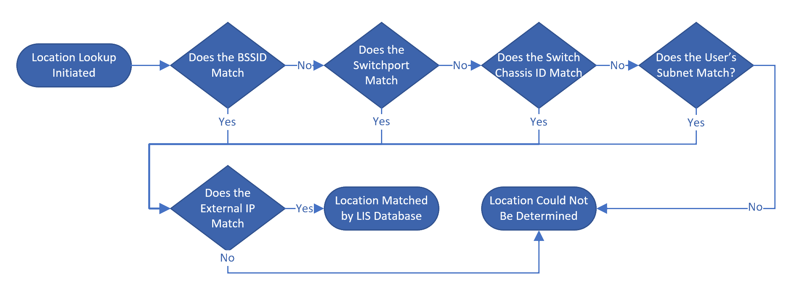

---
lab:
  title: 'Lab 02: Configure your environment for Teams Voice Usage'
  type: Answer Key
  module: 'Learning Path 01: Plan and design Teams collaboration communications systems'
  description: This lab focuses on preparing the Contoso environment for Microsoft Teams Phone by evaluating network readiness, configuring network topology, emergency calling, and voice policies. The scenario covers the foundation for Teams Voice that subsequent labs build on through Direct Routing.
  duration: 115 minutes
  level: 300
  islab: true
---

> **Abstract:**  
> This lab focuses on preparing the Contoso environment for Microsoft Teams Phone by evaluating network readiness, configuring network topology, emergency calling, and voice policies. The scenario covers the foundation for Teams Voice that subsequent labs build on through Direct Routing.

# Lab 02: Configure your environment for Teams Phone
# Student lab answer key

## Lab scenario

Contoso wants to set up Teams Phone for their users. 

Firstly, our administrator wants to ensure the network is capable of running Microsoft teams, we will do this by completing the following tasks:

- Evaluate our network bandwidth with Network Planner

- Test our network performance with the Teams Network Assessment

Next, we need to configure our tenant for Teams Phone usage. Before phone numbers can be assigned to users, we need to configure our network topology and emergency calling addresses.

- Configure a basic network topology and emergency calling addresses

Voice Policies allow us to configure specific parts of Teams Phone. We require extension dialing and call park and some of our users do not want their numbers presented when making outbound calls. Finally, there is a number we wish to block from making inbound calls to Contoso. 

- Configure Voice policies to meet Contoso requirements

Finally, we will review our default audio conferencing settings.

- Review audio conferencing settings

> [!NOTE]
> Direct number ordering through the Teams admin center is currently unavailable in this trial tenant due to a compliance verification requirement. Lab 3 assigns phone numbers through **Direct Routing** in its own lab environment. Labs 4–6 continue in this environment and don't require Lab 3, a Session Border Controller (SBC), or a phone number.

## Lab Setup

  - **Estimated Time to complete**: 115 minutes

## Instructions

## Exercise 1: Evaluate your network with the Network Planner

### Exercise Duration

  - **Estimated Time to complete**: 20 minutes

In this exercise, you will determine if your organization's network has enough bandwidth to run Microsoft Teams successfully using Network Planner.

We will input our network details and review the output report.

### Task 1 - Create Personas

In the following task, you will create a custom user persona of a network user. In our scenario, we have some users that are expected to only use audio for peer-to-peer calls and PSTN calls. They will not use video or desktop sharing as part of their role. We need to create a persona to reflect their use when planning our network.

1. Sign into **MS721-CLIENT01** as **Admin** with the password provided to you.

1. Open Microsoft Edge from the taskbar and browse to the **Microsoft Teams admin center** at [**https://admin.teams.microsoft.com**](https://admin.teams.microsoft.com/).

1. For least-privileged access, use **Allan Deyoung** instead of a Global Administrator for most remaining tasks. If the admin center opens with another account, select the circle in the upper-right corner, and then select **Sign in with a different account**.

1. Sign in with the credentials of **Allan Deyoung**, the Teams Administrator for this lab.

1. Expand the left navigation menu by selecting **Show all** and expand **Planning** and select **Network planner**.

1. Select **Personas**, you will see the default personas provided by Microsoft.

1. Select **Add**.

1. Enter a Persona name as **Audio Only User**.

1. Enter Description as **Audio Only User**.

1. Toggle **Audio**, **Conference audio** and **PSTN** to **On**.

1. Select **Apply**.

1. Leave this window open for the next Network planner task.

You have successfully created our Audio Only User network persona.

### Task 2 - Create Network and Network Sites

In this task, you will set up your network and sites in Teams Network Planner. Contoso has 2 offices, Tacoma and Bellevue, so 2 network sites, we need to add to the planner

1. You are in **Network Planner** in the **Microsoft Teams admin center** on **MS721-CLIENT01** as **Admin** and signed in as **Allan Deyoung**.

1. Select **Network plans**.

1. You will see a prompt: “You haven't added any network plans yet.” Select **Add**.

1. Enter **Plan 1** for your name and **Plan 1** for your description and select **Apply**.

1. Once created select **Plan 1** in the list.

1. You will be prompted “You haven't added any network sites yet.” Select **Add a network site**.

1. Enter the **Network Site Name** as **Tacoma Site**.

1. Enter the description as **Tacoma Office**.

1. You do not need to enter a street address, so skip **Create an address**.

1. Enter the **network users** as **50**, as we have 50 users in the Tacoma office.

1. Network subnets are just for reference in the report, our Tacoma offices network subnet is **10.10.10.0** with a network range of **24**. Enter these values.

1. Tacoma has local internet breakout, enter **50** for **Internet link capacity**.

1. It is **NOT connected to a WAN** or **ExpressRoute**, so leave those at the default of **off**.

1. There is no local PSTN on the Tacoma site, so leave **PSTN egress** as **Use VoIP only**.

1. Select **Save**.

1. Now select **Add network site** to add our second site, Bellevue.

1. Enter the **Network Site Name** as **Bellevue Site**.

1. Enter the description as **Bellevue Office**.

1. You do not need to enter a street address, so skip **Create an address**.

1. Enter the **network users** as **90**, as we have 90 users in the Bellevue office.

1. Network subnets are just for reference in the report, our Bellevue offices network subnet is **10.10.20.0** with a network range of **24**. Enter these values.

1. Bellevue has local internet breakout, enter **20** for **Internet link capacity**.

1. It is **NOT connected to a WAN** or **ExpressRoute**, so leave those at the default of **off**.

1. There is no local PSTN on the Bellevue site, so leave **PSTN egress** as **Use VoIP only**.

1. Select **Save**.

1. Leave this window open for the next Network planner task.

You have successfully added our two sites, user numbers and bandwidth details to network planner.

### Task 3 - Run Reports

In the following task, you will run the Network Planner report and review the results.

1. You are in **Network Planner** in the **Microsoft Teams admin center** on MS721-CLIENT01 as “Admin” and signed in as Allan Deyoung.

1. Select **Report**.

1. You will be prompted with “You haven't generated any reports yet.” Select **Start a report**.

1. Enter the **Report Name** as **Network Report 1**.

1. Enter a description of **Network report for Tacoma and Bellevue**. Next, set the number of users for each persona at each site.

1. For **Bellevue Site**, in the **Office Worker** row, set Network users to **80**.

1. Remove the **Remote Worker** row by selecting the **X** at the end of the row.

1. Select **+Add** and choose **Audio Only User**.

1. In the  **Audio Only User** row, set Network Users to **10**.

1. For **Tacoma Site**, in the **Office Worker** row, set Network users to **30**.

1. Remove the **Remote Worker** row by selecting the **X** at the end of the row.

1. Select **+Add** and choose **Audio Only User**.

1. In the **Audio Only User** row, set Network Users to **20**.

1. Now select **Generate report**.

1. Review the report. At the default of 30% of bandwidth reserved for Teams real-time traffic, the Tacoma site has enough bandwidth. The Bellevue figure is highlighted in red because the site doesn't have enough.

1. Close the browser window.

You have generated a Network Planner report. It shows that Bellevue needs more internet bandwidth.

## Exercise 2: Test Microsoft 365 network connectivity

### Exercise Duration

  - **Estimated Time to complete**: 20 minutes

In this exercise, you run the [Microsoft 365 network connectivity test](https://connectivity.m365.cloud.microsoft/) from MS721-CLIENT01. The browser test checks general Microsoft 365 connectivity. The advanced Windows client adds Teams media measurements. Results from a hosted lab VM can point to a possible network issue, but they don't certify an office network.

### Task 1 - Start the network connectivity test

1. On **MS721-CLIENT01**, open Microsoft Edge and browse to [https://connectivity.m365.cloud.microsoft](https://connectivity.m365.cloud.microsoft).

1. Choose a location for the test. Allow location access, or enter a location manually if location services aren't available.

1. Select **Run test**. You don't need to sign in. If you do sign in, the report is shared with your tenant's administrators.

1. Wait for the **Network connectivity test results for your location** page. The page offers a download named `Connectivity.<report-id>.exe`. The browser results alone don't measure Teams media quality, so continue to Task 2.

### Task 2 - Run the advanced Windows client

1. From Edge's **Downloads** menu, open `Connectivity.<report-id>.exe`. Check that Windows identifies Microsoft as the publisher.

1. If Windows reports that a **.NET Desktop Runtime** is missing, select **Download it now**, install the Windows Desktop Runtime version it requests (x64 8.0.31 when this lab was tested), and then reopen `Connectivity.<report-id>.exe` from **Downloads**.

1. Keep the browser report open and wait for **Office 365 Network Onboarding Advanced Tests** to finish. This can take several minutes.

> [!NOTE]
> If the download, runtime installation, or advanced tests can't complete in your VM, record the error and tell your instructor. Browser-only results aren't a pass for Teams media connectivity. Exercise 3 doesn't depend on this test.

### Task 3 - Review the Teams measurements

1. On the browser results page, select **Details** and scroll to **Microsoft Teams**.

1. Record the **Media connectivity (audio, video, and application sharing)** result and the **Packet loss**, **Latency**, and **Jitter** values. If a value is missing, don't treat it as a pass.

1. Compare the values with the targets: packet loss below **1%**, latency below **100 ms**, and jitter below **30 ms**.

1. Check the rest of **Details** for warnings, such as blocked Microsoft 365 endpoints.

1. Decide whether the results suggest a network issue from this VM. Before making an office-network recommendation, repeat the test on a representative office client.

1. Close Microsoft Edge.

You have reviewed the Teams media measurements from the advanced client.

## Exercise 3: Configure a basic network topology for dynamic emergency calling 

### Exercise Duration

  - **Estimated Time to complete**: 20 minutes

Dynamic emergency calling uses network sites. In this exercise, you map network regions, sites, subnets, and trusted IP addresses.

### Task 1 - Add Network Region and sites to Network Topology

In this task, you add the two offices as network sites in the Teams admin center.

1. On **MS721-CLIENT01**, open Microsoft Edge from the taskbar and browse to the **Microsoft Teams admin center** at [**https://admin.teams.microsoft.com**](https://admin.teams.microsoft.com/).

1. If prompted, sign in as **Allan Deyoung**, the Teams Administrator for this lab.

1. Expand the left navigation menu and select to expand **Locations**, then select **Network topology**.

1. You will be prompted with **You haven't created any network sites yet**. Select **Add**.

1. Enter the **Name** for the first Network Site as **Tacoma Network Site** and **Description** as **Tacoma Office**.

1. Select **Add a Network Region**, enter **US** and select **Add**.

1. Select **US** and then select **Link**.

1. Select **Add subnets**.

1. Leave IP version as IPv4 and enter IP address as **10.10.10.0** with network range as **24**.

1. For Description enter **Tacoma Subnet**.

1. Select **Apply**.

1. You have now added a subnet for the Tacoma site, select **Save** to save the Tacoma site.

1. You can now see the Tacoma Network Site in the Network Sites List.

1. To add the Bellevue site select **Add**.

1. Enter the **Name** for the second Network Site as **Bellevue Network Site** and **Description** as **Bellevue Office**.

1. Select **Add a Network Region**, select **US** and select **Link**.

1. Select **Add subnets**.

1. Leave IP version as IPv4 and enter IP address as **10.10.20.0** with network range as **24**.

1. For Description enter **Bellevue Subnet**.

1. Select **Apply**.

1. You have now added a subnet for the Bellevue site, select **Save** to save the Bellevue site.

1. You can now see both the Bellevue Network Site and Tacoma Network Site in the Network Sites List.

1. Leave the browser open in the **Microsoft Teams admin center** at the end of this task.

You have now added our network sites; Tacoma, and Bellevue.

### Task 2 - Add a trusted IP address

In this task, you will add a trusted IP addresses for each of the Tacoma and Bellevue Offices. Trusted IP addresses are the enterprise's public external IP addresses that a Teams user will show as routing from on the public internet. These are important as they validate that the user is on an enterprise network and the system should check if they are on a mapped subnet. We have two offices, each with its own internet connection and therefore its own public IP address. You do not need to map Trusted IPs to specific networks.

1. From the last task, you are still signed in to MS721-CLIENT01 as “Admin” and have the **Microsoft Teams Admin Center** open as **Allan Deyoung**.

1. On **Network topology**, select the **Trusted IPs** tab.

1. You will see “You haven't added any trusted IP addresses yet”. Select **Add**

1. You can add a specific IP or a subnet of public IPs, For the Bellevue office add **151.101.128.81** and **32** as the network range and in the description enter **Bellevue Office Public IP Addresses**.

1. Select **Apply**.

1. Select **Add** to add our second Public IP address.

1. For the Tacoma office add **151.101.128.91** and **32** as the network range and in the description enter **Tacoma Office Public IP Addresses**.

1. Select **Apply**.

1. Leave the browser open in the **Microsoft Teams admin center** at the end of this task.

You have successfully added the public IP that clients will appear from for the Tacoma and Bellevue Offices as Trusted IPs.

### Task 3 - Add an emergency address

In this task, you will create an emergency location. This is needed before you can assign phone numbers to users for Teams Phone and is also required for dynamic emergency calling configuration in later labs.

1. From the last task, you are still signed in to MS721-CLIENT01 as “Admin” and have the **Microsoft Teams Admin Center** open as **Allan Deyoung**.

1. Select the **Locations** then **Emergency addresses**.

1. On the toolbar, select the **Add**.

1. In the New Address pane, add a name for your Emergency address, **Bellevue Office Address**.

1. Select the **Country or region** menu and then select **United States**.

1. Switch **Input address manually** to **On**.

1. In the **Street Number** box, enter **700**.

1. In the **Street Name** box, enter **Bellevue Way Northeast**.

1. In the **City** box, enter **Bellevue**.

1. In the **State** box, select **Washington**.

1. In the **Zip code** box, enter **98004**.

1. For Latitude enter **47.61676**.

1. For Longitude enter **-122.20083**.

1. Leave organization name as Contoso.

1. For ELIN enter **425-555-1200**.

1. Tick the **I acknowledge and agree…** checkbox under **Emergency calling disclaimer**.

1. On the new **Important Information** window select **Cancel**.

1. Select **Save**.

1. In the **Emergency locations** list verify your emergency location is listed and has been validated.

1. Leave the browser open in the **Microsoft Teams admin center** at the end of this task.

You have successfully added an emergency address

### Task 4 - Mapping a network to a physical location (emergency address)

Now that we have added our network Region, Sites and Subnets we can map our network locations to physical office addresses for emergency calling. 

> [!TIP]
> This configuration refers to Emergency Locations, but when you are defining them, the Teams Admin Center calls them Emergency Addresses. They are the same thing.

> [!NOTE]
> The below information explains general best practices for implementing emergency services in Microsoft Teams. None of the information in this document should be interpreted as legal advice. Please consult with your organization's legal department and the following resources for specific requirements by state.

- [https://www.intrado.com/enterprise-solutions/e911-regulations](https://www.intrado.com/enterprise-solutions/e911-regulations)
- [https://www.911.gov/](https://www.911.gov/)

In the US, Kari's Law requires that users can dial 911 directly and that someone in the organization is notified when an emergency call is placed. RAY BAUM'S Act requires a dispatchable location to be sent with the call so it reaches the correct Public Safety Answering Point (PSAP). Teams uses its Location Information Service (LIS) database to map network elements to emergency addresses.

You can map emergency location\addresses to:

- Wireless Access Point (WAP) by BSSID (Basic Service Set Identifier) - Each AP radio has its own unique BSSID per SSID.

- Ethernet switch port, which maps both the Chassis ID and the port ID. This allows a switch that spans multiple locations to be more accurately mapped down to the port.

- Ethernet switch by Chassis ID. Each network switch is stamped with a Chassis ID that is used to identify a specific switch on a network.

- Subnet. Not tied to any physical equipment address, this is the network address the user has. Unlike mapped subnets in the Teams Network topology, The Location Information Service (LIS) doesn’t maintain a list of Networks and Subnet masks, it relies on the NetworkID of the subnet.

Microsoft Teams utilizes the following flowchart of determining a user's network location:

  

Perform the following steps.

1. From the last task, you are still signed in to MS721-CLIENT01 as “Admin” and have the **Microsoft Teams Admin Center** open as **Allan Deyoung**.

1. Navigate to **Locations** and **Networks &amp; locations**.

1. We are going to map our office **Subnets;** ensure you are on the Subnets tab and select **Add** to add a subnet and Emergency Location.

1. Leave IPv4 Selected for **IP Version**.

1. Enter the Bellevue subnet network ID. The Bellevue office subnet is `10.10.20.0/24`, so enter **10.10.20.0** in the **Subnet** field. After you complete steps 3–8, repeat them to add the second subnet, **192.168.0.0**, which is used in a later task.

1. Enter **Bellevue Subnet** as the **Description**.

1. Under Emergency location, **Search by City** enter **Bellevue** and select our Bellevue emergency address.

1. Select **Apply**.

1. Leave the browser open in the **Microsoft Teams admin center** at the end of this task.

You have aligned a network subnet to a physical emergency address.

### Task 5 - Configure Emergency Calling Policies

In this task, you will configure an emergency calling policy. Emergency calling policies define what happens when a user in your organization makes an emergency call. We would like Alex Wilber to receive a notification whenever an emergency call is made.

1. From the last task, you are still signed in to MS721-CLIENT01 as “Admin” and have the **Microsoft Teams Admin Center** open as **Allan Deyoung**.

1. In the left navigation pane select **Voice** and **Emergency policies**.

1. Select **Add** to add an Emergency Policy.

1. For **Name** enter **Contoso Emergency Policy**.

1. For **Description** enter **Contoso Emergency Policy**.

1. Turn on **External location lookup mode**.

1. Under **Emergency numbers**, select **+ Add**

1. Enter **999** as the **Emergency dial string**.

1. Under **Notification mode**, select **Send notification only**: A Teams chat message is sent to the users and groups that you specify.

1. Under **Users and groups for emergency calls notifications**, enter Alex and then select Alex Wilber and select **Add**.

1. Select **Apply** and then **Save** to finish creating your emergency calling policy.

1. Leave the browser open in the **Microsoft Teams admin center** at the end of this task.

You have successfully set up notifications for Alex Wilber whenever emergency calls are made.

## Exercise 4: Configure voice policies

### Exercise Duration

  - **Estimated Time to complete**: 20 minutes

In this exercise, you will configure some key voice settings and policies required for the Contoso users to utilize voice services in context with the company policies.

### Task 1 - Create a Dial Plan for extension dialing

In this task, you configure extension dialing. Tacoma users dial three-digit extensions from 500 to 599 to reach each other. Each extension matches the last three digits of the user's number in the range +1 425 555 15xx. For example, dialing 511 reaches +14255551511.

Bellevue users must be able to dial the same extensions, so you add the rule to the Global dial plan, which applies to all users. To limit a rule to specific users, you would create a separate dial plan and assign it to them instead.

1. You are still signed in to MS721-CLIENT01 as “Admin” and have the **Microsoft Teams admin center** open as **Allan Deyoung**.

1. In the left navigation pane expand **Voice** then select **Dial plans**. 

1. Select the **Global (org wide default)** dial plan.

1. Under Normalization rules, you will see “You don't have any normalization rules yet”, select **Add** to get to the add new rule dialogue.

1. For **Name** enter **Tacoma 5xx extension dialing**.

1. For **Description** enter **Converts 5xx dialed extensions to full E.164 +142555515xx numbers**.

1. Ensure **Basic** rule is selected, it should be by default.

1. Check **The number dialed begins with** and enter **5**.

1. Check **The length of the number being dialed is** and enter **3**.

1. Ensure **Exactly** is selected for length of number to be dialed.

1. Check **Remove this many digits from the start of the number** and enter **1**.

1. Check **Add this number to the beginning** and enter **+142555515**.

1. Test the rule by entering **503** and selecting **Test**. The output should be +14255551503, if the output is correct select **Save**.

1. You will see your rule as rule 1 in the global dial plan, select **Save**.

1. Leave the browser open in the **Microsoft Teams admin center** at the end of this task.

You have successfully added a normalization rule to a dial plan to meet the extension dialing organizational requirement.

### Task 2 - Configure Calling policies

Calling policies control which calling features users have. Contoso wants two changes: turn on busy on busy, so users on a call aren't interrupted by a second incoming call, and allow users to record 1:1 calls. You create a custom calling policy and assign it to the **Sales Group** team created in Lab 1.

1. You are still signed in to MS721-CLIENT01 as “Admin” and have the **Microsoft Teams admin center** open as **Allan Deyoung**.

1. In the left navigation menu select **Voice** and **Calling policies**. 

1. Select **Add** to add a new policy.

1. Under **Add a name for your calling policy** enter **Busy on busy and call recording**.

1. Under add a **description** enter **Busy on busy and allow call recording**.

1. Switch **Cloud recording for calling** to **On**.

1. For **Busy on busy during calls** to **On**.

1. Select **Save**.

1. While still in Voice and calling policies, select the **Group policy assignment** tab.

1. Select **Add** to open the **Assign policy to group** dialogue.

1. Under **Select a group** search for **Sales Group** and when **Sales Group** appears, select **Add**.

1. Leave rank as **1**.

1. For select a policy select the new **Busy on busy and call recording** policy.

1. Select **Apply**.

1. Leave the browser open in the Microsoft Teams admin center at the end of this task.

The policy now applies to members of the **Sales Group** team. A policy assigned directly to a user takes precedence over a group-assigned policy.

You have successfully created and assigned a calling policy.

### Task 3 - Configure Call Park policies

Call Park and retrieve lets users put calls on hold and enables the same user or someone else to retrieve and continue the call. Call Park is disabled by default. Our organization would like the option to use call park so we will enable it.

1. You are still signed in to MS721-CLIENT01 as “Admin” and have the **Microsoft Teams admin center** open as **Allan Deyoung**.

1. In the left navigation menu select **Voice** and **Call park policies**. 

1. Select the **Global (org wide default)** policy.

1. Switch **Call park** to **On**.

1. Select **Save**.

1. Leave the browser open in the **Microsoft Teams admin center** at the end of this task.

The call pickup range is from 10 to 99 but can be customized here. You have successfully enabled call park for all users.

### Task 4 - Configure Caller ID policies

Caller ID policies change or block the caller ID shown on PSTN calls. By default, a user's phone number is shown on outbound PSTN calls. Some Contoso users don't want their number shown, so you create a policy that presents their calls as anonymous.

1. You are still signed in to MS721-CLIENT01 as “Admin” and have the **Microsoft Teams admin center** open as **Allan Deyoung**.

1. Select **Voice** and **Caller ID policies**.

1. Select **Add**.

1. For **Name** enter **Block outbound caller ID**.

1. For **description** enter **Block outbound caller ID**.

1. Switch **Override the caller ID policy** to **On**.

1. For **Replace the caller ID with** select **Anonymous**.

1. Select **Save**.

1. Leave the browser window open at the end of this task.

You have successfully created a caller ID policy to block the outgoing caller ID for users.

### Task 5 - Configure Inbound call blocking

There is a persistent nuisance caller calling users in the Bellevue office and we need to block all inbound calls from that number for the organization. The calling number is 1 (412) 555-1111.

1. You are still signed in to MS721-CLIENT01 as “Admin” with the password provided to you.

1. Press the start button and enter **PowerShell**.

1. Windows PowerShell will appear on the start menu, right click on it and select **Run as administrator**.

1. Windows PowerShell will load, enter the following at the command to connect to Microsoft Teams.

    ```powershell
    Connect-MicrosoftTeams
    ```

1. It may take around a minute to connect, when prompted enter the username of **Allan Deyoung** and select **Next**.

1. When signed in you will be returned to the command prompt.

1. Run the following to block incoming calls.

    ```powershell
    New-CsInboundBlockedNumberPattern -Name "BlockNuisance1" -Enabled $True -Description "Block Fabrikam" -Pattern "^\+?14125551111"
    ```

1. Leave the PowerShell window open and/or minimize it, you will use it in future exercises.

You have successfully blocked all inbound calls from 1 (412) 555-1111 via PowerShell to end the unwanted calls from that number. 

## Exercise 5: Review audio conferencing settings

### Exercise Duration

  - **Estimated Time to complete**: 5 minutes

In this exercise, you will review the default Microsoft PSTN audio conferencing settings for the tenant.

### Task 1 - Review the default Audio Conferencing Bridge

The default conference bridge number is the caller ID used when someone dials out from a meeting, for example, to add a PSTN participant. Contoso works with many companies in New York and would prefer a New York number as its default bridge.

1. On **MS721-CLIENT01**, switch to Microsoft Edge, where the **Microsoft Teams admin center** is still open as **Allan Deyoung**.

1. Navigate to **Meetings** on the left menu, then select **Audio Conferencing Bridges**.

1. You will see all the conference bridge numbers listed; one number will have (Default) beside it. That is the current default.

1. Leave the browser window open at the end of the task.

You have successfully reviewed the audio conference bridge numbers available to the tenant.

> [!NOTE]
> In a production environment, you can also acquire dedicated conference bridge numbers in specific area codes through the Teams admin center. Because direct number ordering is unavailable in this trial tenant, that step is omitted from the lab. For production guidance, see [Phone numbers for Audio Conferencing in Microsoft Teams](https://learn.microsoft.com/microsoftteams/phone-numbers-for-audio-conferencing-in-teams).

## Next Steps

You have completed Lab 1 and Lab 2. Lab 3 is a separate lab launch that uses the same Microsoft 365 tenant and adds an AudioCodes SBC in Azure for Direct Routing. Labs 4–6 continue in this lab launch and don't depend on Lab 3.
