---
lab:
  title: 'Lab: Expand your Teams Voice Environment to use Direct Routing'
  type: Answer Key
  module: 'Learning Path 01: Plan and design Teams collaboration communications systems'
  description: In this lab, you will expand the Teams Phone environment by configuring Direct Routing with a Session Border Controller (SBC), integrating on-premises telephony, and assigning voice routing policies. The scenario walks through deploying, configuring, and validating Direct Routing for hybrid voice connectivity.
  duration: 200 minutes
  level: 400
  islab: true
---

> **Abstract:**  
> In this lab, you will expand the Teams Phone environment by configuring Direct Routing with a Session Border Controller (SBC), integrating on-premises telephony, and assigning voice routing policies. The scenario walks through deploying, configuring, and validating Direct Routing for hybrid voice connectivity.

# Lab 03: Expand your Teams Phone Environment to use Direct Routing
# Student lab answer key

## Lab Scenario

As part of the expanding business, the organization has an existing SIP trunk in its primary data center. The contractual obligations mean that it’s more cost-effective to utilize the SIP trunk and move to Microsoft Calling Plans later. As part of the move, Megan will be moved from the old telephone system to the new Microsoft Phone solution.

## Lab Setup

  - **Estimated Time to complete**: 200 minutes

## Instructions

> [!IMPORTANT]
> Throughout this lab, you will use PowerShell cmdlets that must be customized for your specific lab configuration. In the instructions below, when you see &lt;LAB NUMBER&gt; in a PowerShell command, you should replace it with the LAB NUMBER obtained in Exercise 1, Task 2. LAB DOMAIN refers to the full lab domain (i.e. lab12345.o365ready.com).

## Exercise 1: Configure lab for Direct Routing

### Exercise Duration

  - **Estimated Time to complete**: 25 minutes

In this exercise, you will configure DNS, verify your custom domain in Microsoft 365, and prepare local certificate and SBC configuration files. You can rerun each setup phase independently if one fails.

### Task 1 - Identify your lab's public IP address

In this task, you will identify the public IPv4 address used by your lab. You need this address to configure your lab domain's DNS delegation.

1. Sign in to **MS721-CLIENT01** as “Admin” with the password provided to you. You can find the password in the “Resource” section on the right side of the lab window.

1. Open **Windows PowerShell** on **MS721-CLIENT01**.

1. Run the following command to request your internet-facing IPv4 address:

    ```powershell
    Invoke-RestMethod -Uri 'https://api4.ipify.org' -TimeoutSec 15
    ```

1. Record the IPv4 address returned by the command. Use this address in Task 2, not a private address from `ipconfig`. If the request fails, check that **MS721-CLIENT01** can access HTTPS websites and try again.

When you restart the lab, run the command again. Your public IPv4 address might change, in which case you must update the DNS delegation in Task 2.

### Task 2 - Retrieve your lab number

This task updates the o365ready.com DNS server with your lab's public IP address and creates a DNS delegation zone for your lab domain pointing to the DNS server running on MS721-RRAS01. Requests for hosts in your lab domain will be resolved by the DNS server running on MS721-RRAS01.

**Note**: If you have restarted this lab or if it expired and the virtual machines were reset, perform the steps in the knowledge section at the end of this task. You do not need to be issued a new lab number.  

1. You are still signed in to MS721-CLIENT01 as “Admin” with the password provided to you.

1. In Microsoft Edge, browse to **http://www.o365ready.com**.

1. On the Welcome page, select the **Generate Lab Number** tab.

1. In the **IP address** box, enter your public IP address from the previous task.

1. In the **Lab Code** box, enter **MS720**, press **Enter** or select **Submit** (**Note**: Do not enter MS721.).

1. When the process is completed, you will see a **Student LAB NUMBER** dialog, followed by a 5 digit number. Note this number down and remember it. We will refer to this as your **LAB NUMBER** going forward in the lab.

1. You will be using all five digits as part of your organization's on-premises domain.

1. Leave the browser window open and continue with the next task.

    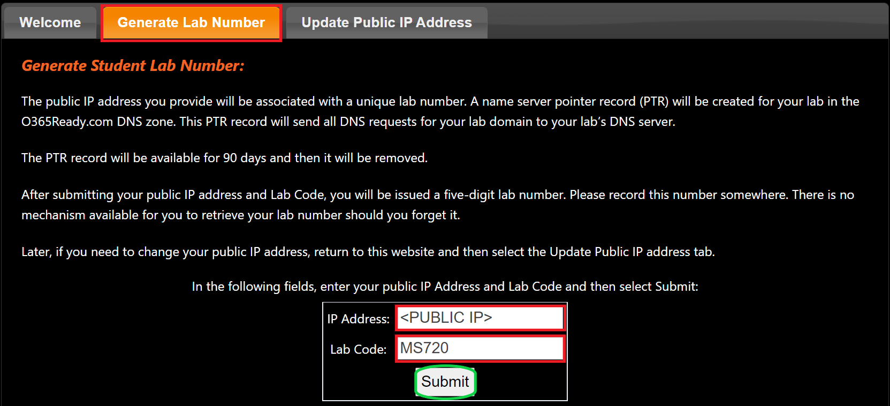

> [!NOTE]
> If you have restarted this lab or if the lab timer has expired and the virtual machines were reset, you will likely have a new public IP address. Perform the following steps to update your lab domain delegation zone's public IP address.

1. In Microsoft Edge, browse to [http://www.o365ready.com](http://www.o365ready.com/).

1. On the Welcome page, select the **Update Public IP Address** tab.

1. In the **Student LAB NUMBER** box, type your five-digit lab number. If you did not write down your original lab number, you can find it by signing in to Microsoft 365 and browsing to the **Domains** feature.

1. In the **Old public IP address** box, type the previously used public IP address. If you did not write down your original public IP address, open a command prompt and try to ping your lab domain name. Although you will not receive a response, the domain name should resolve to IP.

1. In the **New public IP address** box, type the new public IPv4 address from Task 1 and then press Enter.

1. Select **Submit** and wait for the update to complete. This may take a couple of minutes.

You have successfully identified your lab number and updated your public IP address.

### Task 3 - Run the resumable Lab 3 setup script

When you run V3 without arguments, it shows a menu. Choose **1** to run four phases in order: **Dns** (the zone and Microsoft 365 records on the RRAS VM), **Domain** (the tenant domain, ownership TXT record, and verification), **Csr** (a local certificate signing request), and **Sbc** (a local SBC INI file). You can also choose one phase or **Q** to exit without starting. The RRAS VM is labeled **MS721-RRAS01** in the lab console, but its Windows computer name is **MS720-RRAS01**. The script does not deploy or sign in to an SBC, Azure, or Cloud Slice. Each phase verifies its output. If a phase fails, correct the reported prerequisite or conflict and rerun **only that phase**; existing zones, requests, and INI files are not deleted.

1. You are still signed in to MS721-CLIENT01 as **Admin** with the password provided to you.

1. Obtain [MS-721TeamsDirectRoutingLabSetup-V3.ps1](https://github.com/MicrosoftLearning/MS-721T00-Collaboration-Communications-Systems-Engineer/blob/main/Instructions/Labs/Labfiles/MS-721TeamsDirectRoutingLabSetup-V3.ps1) from the published lab repository. Select **Raw**, then save the script as **C:\Scripts\MS-721TeamsDirectRoutingLabSetup-V3.ps1**. If V3 isn't published there yet, ask your instructor for this V3 file from the course repository before continuing. The pre-staged V2 script in **C:\Scripts** is not the resumable version; don't substitute it.

1. Open **Windows PowerShell as Administrator**.

1. In the **User Account Control** dialog box, select **Yes**.

1. Check whether the Graph modules needed by the **Domain** phase are installed:

    ```powershell
    Get-Module -ListAvailable Microsoft.Graph.Authentication, Microsoft.Graph.Identity.DirectoryManagement
    ```

    If either module is missing, install Microsoft Graph PowerShell before you run **Domain**:

    ```powershell
    Install-Module Microsoft.Graph -Scope CurrentUser -Force -AllowClobber
    ```

1. In the elevated Windows PowerShell window, run the script to see the menu:

    ```powershell
    Set-Location C:\Scripts
    Set-ExecutionPolicy -Scope Process -ExecutionPolicy Bypass
    .\MS-721TeamsDirectRoutingLabSetup-V3.ps1
    ```

    Select **1** for the guided sequence. Enter your five-digit lab number from Task 2 and the public IPv4 address from Task 1 when prompted. Invalid numbers and private IP addresses prompt you again. To run the guided sequence without the menu, supply `-LabNumber <LAB NUMBER> -PublicIp <PUBLIC IPv4 ADDRESS>` with your own values and without the angle brackets. To retry or independently verify a phase, run the same script with `-Phase Dns`, `-Phase Domain`, `-Phase Csr`, or `-Phase Sbc` and your `-LabNumber`. Only **Dns** needs `-PublicIp`; omit it for the other phases. Run **Dns** before **Domain** on a fresh lab. **Csr** and **Sbc** need neither Graph nor RRAS and can run without an SBC or Cloud Slice.

1. For **Dns** and **Domain**, enter the **local Administrator** password for the RRAS VM (console label **MS721-RRAS01**, computer name **MS720-RRAS01**) from the lab **Resources** panel when Windows asks for RRAS credentials. Don't use the MOD Administrator password for RRAS. **Domain** separately prompts you to sign in to Microsoft Graph as **MOD Administrator**, not Allan Deyoung. If asked to grant the `Domain.ReadWrite.All` permission, review and accept the consent prompt for your lab tenant. Check the displayed Graph tenant and account. Type `YES` only if this is your lab tenant and domain; the script stops before making changes otherwise.

1. Continue to Task 4 only after **Domain** reports the domain verified and **Csr** confirms **C:\LabFiles\CertReq-lab&lt;LAB NUMBER&gt;.o365ready.com.txt** exists. **Sbc** prepares **C:\LabFiles\Lab&lt;LAB NUMBER&gt;-SBC01-Config.ini** for the later SBC exercise. If the public IP changed after a lab restart, update the o365ready.com delegation in Task 2 and rerun **Dns** with the new IP; an existing apex A record is updated in place. If domain verification fails, check the public delegation and TXT propagation, then rerun **Domain**. When you rerun **Domain** after verification, it checks the verified state without requiring a new ownership TXT record. Don't remove the DNS zone or an existing certificate request to recover from an error.

### Task 4 - Request your public certificate from DigiCert

In the following task, you will request your public certificate for the SBC (Session Border Controller) so you can use it later in the labs. This is used to authenticate connections to multiple tenants and networks served from a single SBC.

1. You are still signed in to MS721-CLIENT01 as “Admin” with the password provided to you.

1. Open File Explorer and then browse to **C:\LabFiles**.

1. Double-click **CertReq-lab&lt;LAB NUMBER&gt;.o365ready.com.txt**. This certificate request was created by the configuration script.

    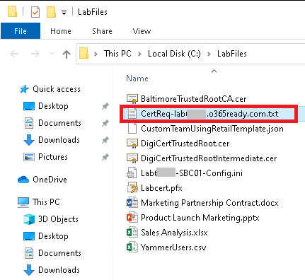

1. In Notepad, select all the text in the file and then press Ctrl+C or right-click or tap and hold and select **Copy** to copy the contents to the clipboard.

1. Open Microsoft Edge, open a new tab and then browse to **https://www.digicert.com/friends/exchange.php**.

1. On the Microsoft Event CSR Submission page, in the **Paste CSR** box, right-click or tap and hold inside the box, and then select **Paste**.

1. Verify that you have pasted the contents of your certificate request.

1. Under **Certificate Details**, review the common name and subject alternative names (SAN) information that will be assigned to the certificate. Ensure that all SAN entries are lowercase. All SAN entries may not be used for this lab.

1. Under Certificate Delivery, in the **Email Address** and **Email Address (again)** boxes, enter the MOD Administrator account name, which is also the user's email address.

1. Select the **I agree to the Terms of Service above** check box.

1. Select **Submit**.

    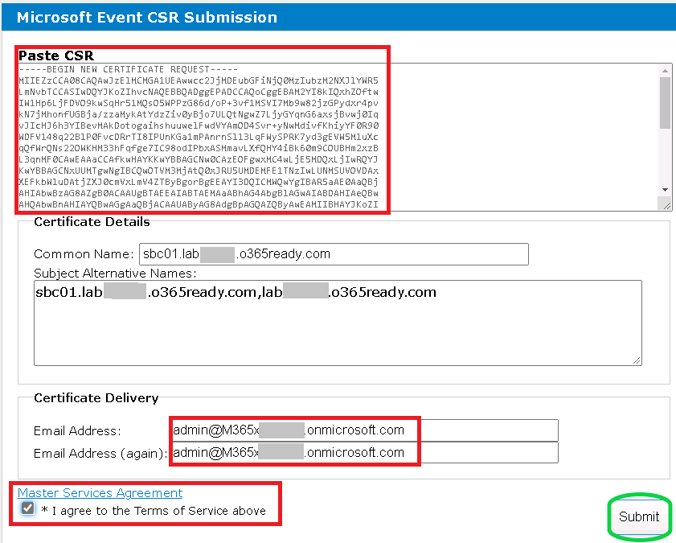

1. Close File Explorer.

You have successfully requested the certificate from DigiCert and will download it later.

### Task 5 - Verify the custom domain has been added to your Microsoft 365 tenant

In this task, you will verify your custom domain so you can work with it and assign it to users.

1. You are still on **MS721-CLIENT01** where you are still signed in as **Admin**. 

1. In **Microsoft Edge**, browse to the Microsoft 365 admin center at [**https://admin.microsoft.com**](https://admin.microsoft.com/).

1. On the **Sign in** screen, enter the credentials of the Global Admin account of the **MOD Administrator** with the username and password provided to you.

1. When a **Save password** dialog is displayed, select **Never**.

1. When a **Stay signed in?** dialog is displayed, select **No**.

1. In the left navigation, select the three dashes and select **… Show all**.

1. Select **Settings** then select **Domains**.

1. Verify your custom domain has been added and is **Verified** in Microsoft 365. This domain starts with **lab** and your five-digit lab number, followed by **o365ready.com**. Its service setup might still show as incomplete; ownership verification is the requirement for assigning it to users. V3 doesn't change the tenant's default domain.

1. Leave the browser window open.

    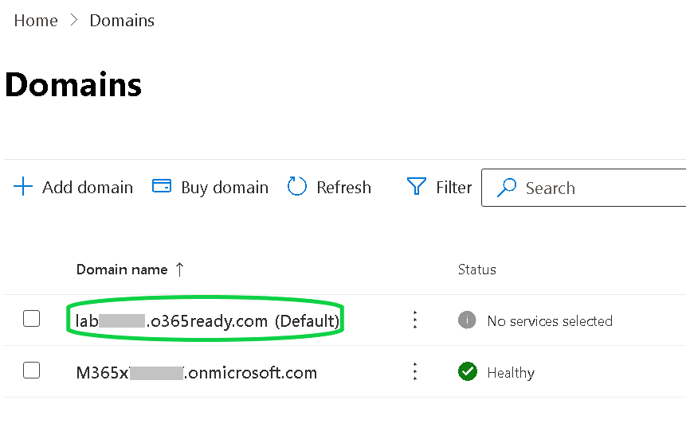

You have verified ownership of the custom domain. It doesn't need to be the tenant's default domain for the next task.

### Task 6 - Assign the custom lab domain to Megan Bowen, Nestor Wilke, and Isaiah Langer

In the following task, you will add the custom domain to Megan Bowen, Nestor Wilke, and Isaiah Langer.

1. You are still on MS721-CLIENT01 where you are still signed in as “Admin”, and you are still in the **Microsoft 365 admin center** as **MOD Administrator**.

1. In the left navigation, select **Users** and **Active users**.

1. In the **Active users** list, select **Megan Bowen** to open the right-side menu.

1. In the Megan Bowen user card, select the **Account** tab under **Username and email** select **Manage username and email**.

1. Below **Primary email address and username**, you can see the default UPN of Megan Bowen. Select the pencil symbol, select the textbox under **Domains** and select **lab&lt;LAB NUMBER&gt;.o365ready.com**.

1. Select **Done**, then select **Save changes**.

1. Repeat steps 3–6 for **Nestor Wilke** and **Isaiah Langer**.

1. Leave the browser open for the next task.

You have successfully added the custom domain to Megan Bowen, Nestor Wilke, and Isaiah Langer.

## Exercise 2: Deploy the session border controller

### Exercise Duration

  - **Estimated Time to complete**: 30 minutes

In this exercise, you will deploy the AudioCodes Mediant VE Session Border Controller (SBC) from the Azure Marketplace, and install the services needed to ensure the custom domain and SBC work as expected.

### Task 1 - Add the SBC to the tenant

In this task, you will verify and add your SBC to your tenant.

1. You are still on MS721-CLIENT01 and signed in as “Admin”.

1. Open a new tab in Microsoft Edge and then browse to [**https://admin.teams.microsoft.com**](https://admin.teams.microsoft.com/).

1. Sign in to the Teams admin center as **MOD Administrator**.

1. In the left navigation select **Voice**, select **Direct Routing**, and under SBCs, select **Add**.

1. Add the FQDN **sbc01.lab&lt;LAB NUMBER&gt;.o365ready.com**, set the following parameters, and select **Save**. Use lowercase letters in the FQDN, and leave the other settings as-is.

	- **Enabled:** Toggle On

	- **Forward call history:** Toggle On

	- **Forward P-Asserted-Identity (PAI) header:** Toggle On

	- **SBC supports PIDF/LO for emergency Calls:** Toggle On

    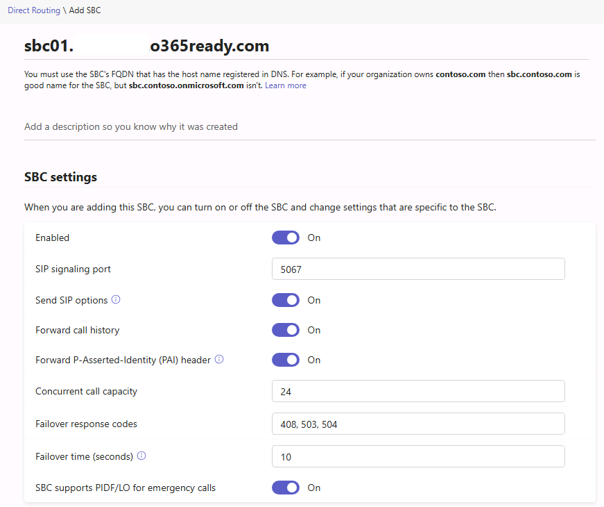

1. On the **SBCs** tab, verify that the new FQDN appears in the list. Registration alone does not confirm TLS connectivity; you verify the certificate and proxy connections in Exercise 3.

1. Leave the browser open at the end of this task.

You have added an SBC to the tenant. Verify its connectivity after you configure the certificate.

### Task 2 - Retrieve your public certificate file

In the following task, you will download the DigiCert certificate you requested earlier in the lab so you can use it for your SBC. This step is required to upload the certificate in the compressed archive container in the next task.

1. You are still on MS721-CLIENT01 where you are still signed in as “Admin” 

1. Open Microsoft Edge and then browse to **Outlook on the web** [**https://outlook.office.com**](https://outlook.office.com/), where you should still be signed in as the **MOD Administrator**.

1. In the message list, locate and select the email from **DigiCert** with the zip file attachment. The message may arrive in the Focused or Other folder and should arrive within 2-5 minutes.

1. Download the **sbc01_lab&lt;LAB NUMBER&gt;.o365ready.comXXXXXXX.zip** file attachment, it will be saved to the default Downloads folder.

1. Close the browser window to end the task.

You have successfully downloaded the certificate you requested in an earlier exercise and it is now available to certify your SBC.

> [!WARNING]
> Download the file as-is. Do not compress the already compressed zip file. Some web-based email systems allow you to compress or zip your download. This will cause the already compressed file to be compressed again and will cause the script in this lab to fail.

### Task 3 - Run the ImportLabCert script located in C:\Scripts

In the following task, you will import the certificate to the local machine and convert it to a format the SBC can read.

1. You are still on MS721-CLIENT01 where you are still signed in as “Admin”.

1. Switch to File Explorer and then browse to **C:\Scripts**.

1. Double-click **ImportLabCert.exe**.

1. In the **User Account Control** dialog box, select **Yes**.

1. In the window, select **Import lab certificate**.

1. When the script completes, select **Finish**.

1. Close File Explorer.

You have successfully converted the certificate for the SBC.

### Task 4 – Setting up Session Border Controller (SBC) Virtual Machine resources

In the following task you will create the new session border controller resource hosted within Microsoft Azure.

1. You are still on MS721-CLIENT01 where you are still signed in as **Admin**.

1. Open a new **In-Private Microsoft Edge browser window** by right-clicking on the Microsoft Edge icon in the taskbar and selecting **New InPrivate Window** and then navigate to **https://portal.azure.com**.

1. Log in with the **Azure Portal username and password** provided to you by your lab provider.  **DO NOT** log in with your Microsoft 365 account.

1. Select **Create a resource**.

1. Search for **Mediant VE Session Border Controller (SBC)**.

1. Select **Mediant VE Session Border Controller (SBC)**.

1. Select **Create > AudioCodes Mediant VE SBC for Microsoft Azure**

1. For **Resource group**, select **Create New**.

1. Fill **Name** with **SBC** then Select **OK**.

1. For **Region** select **West US 2**.

1. Fill out the following information and leave everything else as-is:

	- **Virtual machine name:** sbc01

	- **Username:** sbcadmin

	- **Password:** *Enter the MOD Administrator password in the _"Resource"_ section on the right side of the lab window.*

1. Select **Next** to configure **Virtual Machine Settings**

1. Select **Change size**, choose **D2ds_v5** from the list, and then select **Select** at the bottom. If **D2ds_v5** is already selected, leave it as-is.
    - If **D2ds_v5** is unavailable for your subscription in this region, try another region. If the size remains unavailable, contact your lab provider.

1. Select **Review + Create** (If you see a "Validation failed" message, you need to select **Previous** and select **Review + Create** again).

1. Select **Create** and wait for the deployment to complete.

### Task 5 - Retrieve SBC Public IP and configure DNS routing

In the following task you will retrieve the public IP address of the SBC and routing to the public DNS so Teams can locate the SBC.

1. Select **Go to resource group**.

1. Select **sbc01-ip**.

1. Make note of the Public IP Address to use later.

1. Select the start button, enter **Windows PowerShell** and select **Run as administrator** below PowerShell from the start menu.

1. When Windows PowerShell window has opened, enter the following cmdlet to a session with the DNS Server (**Note**: the machine name should stay as MS720-RRAS01, despite the course being MS-721):

    ```powershell
    $Cimsession = New-CimSession -Name MS720-RRAS01 -ComputerName MS720-RRAS01 -Authentication Negotiate -Credential (Get-Credential -Credential Administrator)

    ```

1. When prompted to provide credentials fill out the following information and select **OK**:

	- **User name:** Administrator

	- **Password:** *Enter the local Administrator password from the _“Resource”_ section on the right side of the lab window. _DO NOT_ enter the MOD Administrator's account password.*

1. After the connection is established, the command prompt appears again.

1. Enter and modify the following cmdlet with your **LAB NUMBER** and **Public SBC IP Address** to configure the DNS Record for the SBC (**Note**: the machine name should be stay as MS720-RRAS01, despite the course being MS-721):

    ```powershell
    Add-DnsServerResourceRecordA -ComputerName MS720-RRAS01 -CimSession $Cimsession -ZoneName lab<LAB NUMBER>.o365ready.com -Name sbc01 -IPv4Address <Public SBC IP>
    ```

1. Verify the DNS zone was created successfully by running the following command.  You should see it pointing to the Public IP Address that the SBC was assigned through Azure:

    ```powershell
	nslookup sbc01.lab<LAB NUMBER>.o365ready.com

	```

1. You can close the Windows PowerShell window by selecting the **X** in the top right.

You have successfully created an SBC hosted inside Microsoft Azure.

### Task 6 – Sign into and apply a base configuration to the SBC

 In the following task, we will configure the Session Border Controller (SBC) to work with Microsoft Teams.

1. You are still on MS721-CLIENT01 where you are still signed in as “Admin”.

1. Open a new Microsoft Edge browser window and navigate to [**https://&lt;SBCpublicIPAddress&gt;**](*) or [https://sbc01.lab&lt;LAB NUMBER&gt;. o365ready.com](*). Ensure that you replace &lt;SBCpublicIPAddress&gt; or &lt;LAB NUMBER&gt; with the IP address of the SBC instance or the lab number you got from o365ready.com.

    > NOTE: You may see a connection message indicating your connection isn't private (NET::ERR_CERTIFICATE_TRANSPARENCY_REQUIRED or NET::ERR_CERT_COMMON_NAME_INVALID).  Select **Advanced** and then the link at the bottom to **Continue to &lt;SBCpublicIPAddress&gt;**.

1. Logon to the SBC using the following credentials you configured earlier:

	- **Username:** sbcadmin

	- **Password:** *Enter the MOD Administrator password in the _“Resource”_ section on the right side of the lab window.*

1. Once you have successfully logged onto the SBC, click on **Actions** and then **Configuration File**.

1. Under the **Configuration File** > **INI FILE** section, select **Choose File**, select the file named **Lab&lt;LAB NUMBER&gt;-SBC01-Config.ini** inside of the **C:\LabFiles** directory, and then click **Upload INI File**. The SBC will reboot

1. Upon reboot of the SBC, log back into the box. To confirm successful configuration, ensure that you see two IP Groups at the top of **Topology View**

    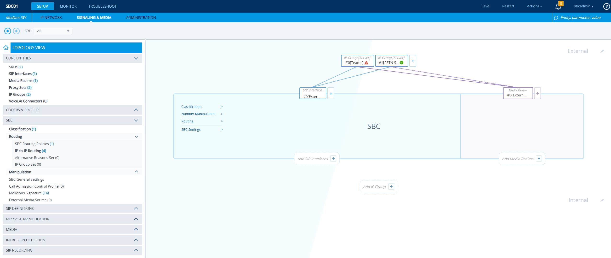

You have successfully performed the base configuration of the AudioCodes SBC.

## Exercise 3: Configure the session border controller

### Exercise Duration

  - **Estimated Time to complete**: 10 minutes

In this exercise, you will configure the session border controller, and install the services needed to ensure the custom domain and SBC work as expected.

### Task 1 - Upload the lab certificate to the SBC

In the following task, you will upload the lab certificate you requested earlier to the SBC. This is needed to secure the connection between the SBC and Microsoft Teams  

1. Sign in to the SBC again after the reboot. Navigate to **Setup > IP Network > Security > TLS Contexts**.

2. In the **TLS Contexts** table, select **External**.

3. Scroll below the **External** TLS context's information and select **Change Certificate**.

4. On the **Change Certificates** page, scroll to **UPLOAD CERTIFICATE FILES FROM YOUR COMPUTER**.

5. In **Private key pass-phrase (optional)**, enter the **Admin** password for the MS721-CLIENT01 virtual machine.
 
6. Under **Send Private Key file from your computer to the device**, select **Load Private Key File**.

7. In the **Open** window, browse to **C:\LabFiles**. Change the file type from **PEM File (*.pem)** to **All files (*.*)**, select **Labcert.pfx**, and then select **Open**.

8. Wait for the **Completed** dialog to report **File loaded successfully, Private Key & Certificate were replaced**, then select **Close**. Selecting **Open** uploads the PFX; there is no separate **Load File** button.

9. Select the back arrow next to **TLS Context**, select **External**, and scroll to and select **Certificate Information**. Verify that the certificate subject contains `sbc01.lab<LAB NUMBER>.o365ready.com`, its issuer is **DigiCert Global G2 TLS RSA SHA256 2020 CA1**, and **Private Key** shows **Status: OK**.

    Select the back arrow again, select **External**, and scroll to and select **Trusted Root Certificates**. Verify that the list contains **DigiCert Global Root G2** and the intermediate issued by it, **DigiCert Global G2 TLS RSA SHA256 2020 CA1**. Select the intermediate row to see its full subject when the list truncates it.

    > [!IMPORTANT]
    > The `Labcert.pfx` upload adds both authorities to this list in this lab. If either is missing, check the DigiCert download and the PFX import before continuing. The older `.cer` files already in `C:\LabFiles` do not contain this G2 chain.

10. Select **Save** at the top right of the page, then select **Yes**.

11. Leave the browser window open for the next task.

The SBC now has the issued certificate and its G2 chain.

### Task 2 - Verify the SBC Connections to Teams

In the following task, you verify the SBC's connection to Teams.

On the SBC, select **Monitor > VOIP STATUS > Proxy Sets Status**. Expand **VOIP STATUS** in the left pane if needed. Under the **Teams** proxy set, verify **ONLINE** in the **STATUS** column for `sip.pstnhub.microsoft.com`, `sip2.pstnhub.microsoft.com`, and `sip3.pstnhub.microsoft.com`.

If all three endpoints show **ONLINE**, the SBC has established connections to the Teams proxies. Continue with the configuration exercises, but verify Teams-side health and calling separately.

> [!NOTE]
> Also review the SBC under **Voice > Direct Routing > SBCs** in the Teams admin center. Select a **TLS connectivity status** warning to read its specific cause. A short-lived lab certificate can trigger a warning because it expires within 30 days; this warning alone does not mean TLS negotiation failed. Record the expiration date and renew the certificate before it expires. If the overall status is **Inactive**, do not count end-to-end calling as verified. Check the FQDN's DNS record, the certificate on the SBC's SIP signaling port, and SIP OPTIONS responses before diagnosing a connectivity problem. For the meaning of each status, see the [Direct Routing health dashboard](https://learn.microsoft.com/microsoftteams/direct-routing-health-dashboard).


## Exercise 4: Configure Teams for Direct Routing

### Exercise Duration

  - **Estimated Time to complete**:  120 minutes

In this exercise, you will create a direct route routing policy, PSTN Usage policy, and voice route to enable Megan Bowen to perform voice calls over the SBC. Megan resides in a location where the telephone number assigned to her has a long-standing contract and requires her to continue to use the telephone service provider's telephone number rather than moving to a calling plan from Microsoft. Long term the plan is to move the telephone number over to a calling plan, however, currently, this is cost prohibitive. 

### Task 1 - Create a voice routing policy with PSTN usages containing voice routes

In the following task, you will create your first voice routing policy and PSTN usage so you can later assign this policy to your users.

1. You are still on MS721-CLIENT01 where you are still signed in as “Admin”.

1. Select the Windows symbol in the task bar, type **PowerShell** and open a regular PowerShell window.

1. In Windows PowerShell, enter the following cmdlet to connect to Teams in your tenant:

    ```powershell
    Connect-MicrosoftTeams

    ```

    > NOTE: If you get an error stating that the MicrosoftTeams PowerShell module is not installed, run **Install-Module MicrosoftTeams** as an administrator.

1. In the PowerShell prompt, sign in as **Allan Deyoung** with the credentials provided to you.

1. In Windows Powershell, enter the following and then press **Enter**. By running the command you will see that the existing PSTN usages in place. You can see what is in place and what usage plans are being assigned to the identity. 

    ```powershell
    Get-CsOnlinePstnUsage

    ```

1. Review the output of the command.

    If you have several usages defined, the names of the usages might truncate. Use the command Get-CSOnlinePSTNUsage to display a list of the defined PSTN usages. An online PSTN usage links an online voice policy to a route. The output will show if there is an identity that can be used or possibly reused, or also excluded from being used. For example, there may be a PSTN usage called Seattle, that can cover all of the Pacific North West of the United States. The overall goal is to keep your PSTN Usage rules to a minimum and keep them simple as it will reduce the overall administration effort later. We want to validate that the information we have in the tenant is relevant and also ensure we do not duplicate any existing PSTN usages. 

1. Run the Set-CSOnlinePSTNUsage cmdlet is used to add or remove phone usages to or from the usage list. This list is global so it can be used by policies and routes throughout the tenant:

    ```powershell
	Set-CsOnlinePstnUsage -Identity Global -Usage @{Add = 'NA-Emergency', 'NA-Service', 'NA-National'}

    ```

1. Run the New-CSOnlineVoiceRoutingPolicy to create a new online voice routing policy. Online voice routing policies are used in Microsoft Phone System Direct Routing scenarios. Assigning your Teams users an online voice routing policy enables those users to receive and to place phone calls to the public switched telephone network by using your on-premises SIP trunks:

    ```powershell
    New-CsOnlineVoiceRoutingPolicy "NA-National" -OnlinePstnUsages 'NA-Emergency','NA-Service','NA-National'

    ```

1. Run the following `New-CsOnlineVoiceRoute` command to create the **NA-Emergency** voice route:

    ```powershell
	New-CsOnlineVoiceRoute -Identity "NA-Emergency" -NumberPattern '^\+?(911|933)$' -OnlinePstnGatewayList sbc01.lab<LAB NUMBER>.o365ready.com -Priority 1 -OnlinePstnUsages 'NA-Emergency'
    ```

1. Run the following `New-CsOnlineVoiceRoute` command to create the **NA-Service** voice route:

    ```powershell
	New-CsOnlineVoiceRoute -Identity "NA-Service" -NumberPattern '^\+?([2-9]\d{2})$' -OnlinePstnGatewayList sbc01.lab<LAB NUMBER>.o365ready.com -Priority 2 -OnlinePstnUsages 'NA-Service'
    ```

1. Run the following `New-CsOnlineVoiceRoute` command to create the **NA-National** voice route:

    ```powershell
	New-CsOnlineVoiceRoute -Identity "NA-National" -NumberPattern '^\+1[2-9]\d\d[2-9]\d{6}$' -OnlinePstnGatewayList sbc01.lab<LAB NUMBER>.o365ready.com -Priority 3 -OnlinePstnUsages 'NA-National'
    ```

    Online voice routes tell Microsoft Teams how to route calls from Microsoft 365 users to phone numbers on the public switched telephone network (PSTN) or a private branch exchange (PBX).

1. Run the Get-CSOnlineVoiceRoute command, this command returns information about the online voice routes configured for use in your tenant. Online voice routes contain instructions that tell Microsoft Teams how to route calls from Office 365 users to phone numbers on the public switched telephone network (PSTN) or a private branch exchange (PBX):

    ```powershell
    Get-CsOnlineVoiceRoute

    ```

1. Review the output of the command and verify that your new voice routes have been added.

1. Leave the PowerShell window open for the next task.

You have successfully created a voice routing policy with PSTN Usages containing voice routes.

### Task 2 - Assign the voice routing policy named NA-National to Megan Bowen

In the following task, you will assign the voice routing policy you created in an earlier task to your users.

> [!IMPORTANT]
> In **Microsoft 365 admin center > Users > Active users**, check Megan Bowen's actual username before running the next two tasks. If the earlier custom-domain change did not take effect, her sign-in name is still `MeganB@<TENANT NAME>.onmicrosoft.com`. Replace the sample `MeganB@lab<LAB NUMBER>.o365ready.com` identity in both commands with her actual username. A verified lab domain does not by itself change a user's sign-in name.

1. You are still on MS721-CLIENT01 where you are still signed in as “Admin”, and you have an open **Teams PowerShell** session signed in as **Allan Deyoung**.

2. Run the Grant-CsOnlineVoiceRoutingPolicy, the command assigns a per-user online voice routing policy to one or more users. Online voice routing policies manage online PSTN usages for Phone System users:

    ```powershell
    Grant-CsOnlineVoiceRoutingPolicy -Identity MeganB@lab<LAB NUMBER>.o365ready.com -PolicyName "NA-National"

    ```

    > [!NOTE]
    > If you receive an error stating that the **Policy "NA-National" is not a user policy. You can assign only a user policy to a specific user**, wait 2–3 minutes, and then retry the command. You may need to retry the command several times before it succeeds, and it may take up to 15 minutes before it becomes available. If the policy is still not updated in the service, continue to the next task and return later.

3. Run the Get-CsOnlineUser command, the command returns information about users who have accounts homed on Microsoft Teams:

    ```powershell
    Get-CsOnlineUser MeganB | select OnlineVoiceRoutingPolicy

    ```

4. Review the output of the command. If the policy is empty, try the command again.

5. Leave the PowerShell window open for the next task.

You have successfully used PowerShell to assign your voice routing policy to your users.

### Task 3 - Enable users for Direct Routing

In the following task, you will enable the end user for voice services through the direct routing SBC, assign the telephone number, and enable the user for dial pad service.

1. You are still on MS721-CLIENT01 where you are still signed in as “Admin” and you have an open **Teams PowerShell** session signed in as **Allan Deyoung**.

1. Run the Set-CsPhoneNumberAssignment command, the command assigns a phone number to a user or resource account. When you assign a phone number the EnterpriseVoiceEnabled flag is automatically set to True.:

    ```powershell
    Set-CsPhoneNumberAssignment -Identity MeganB@lab<LAB NUMBER>.o365ready.com -PhoneNumber "+14255551234" -PhoneNumberType DirectRouting

    ```

1. The cmdlet does not provide any output. When you are back on the command prompt, leave the window open for the next task.

You have successfully assigned a telephone number to the end user and you have enabled the end user for the dial pad.

### Task 4 - Translate numbers to an alternate format

In the following task, you will create a normalization record for a 4-digit dial plan

1. You are still signed in to MS721-CLIENT01 as “Admin”.

1. Open Microsoft Edge and then browse to the **Microsoft Teams admin center** at https://admin.teams.microsoft.com.

1. Sign in with **Allan Deyoung**, who is your Teams Administrator in this lab.

1. In the left navigation pane select **Voice,** select **Dial Plans** and select **Global (Org-wide default).**

1. Under **Normalization** **rules** select **Add.**

1. Under **Name** enter **4 Digit Extension** and under Description **4-digit extension dialing.**

1. Select “**The length of the number being dialed is”** set to **4** and select **Exactly.**

1. Under **Then do this** select **Add this number to the beginning** and enter **+1425555.**

1. Verify functionality by typing **1234** into the test box and pressing **Test –** Output should be +14255551234.

1. Select **Save**.

1. Leave the browser window open for the end of this task.

You have successfully you have assigned a 4-digit extension dial to the global group.


### Task 5 - Configure Emergency Location Identification Number (ELIN)

In this task, check the Emergency Location Identification Number (ELIN) on the address created in Lab 2, Exercise 3, Task 3. The ELIN is optional and isn't required in most E911 deployments. If **Bellevue Office Address** isn't listed, complete that Lab 2 task with its documented civic address and ELIN before you continue. Don't substitute the SBC's public IP or invent an address or ELIN. If the lab environment doesn't allow you to create or validate the address, record this check as not verified.

1. You are still signed in to MS721-CLIENT01 as “Admin” and signed into the **Microsoft Teams admin center** as **Allan Deyoung**.

1. In the left navigation pane select the three dashes, select **Locations** and select **Emergency addresses.**

1. Select **Bellevue Office Address** and then select **Edit**.

1. Review the **ELIN** setting. Lab 2 sets it to **425-555-1200**. If the validated location doesn't show this value, don't claim that the ELIN check passed. A validated location's properties, including the ELIN, can't be changed here.

1. Select **Cancel** if no changes were made, and **Save** if you made changes.

1. Leave the browser window open.

If the address exists with the expected ELIN, you have verified the value configured in Lab 2. This check doesn't verify emergency call delivery.

### Task 6 - Configure Emergency Call Routing Policy

In the following task, you configure emergency dial strings and a PSTN usage in the Global Emergency Call Routing Policy. This configures Teams-side routing; it does not establish a working emergency service. Direct Routing also requires a suitable emergency routing service provider connection or a configured SBC ELIN application. Do not place an emergency call as part of this configuration task.

1. You are still signed in to MS721-CLIENT01 as “Admin” and signed into the **Microsoft Teams admin center** as **Allan Deyoung**.

1. Select the three dashes, select **Voice**, then **Emergency policies**, and then **Call routing policies** across the top.

1. Select the **Global (Org-wide default)** policy, and change **Dynamic emergency calling** to **On**.

1. Select **Add** and then provide the following configuration:

	- **Emergency dial string:** 911

	- **Emergency dial mask:** 911;9911;999;112

	- **PSTN Usage:** NA-Emergency

1. Select **Add** again and then provide the following configuration for the second line:

	- **Emergency dial string:** 933

	- **Emergency dial mask:** 933;9933

	- **PSTN Usage:** NA-Emergency

1. Select **Save** and leave the browser window open.

    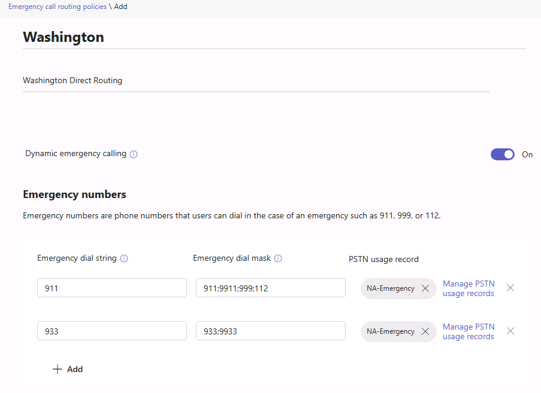


### Task 7 - Configure Emergency Calling Policy

In the following task, you configure external location lookup and emergency call notifications in the Global Emergency Calling Policy. Saving the policy does not verify notification delivery or emergency call completion.

1. You are still signed in to MS721-CLIENT01 as “Admin” and signed into the **Microsoft Teams admin center** as **Allan Deyoung**.

1. Select the three dashes, select **Voice**, and then **Emergency policies.**

1. Select the **Global (Org-wide default)** policy, and change **External location lookup mode** to **On**.

1. In the **Emergency Services Disclaimer** box, enter the following text:

    ```
    If you are working offsite, please set your location by clicking "Location Not Detected" below
    ```

1. Under **Emergency Numbers** select **Add** and then provide the following configuration:

	- **Emergency dial string:** default

	- **Notification mode:** Send Notification Only

	- **Users and Groups for emergency calls notifications:** Alex Wilber

1. Select **Save** and leave the browser window open.

    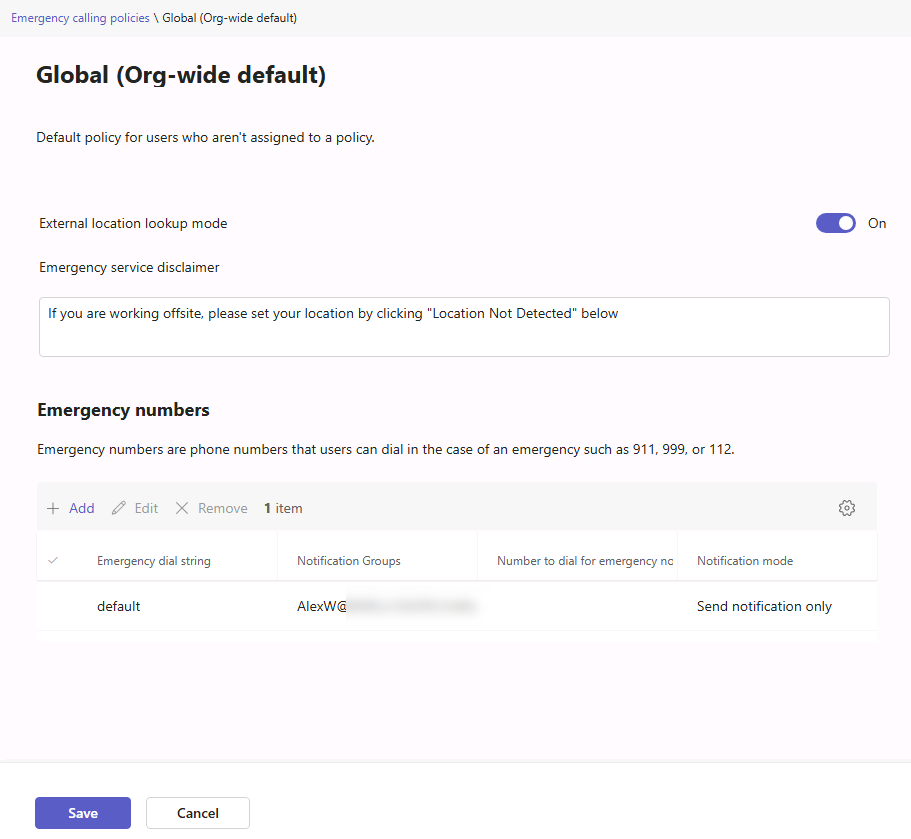


### Task 8 - Configure location-based routing for a network site and gateway

Configure location-based routing (LBR) for the network site, gateway, and test user's calling policy. The Global emergency policies configured in Tasks 6 and 7 apply by default; this task does not assign site-specific emergency policies or demonstrate an override of user policies. Site-specific assignments require selecting policies on the network site.

1. You are still signed in to MS721-CLIENT01 as “Admin” and signed into the **Microsoft Teams admin center** as **Allan Deyoung**.

1. Select the three dashes, select **Locations**, then **Network topology.**

1. Select **Add**, give the network site a name of **Washington** and description of **Washington Network**. Under **Network region**, select **US**. If no regions are listed, select **Add network region**, create **US**, select it, and then select **Link**. Turn **Location based routing** on. Leave both emergency policy selections at **Global (Org-wide default)** for this exercise.

1. Select **Add subnets,** for **IP address** enter **192.168.0.0** and a **Network Range** of **24,** select **Apply,** and then select **Save**

    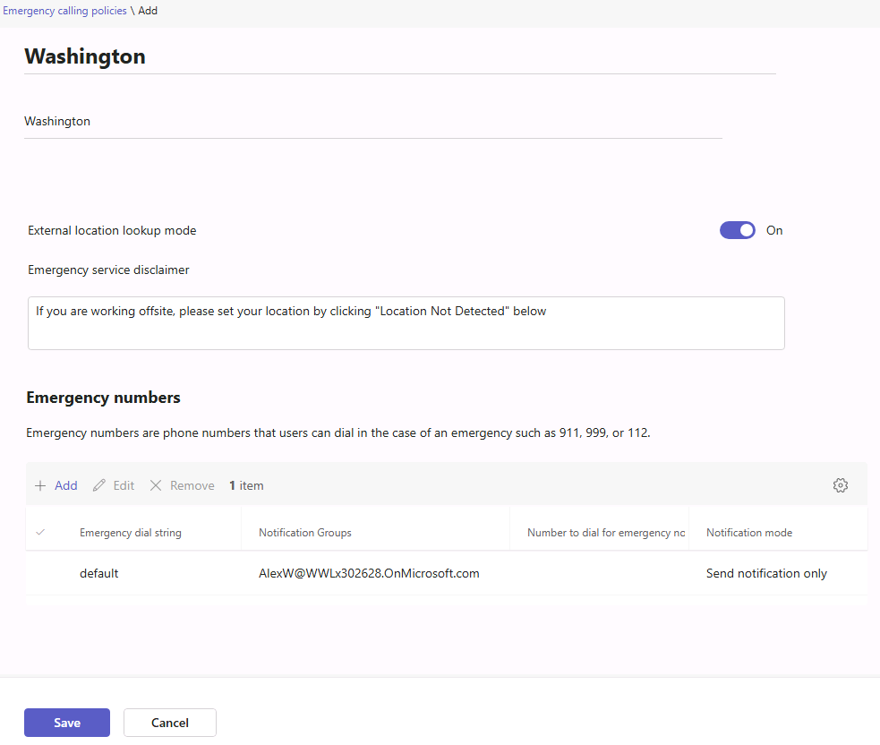

1. Within the Teams Admin Center select **Locations**, then **Network topology.**

1. Select **Trusted IPs**, then **Add**. Enter the workstation IP found in Exercise 1, Task 1 with a **Network Range** of **32**, a **Description** of **Washington.**, and then select **Save**

    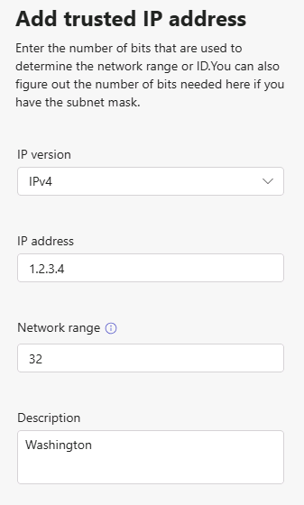

1. Within the Teams Admin Center select **Voice**, then **Direct Routing.**

1. Select **sbc01**, select **settings** and then **edit SBC.**

1. Under **Location based routing and media optimization**, turn on **Location based routing**, select **Gateway site ID** to **Washington**, then select **Save**.

    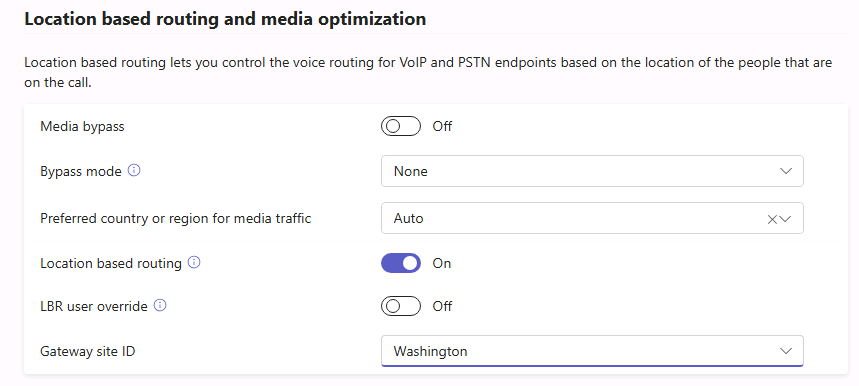

1. Under **Voice > Calling policies**, open the policy assigned to Megan Bowen. Turn on **Prevent toll bypass and send calls through the PSTN** and select **Save**. If her assigned policy is Global, this change affects all users who inherit Global. In a shared tenant, use a dedicated calling policy assigned to Megan instead of changing Global.

1. Leave the browser window open.

You have configured the LBR site, gateway, and calling-policy prerequisites. Confirm the effective user policy and site association before testing. These readbacks do not prove that a call is blocked by LBR or reaches a PSTN destination.

### Task 9 - Modify the Global Dial Plan to Support Dialing 911 and 933

In the following task, you will configure a Microsoft teams dial plan rule to allow 911 and 933 to be sent out to the SBC as is. Without this rule, Microsoft Teams' Tenant Dial Plan rules will normalize this to +1911 as an example.

1. In the PowerShell window from Task 1, run the following commands:

    ```powershell
    $nr1=New-CsVoiceNormalizationRule -Parent Global -Name 'NA-Emergency' -Pattern '^9?(911|933)$' -Translation '$1' -InMemory
    Set-CsTenantDialPlan -Identity 'Global' -NormalizationRules @{Add =$nr1}

    ```

1. In **Voice > Dial plans > Global (Org-wide default)**, confirm the new `NA-Emergency` rule appears above the four-digit extension rule. If it appears below that rule, select it, choose **Move up**, and save the dial plan. The four-digit rule also matches `9911` and `9933`, so rule order matters. Use **Test dial plan** for `911`, `9911`, `933`, and `9933` and verify the expected dial strings without placing calls.

You have configured an emergency-number normalization rule. This test checks translation only; it does not verify delivery through the SBC or an emergency provider.

## Exercise 5: Test and Validate your Configuration

### Exercise Duration

  - **Estimated Time to complete**: 30 minutes

In this exercise, you will validate that the SBC is accepting calls, and test E911 configuration to ensure items created work as expected.

> [!IMPORTANT]
> **Check the call path before Task 1.** Confirm that the SBC is connected to a configured PSTN trunk or test destination and that the intended test number can actually be answered. If no trunk or destination exists, stop the call-dependent steps here. A failed call cannot establish that LBR blocked it, and a connected call cannot be expected after LBR is disabled. You can still review the saved policies, site, gateway, and normalization tests from Exercise 4; record call delivery and LBR behavior as **not verified**.
>
> **Check the emergency test service before Task 2.** Direct Routing does not automatically route `933` to the Microsoft Calling Plan test bot. Coordinate a permitted test service and approved test procedure with your emergency routing service provider or SBC ELIN operator. If no such service is available, do not place a `933` call or claim that PIDF/LO delivery was tested. Never place a `911` call for this lab.

### Task 1 - Validate Location-Based Routing blocks calls not allowed

In this task, you will validate that Location-Based Routing is blocking calls that are not permitted on the gateway defined.

1. Sign in to **MS721-CLIENT02** as “Admin” with the password provided to you. You can find the password in the “Resource” section on the right side of the lab window.

1. Launch the Microsoft Teams client and sign in as Megan Bowen using the **actual username** you checked in Exercise 4, Task 2, and the User Password in the "Resource" section on the right side of the lab window.

1. Once signed into Microsoft Teams, navigate to the **Calls** tab and place a call to "+14255550001". The call should fail and show the below error:

    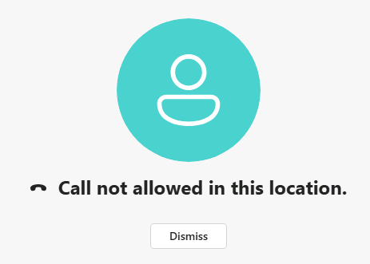

1. To correct this issue, we are going to disable Location-Based Routing. Open the **Microsoft Teams admin center** as **Allan Deyoung**.

1. Select the three dashes, select **Locations**, then **Network topology**, and then select **Washington**. Turn off **Location Based Routing** and then click **Save**

1. Within the Teams Admin Center select **Voice**, then **Direct Routing.** Select **sbc01**, select **settings** and then **edit SBC.**

1. Under **Location based routing and media optimization**, turn off **Location based routing**, clear the **Gateway site ID**, then select **Save**.

    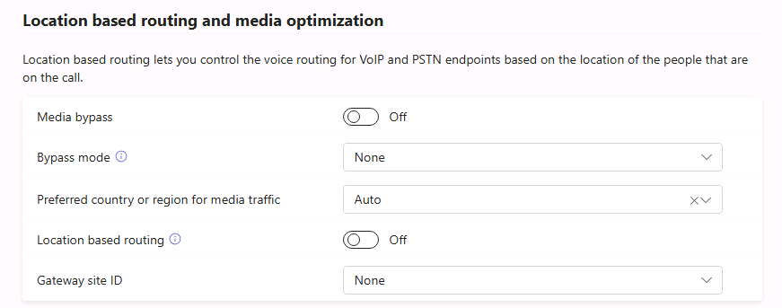

1. After about 30 minutes, attempt to place the call again to +14255550001. The call should connect. The call should show a connected window with a timer in the top left as shown below:

    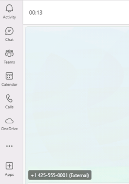

1. Leave the Teams client window open and continue with the next task.

You have successfully placed a test call in the lab through your SBC and validated correct routing.

### Task 2 - Validate PIDF/LO Information is being sent to the SBC

In this task, you will validate that PIDF/LO information from the LIS database in Microsoft Teams is being sent to the SBC. 

1. Sign in to **MS721-CLIENT02** as “Admin” with the password provided to you. You can find the password in the “Resource” section on the right side of the lab window.

1. Launch the **Microsoft Edge** and download the **AudioCodes Syslog Viewer** at: [http://redirect.audiocodes.com/install/syslogViewer/syslogViewer-setup.exe](http://redirect.audiocodes.com/install/syslogViewer/syslogViewer-setup.exe)

1. Run **syslogViewer-setup.exe** once downloaded keeping all defaults in the setup wizard.

1. Once installed, open Syslog Viewer and then press the Chain-Link icon in the top toolbar

    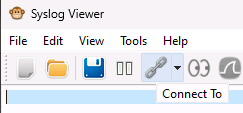

1. On the **Web Connection** window, provide the following configuration and then click **Connect:**

	- **Address:** the IP address or FQDN of your Azure SBC

	- **Username:** sbcadmin

	- **Password:** The MOD Administrator account password. You can find the password in the “Resource” section on the right side of the lab window.

    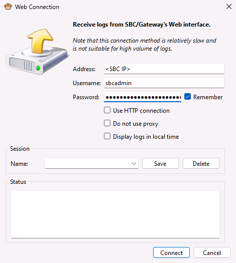

1. Now that the syslog capture is running, open the Microsoft Teams client, click on **Calls** and you should see the Bellevue Address previously created.

    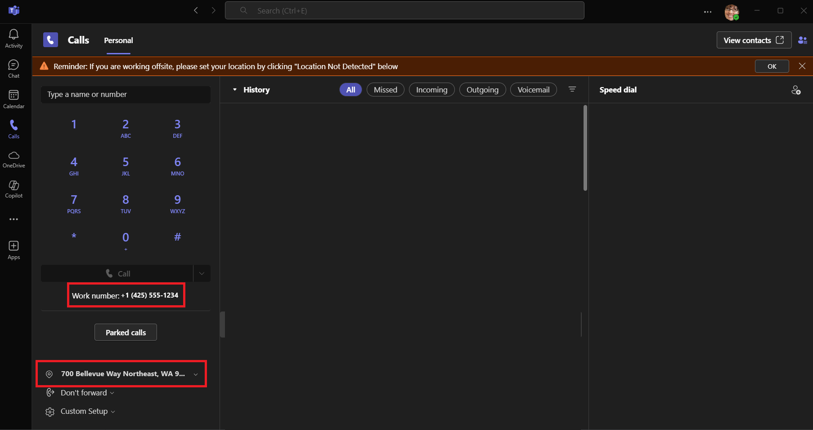

    > NOTE: If you see "Location Not Detected" You can either set your location manually for this test or restart your Microsoft Teams client. The policies created previously can take some time to take effect.

1. Dial **933** in Microsoft Teams and then verify that +1933 does not show in the translation. If it does, restart the Microsoft Teams client.

    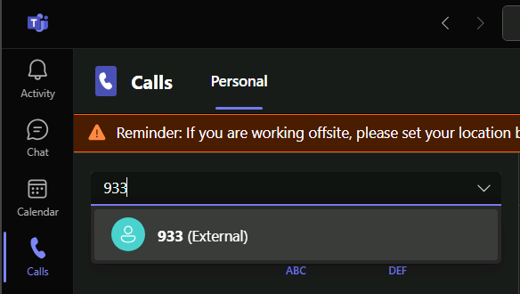

1. Only if you confirmed an approved `933` test service and procedure in the prerequisite check above, select **Call**. End the test as directed by your provider. If no approved service is available, stop this task after checking the dial-plan test; do not start a call.

    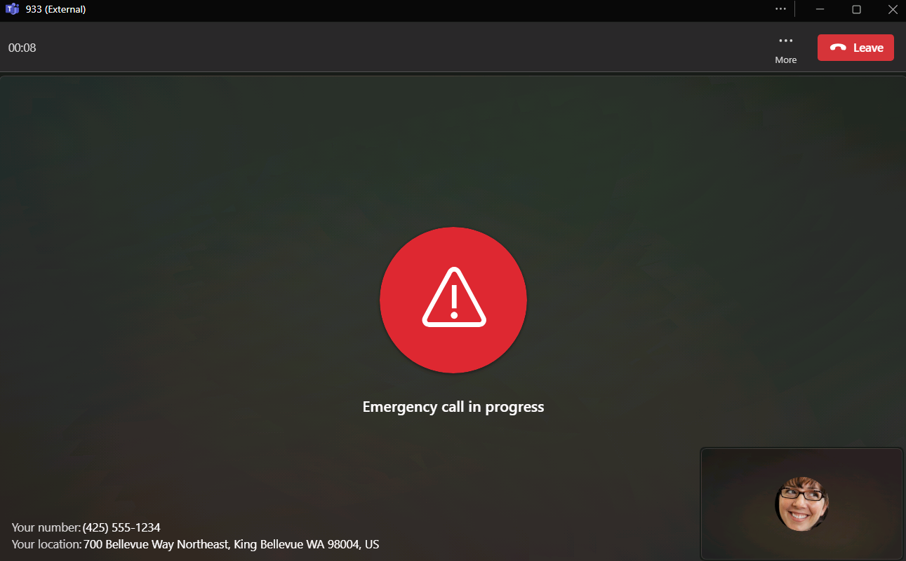

1. On **MS721-CLIENT02** open the AudioCodes Syslog Viewer and press the **Snowflake** button at the top to pause capture. Then Press the **Blue I** to open the sip ladder.

    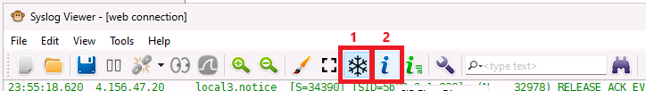

1. In the **SIP Flow Diagram** Window, select **Show Calls** in the dropdown on the middle-right. Then select the call to 933 above this. In the message window below, scroll down and you will see XML PIDF/LO XML Data.

    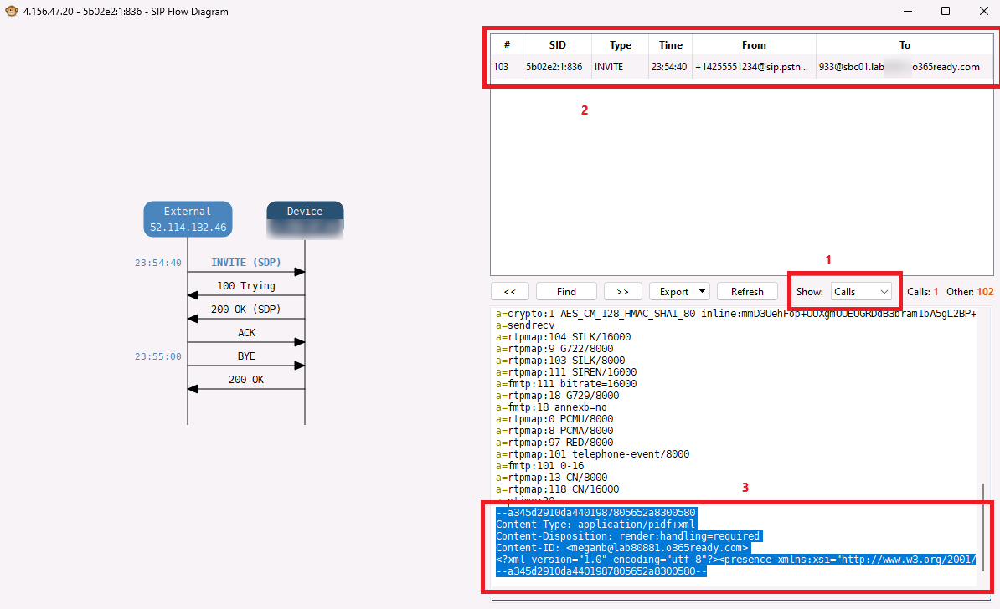

1. If you continue scrolling right, you will see the XML encoded version of your Emergency Address.

    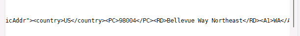

If you completed an approved test call and observed the PIDF/LO payload in the SBC log, you have verified its delivery to the SBC for that test. Otherwise, record PIDF/LO delivery as **not verified**; saved Teams policies and an ELIN field alone do not verify emergency service.