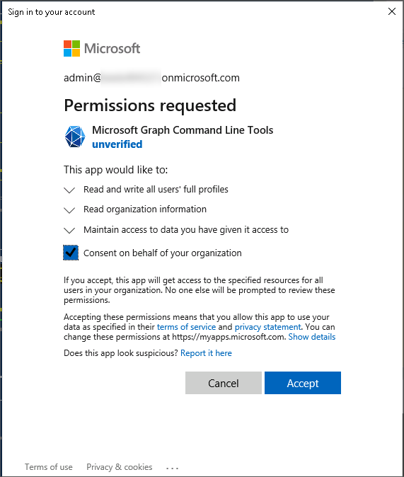

---
lab:
    title: 'Lab 04: Manage your Teams Voice Environment'
    type: 'Answer Key'
    module: 'Learning Path 02: Manage Teams collaboration communications systems'
---

# Lab 04: Manage your Teams Phone environment
# Student lab answer key

## Lab Scenario

Contoso needs to make changes to existing users who are enabled for Teams Voice and add Teams Devices. Whilst making changes, support tickets have been raised due to problems users have reported with connectivity and troubleshooting must be performed.

## Lab Duration

  - **Estimated Time to complete**: 180 minutes

## Instructions

> [!IMPORTANT]
> Throughout this lab, you will use PowerShell cmdlets that must be customized for your specific lab configuration. In the instructions below, when you see &lt;LAB NUMBER&gt; in a PowerShell command, you should replace it with the LAB NUMBER obtained in Lab 3, Exercise 1, Task 2.
> You will also see &lt;TENANT NAME&GT; used in PowerShell commands and should replace it with the Microsoft 365 TENANT NAME (e.g. M365x01234567) for your Microsoft 365 account.

## Exercise 1: Manage voice users

### Exercise Duration

  - **Estimated Time to complete**: 30 minutes

In this exercise, you will perform day-to-day management tasks for Teams Phone users.

### Task 1 - Change user call pickup settings

In this task, you will sign into the Microsoft Teams admin center and make changes so that Isaiah’s colleague Allan can pick up their calls.

1. You are still signed in to MS721-CLIENT01 as “Admin” and signed into the **Microsoft Teams admin center** as **Allan Deyoung**.

1. In the left navigation menu select **Users** and **Manage users** and find **Isaiah Langer** and select the name to open the user’s properties.

1. On the user’s properties page, select the **Voice** tab.

1. Under the **Call answering rules** section, also allow **Group call pickup**.

1. Select **Manage call group**, then select **Add people**.

1. Search for **Allan Deyoung** and select **Add** to include them in the **People list**, then select **Apply**.

1. As Allan would prefer an on-screen notification to show, rather than Teams to ring when Isaiah is unavailable, find **Allan Deyoung** in the Group Call Pickup list. 

1. In the **Notification** column, update the value from **Ring** to **Banner** from the drop-down menu. Then select **Save**.

1. In the left navigation menu select **Manage users** to exit the properties page for Isaiah Langer.

The changes are now applied, and a banner will show for calls directed to Isaiah on Allan’s Teams client, allowing them to answer if Isaiah is unable.

### Task 2 - Enable user for Teams Direct Routing

In this task, an existing user who isn’t enabled for voice services must be enabled for Direct Routing. We’ll ensure the necessary licenses are assigned, then enable the user for Direct Routing.

1. You are still signed in to MS721-CLIENT01 as “Admin” and signed into the **Microsoft Teams admin center** as **Allan Deyoung**.

1. Select Start, type PowerShell and open a non-Administrative **Windows PowerShell** window.

1. Use the following cmdlet to import the module and connect to Microsoft Teams:

    ```powershell
    Import-Module MicrosoftTeams  
    Connect-MicrosoftTeams
    ```

1. When prompted for credentials, enter the credentials of **Allan Deyoung**.

1. Run the Grant-CsOnlineVoiceRoutingPolicy, the command assigns a per-user online voice routing policy to one or more users. Online voice routing policies manage online PSTN usages for Phone System users:

    ```powershell
    Grant-CsOnlineVoiceRoutingPolicy -Identity NestorW@lab<LAB NUMBER>.o365ready.com -PolicyName "North America"

    ```

1. Type the following command to enable Nestor Wilke for Direct Routing:

    ```powershell
    Set-CsPhoneNumberAssignment -Identity NestorW@lab<LAB NUMBER>.o365ready.com -PhoneNumber "+14255551122" -PhoneNumberType DirectRouting
    ```


1. Close the PowerShell Window at the end of the task.

Nestor is now configured to use Direct Routing.

### Task 3 - Configure call delegation

In this task, you will configure Nestor Wilke so that Allan Deyoung is a delegate of Nestor Wilke and is allowed to make calls on their behalf, but not receive calls.

1. You are still signed in to MS721-CLIENT01 as “Admin” and signed into the **Microsoft Teams admin center** as **Allan Deyoung**.

1. Select **Users** and **Manage users**.

1. Find **Nestor Wilke** and select the name to open the user’s properties.

1. On the user’s properties page, select the **Voice** tab.

1. Under the **Call answering rules** section, also allow **Call delegation**.

1. Scroll down to **Call delegation** and select **Add people**

1. Search for **Allan Deyoung**, and select **Add** to include them on the **People list**, then select **Apply**.

1. In the list below **Call delegation**, find **Allan Deyoung** and leave the **Permission** value as **Make calls**. Switch the **Allow changing call settings** radio button to **Off**.

1. Select **Save**. 

1. Leave the browser window open.

The changes are now active.

### Task 4 - Enable audio conferencing

In this task, you validate audio conferencing is enabled for Isaiah Langer and change the default settings.

1. You are still signed in to MS721-CLIENT01 as “Admin” and signed into the **Microsoft Teams admin center** as **Allan Deyoung**.

1. Select **Meetings** and **Audio Conferencing**.

1. Select **Add** from **Audio Conferencing policies**.

1. Enter **No toll-free numbers** for **Name** and **No toll-free numbers in meetings** for **Description**

1. Turn off **Include toll-free numbers in meetings created by users of this policy** and **Save**.

1. Select the row with **No toll-free numbers** policy that was just created and select **Assign users**.

1. Search for **Isaiah** from **Manage users**, select **Isaiah Langer**, **Add**, **Apply** and **Confirm**.

1. Select **Users** and **Manage users**.

1. Find **Isaiah Langer** and select the name to open the user’s properties.

1. On the user’s properties page, select the **Account** tab and under **Audio Conferencing** select **Edit**.

1. Check if **Audio Conferencing** is switched to **On**.

1. Select the **Toll number** dropdown and change it to **+1 689 206 9333 Orlando, United States**. (**Note**: That particular number might not be available.  Choose another number as appropriate.)

1. Select **Apply**.

1. Leave the browser window open.

You have successfully modified the audio-conferencing settings for Isaiah Langer. 

### Task 5 - Assign a dial out policy

In this task you will assign a new Dial out policy to Megan Bowen, to restrict her from making outbound calls.

1. You are still signed in to MS721-CLIENT01 as “Admin” and signed into the **Microsoft Teams admin center** as **Allan Deyoung**.

1. Select **Users** and **Manage users**.

1. Find **Megan Bowen** and select the name to open the user’s properties.

1. On the user’s properties page, select the **Voice** tab.

1. Under **Outbound calling**, select **Don’t allow** from the drop-down menu.

1. Wait until the notification **The dial out policy was assigned** shows, then select **Manage users** to exit the properties page.

1. Select the circle with the **AD** initials in the upper right-side and select **Sign out**.

1. Close the browser window open for the end of this task.

Outbound calls from Megan Bowen have been restricted.

## Exercise 2: Configure call queues and auto attendants

### Exercise Duration

  - **Estimated Time to complete**: 45 minutes

In this exercise, you will gain an understanding of how to configure Call Queues and Auto Attendants. Auto attendant being configured today is for the Sales Team. The Sales Team takes sales queries and then applies them to different parts of the business. On this occasion, Alex Wilber is going to be part of the call queue and later in the module, we will see how to then assign it to a Team.

### Task 1 - Create a call queue in the Teams admin center

In this task, you will create a call queue. A call queue is a group of agents that you can direct calls to.

1. You are still signed in to MS721-CLIENT01 as **Admin** and have the **Microsoft Teams admin center** open as **Allan Deyoung**.

1. Select **Voice** and then select **Call queues**.

1. Select **Add** and enter the **Sales CQ** as the name

1. Under **Resource accounts**, select **Add**.

1. Enter **Sales** in the search box, when no results are found, select **Add resource account**.

1. Enter **Sales CQ** as **Display name**

1. **SalesCQ** as **Username** and leave the domain as-is.

1. **Resource account type** select **Call queue**, then select **Save**.

1. Once saved, you will see Sales CQ under accounts to add, select **Add**.

1. You do not need to assign a Calling ID for this lab.

1. Set **Language** to **English (United States)**.

1. Select **Next** to skip **Greeting and music** for now, and go to **Call answering**. 

1. Under **Call answering** select **Choose users and group > Add users**, search for Isaiah Langer. and select **Add**.

1. Leave the other options as default.

1. Scroll down the page and select **Submit**. You will see **Sales CQ** in the call queues list, but with a notice that the Resource account is unlicensed. 

    > [!NOTE]
    > All resource accounts associated with voice applications need a Microsoft Teams Phone Resource Account license to work, but not having one for this lab will not prevent completion. Microsoft 365 does not offer trial licenses for Resource Accounts, and despite being free, administrators are still required to enter billing information.

1. Leave the Teams admin center Open for the next steps.

You have successfully created the Sales CQ call queue and added Isaiah Langer as an agent.

### Task 2 - Create an auto attendant for the Sales call queue

Now we will create an auto attendant and direct one of the options to send calls to our Sales CQ call queue. This will ready the Microsoft 365 Auto Attendant to become functional. 

1. You are still signed in to MS721-CLIENT01 as “Admin” and have the **Microsoft Teams admin center** open as **Allan Deyoung**.

1. Under **Voice**, select **Auto Attendants** and select **Add**.

1. Enter **Sales AA** for the name. 

1. Time zone of **(UTC-08:00) Pacific Time (US…)**,

1. Select **English** or your preferred language.

1. select **Next**.

1. Under **Call flow**, select **Add a greeting message** and enter, “Thank you for calling Contoso, your call is important to us, please be patient while we handle your call”.

1. Under **Call routing options**, select **Redirect Call**, then select Redirect to **Voice App**, enter **Sales CQ**, then select **Next**

1. Under **Set business hours** leave the defaults and select **next**, 

1. Under set Holiday call settings select **Next**, 

1. Under Dial scope select **Next**.

1. Under **Resource Accounts**, Select **Add**, enter **Sales AA** in the search box, then select **Add Resource Account**, enter **Display Name** of **Sales AA**, Username is **SalesAA**, and **Resource account type** of **Auto Attendant**, select **Save**.

1. Select **Add**, select **Submit** under **Resource Accounts** menu.

1. You will see your Sales AA auto attendant in the auto attendants list

1. Leave the Teams Admin Center open for the next task

You have successfully created an Auto Attendant, and aligned it to a Call Queue

### Task 3 – Configure a Call Queue to use a channel

Collaborative calling enables you to connect a call queue to a channel in Teams. Users can collaborate and share information in the channel while taking calls in the queue. Instead of defining the agents in the Teams Admin Center, the agents are defined by who are members of the team.

1. You are still signed in to MS721-CLIENT01 as “Admin” and have the **Microsoft Teams admin center** open as **Allan Deyoung**.

1. Under **Voice**, and **Call Queues**, select **Sales CQ**.

1. Under **Call answering** select **Choose a team**, select **Add a channel**. 

1. Type **Sales Group**, select the **General** channel and select **Add**, select **General**, select **Apply** and select **Submit**.  

1. Leave the Teams Admin Center open for the next task

You have successfully assigned the call answering for the Call Queue to the General channel within the Sales Group team.

### Task 4 - Configure a Call Queue to forward to voicemail if busy

By default, if a call to a call queue isn't answered by an agent within the maximum wait time, it will be disconnected. We would like to configure unanswered calls to go to voicemail instead. The voicemail must be an Office 365 Group voicemail.

1. You are still signed in to MS721-CLIENT01 as “Admin” and have the **Microsoft Teams admin center** open as **Allan Deyoung**.

1. Under **Voice**, and **Call Queues**, select **Sales CQ**

1. Under **Exception handling > Call timeout**, select **Redirect this call to**, select Redirect to, from the drop-down menu select **Voicemail (Shared)**

1. In the search type **Sales Group**, select **Sales Group**, 

1. Set Enable **Transcription On**

1. Select **Add a greeting message** and type **We are unable to take your call, please leave a message and we will be back with you as soon as possible.** 

1. Select **Submit**

You have successfully assigned a voicemail to the Call Queue should it reach a time out period. 

### Task 5 - Explore conference mode toggle

In this task, you will enable conference mode that will pass the call between the inbound calls more quickly.

1. You are still signed in to MS721-CLIENT01 as **Admin** and have the **Microsoft Teams admin center** open as **Allan Deyoung**.

1. Under **Voice**, and **Call Queues**, select **Sales CQ**.

1. Under **Call answering**, find **Conference mode** and validate the toggle is **On**.

1. Click **Submit**.

You have successfully enabled conferencing mode for **Sales CQ** call queue.

### Task 6 - Set holiday modes within AA

In this task, you will create the relevant holiday configuration. Holidays differ from country to country but in this instance, we will just create a new holiday time that’s relevant to you. 

1. You are still signed in to MS721-CLIENT01 as “Admin” and have the **Microsoft Teams admin center** open as **Allan Deyoung**.

1. In the Microsoft Teams admin center, go to **Voice &gt; Holidays**.

1. Select **Add** to start the creation of a new holiday.

1. Enter a name for the holiday.

1. Select **Add new date**.

1. Under **Start time**, select the calendar icon and choose the date when you'd like the holiday to begin.

1. Use the drop-down list to select a start time for the holiday.

1. Under **End time**, select the calendar icon and choose the date when you'd like the holiday to end.

1. Use the drop-down list to select an end time for the holiday. **The End** time must be after the **Start time**.

1. Optionally, add more dates for recurring holidays.

1. Select **Save**.

You have successfully created a holiday relevant to your area and assigned it to a Call queue. 

### Task 7 - Import MP4 file for custom music on hold

In this task, you will obtain a free MP3 to the music on hold solution for the Sales Call Queue

1. You are still signed in to MS721-CLIENT01 as “Admin” and have the **Microsoft Teams admin center** open as **Allan Deyoung**.

1. Close the tab and switch back to the Microsoft Teams admin center.

1. Under **Voice** and **Call Queues**, select **Sales CQ**.

1. Select **Greeting and music**.

1. Under **Music on hold**, select **Play an audio file**.

1. Select **Upload file**, navigate to the **C:\Labfiles** folder, select **MoH-sample.mp3** and select **Open**.

1. Select **Submit**.

1. Select the circle with the **AD** initials in the upper right-side and select **Sign out**.

1. Close all browser windows currently open.

You have successfully signed into your test clients and assigned a new MP3 file to the call queue.

## Exercise 3: Manage Teams devices

### Exercise Duration

  - **Estimated Time to complete**: 30 minutes

In this exercise, we will begin the provisioning process for a Teams Phone. We will then create and license an account to use with a Microsoft Teams Room.

### Task 1 - Perform remote provisioning of Teams Phones

> [!NOTE]
> The instructions provided here are for reference only and will not complete successfully.  To view the demonstration of these steps, visit [https://www.microsoft.com/videoplayer/embed/RWN0wC](https://www.microsoft.com/videoplayer/embed/RWN0wC).

In this task, you will provision a Teams Phone device in the Teams administration center.

1. Open Microsoft Edge from the taskbar and browse to the **Microsoft Teams admin center** at [https://admin.teams.microsoft.com](https://admin.teams.microsoft.com/).

1. Sign in as **Allan Deyoung**, who has the Teams Administrator role.

1. Select **Teams devices** and then select **Phones**.

1. Select **Actions** in the upper right corner, then from the drop-down menu, select **Provision Devices**.

1. The **Provision devices** page shows. Under **Waiting on activation** select **Add MAC addresses manually**.

1. In the **Add MAC** addresses dialogue, enter the MAC address of **ab-cd-12-34-ef-56** and for location enter **Bellevue**, for the Teams IP Phone.

	In a production environment, you would enter the actual MAC address of the device you want to connect.

1. Select **Save** to save the change.

1. The **Waiting on activation page** will show the Teams IP Phone’s MAC address and location. Select the MAC address from the list, then select **Generate verification code**

    **Since there are no physical phones to connect to the lab environment, the lab is complete here. The steps below are strictly informational to demonstrate the remainder of the process. You may now proceed to the next task**.

1. On the Teams IP Phone, select **Settings,** then choose **Provision phone**

1. Enter the generated verification code on the Teams IP Phone, then select **Next**

1. **Device provisioned successfully** should display on the Teams IP Phone screen.

1. In the Teams Admin Center, on the **Provision devices** page, choose **Refresh**, then choose the **Waiting for sign in** tab. The Teams IP Phone will show in the list.

1. Select the circle in the upper right-side with the **AD** initials and select Sign out.

1. Close the browser window at the end of this task.

The Teams IP Phone can now be signed in to by a user or remotely signed in to a common area account.

### Task 2 - Create a resource account and Exchange Online mailbox for Teams Rooms

In the following task, we will use a combination of Microsoft Graph PowerShell, Exchange Online PowerShell, and Teams PowerShell to create and configure a resource account with an Exchange Online mailbox. 

1. Make sure you have the latest Exchange Online PowerShell modules installed with the following cmdlet. If you receive an **Untrusted repository** prompt, select **[A] Yes to all**.

    ```powershell
    Install-Module ExchangeOnlineManagement

    ```

1. Connect to Exchange Online PowerShell, when prompted for credentials, enter the credentials of **Allan Deyoung**:

    ```powershell
    Connect-ExchangeOnline
    
    ```

1. Run the following command to create a new resource account with an Exchange Online mailbox.  Replace &lt;TENANT NAME&gt; and &lt;USER PASSWORD&gt; with the correct values:

    ```powershell
    New-Mailbox -MicrosoftOnlineServicesID mtr01@<TENANT NAME>.onmicrosoft.com -Name "mtr01" -Alias mtr01 -Room -EnableRoomMailboxAccount $true -RoomMailboxPassword (ConvertTo-SecureString -String '<USER PASSWORD>' -AsPlainText -Force)

    ```

1. Run the following command to configure the settings on the room mailbox:

    ```powershell
    Set-CalendarProcessing -Identity "mtr01" -AutomateProcessing AutoAccept -AddOrganizerToSubject $false -DeleteComments $false -DeleteSubject $false -ProcessExternalMeetingMessages $true -RemovePrivateProperty $false -AddAdditionalResponse $true -AdditionalResponse "This is a Microsoft Teams Meeting room!"
    ```

### Task 3 - Configure and license resource account with Microsoft Graph

Next, you will use Graph PowerShell to assign the Teams Rooms Pro trial license you acquired in a previous lab and configure the resource account password policy.

1. Open Windows PowerShell as **Administrator** and make sure you have the latest Microsoft Graph PowerShell module installed with the following cmdlet. If you receive an **Untrusted repository** prompt, select **[A] Yes to all**.

    > [!NOTE]
    > This command can take some time to run, wait for the prompt in PowerShell to return or not all the Graph sub-modules will install.

    ```powershell
    Install-Module Microsoft.Graph -Force -AllowClobber

    ```

1. Now that the resource account and mailbox have been created, set the usage location and configure the password to never expire. When prompted for credentials, enter the credentials of **MOD Administrator** and check the box give consent for Graph to manage your organization:

    

    ```powershell
    Connect-MgGraph -Scopes User.ReadWrite.All, Organization.Read.All

    Update-MgUser -UserId "mtr01@<TENANT NAME>.onmicrosoft.com" -UsageLocation US -PasswordPolicies DisablePasswordExpiration

    ```

1. To assign the license, use the **Set-MgUserLicense** cmdlet, and convert the license SKU ID into a PowerShell license type object which is then assigned to the resource account. In the following example, we search for the **Sku  Part Number** to obtain the **SkuId** and then assign it to the account **mtr01@&gt;TENANT NAME&lt;.onmicrosoft.com**:

    ```powershell
    
    $MTRProSku = Get-MgSubscribedSku -All | Where SkuPartNumber -eq 'Microsoft_Teams_Rooms_Pro'
    
    Set-MgUserLicense -UserId "mtr01@<TENANT NAME>.onmicrosoft.com" -AddLicenses @{SkuId = $MTRProSku.SkuId} -RemoveLicenses @()

    ```

Upon completion of these steps, you can view the new Teams Room account in the Microsoft 365 admin center and the account can now be signed-in to a Microsoft Teams Room system using the password provided earlier.

### Task 4 - Prepare to manage devices by creating tags in the Teams Admin Center

In this task, you will configure device tags to allow Contoso to identify devices based on the type of employee that will use the device so that the importance of the device can be identified by a support technician. We will configure two tags, **Executive** and **Contact Center**.

1. You are still signed in to MS721-CLIENT01 as “Admin” and signed into the **Microsoft 365 admin center** as **MOD Administrator**.

1. Navigate to the Microsoft Teams admin center at [https://admin.teams.microsoft.com](https://admin.teams.microsoft.com/).

1. Select **Teams devices**, then select **Phones**.

1. Select **Actions**, then from the upper right-side and select **All Device tags**.

1. From the **Manage tags** dialogue, select **Add**.

1. Enter **Executive** and choose the **Save** icon.

1. Select **Add**.

1. Enter **Contact Center** and select the **Save** icon.

1. Select **Cancel** to close the Manage Tags dialogue.

1. Leave the browser window open for the next task.

As devices are provisioned or joined, they will be displayed in the **Devices** section of the Teams Admin Center. Although no devices are available during the lab exercise, you will expect after a device is added that you can then assign the tags to a device, by selecting the **Device** in the list and then selecting **Manage Tags**, then searching for a tag, and selecting **Apply**.

After applying a tag to devices, you can then use the **Search** box in the device list to choose **Select what you want to search by**, and then choose **Tags**. Enter the tag you’ve assigned to devices, and these devices will be displayed in the search results.

## Exercise 4: Monitor and troubleshoot Teams Phone

### Exercise Duration

  - **Estimated Time to complete**: 120 minutes

In this exercise, you will perform exercises to help troubleshoot specific issues and monitor call use and quality.

### Task 1 - Run self-help diagnostics tool in Microsoft 365 admin center

Megan Bowen has reported they are not receiving voicemails. Microsoft offers some Self-help diagnostics tools that can be run before raising a support ticket. In this task, you will run the Voicemail diagnostic that validates that a user is properly configured to use Voicemail in Teams.

1. You are still signed in to MS721-CLIENT01 as “Admin” and signed into the **Microsoft 365 admin center** as **MOD Administrator**.

1. Navigate to the **Microsoft 365 admin center** at admin.microsoft.com.

1. On the left menu, select **Show all**, then **Users** and **Active Users**. 

1. Find Megan Bowen and note down their username and email address, you will need it to run the test. Note this is one value in the format MeganB@lab&lt;LAB NUMBER&gt;.o365ready.com

1. On the left menu, select **show all**, then **Support** and under the support menu **Help & support**.

1. In the **How can we help?** dialogue, enter **Diag: Voicemail** and press enter to jump straight to the voicemail diagnostics test.

1. You will see the following diagnostics test **We understand you are having issues with receiving voicemails in Teams**. Under Username or Email enter Megan Bowen’s Username and email.

1. Select **Run Tests**.

1. The result should be **No Teams Voicemail issues were detected**.

You have successfully used the Microsoft 365 self-help diagnostics to confirm that there are no configuration issues with Megan Bowen’s voicemail.

### Task 2 - Break a dial plan and check the issue

In this lab, we are going to create and then break a dial plan rule and check Call Analytics to see the issue.

Firstly, we will create a dial plan rule, in this scenario, the organization would like the short code 7786 to translate to +1-877-696-7786.

1. You are still signed in to **MS721-CLIENT01** as “Admin” and signed into the **Microsoft 365 admin center** as **MOD Administrator**.

1. Navigate to the **Microsoft Teams admin center** at [https://admin.teams.microsoft.com](https://admin.teams.microsoft.com/).

1. Select **Voice** and **Dial Plan**.

    1. Select the **Global (org wide default)** dial plan.
    
    1. Under Normalization rules select **Add** to get to the add new rule dialogue.
    
    1. For **Name** enter **Converts 7786 to US support number**.
    
    1. For **Description** enter **Converts 7786 to US support number**.
    
    1. Ensure **Basic** rule is selected, it should be by default.
    
    1. Tick **The number dialed begins with** and enter **7786**.
    
    1. Tick **The length of the number being dialed is** and enter **4**.
    
    1. Ensure **Exactly** is selected for length of number to be dialed.
    
    1. Tick **Add this number to the beginning** and enter **+1877696**.
    
    1. Test the rule by entering **7786** and pressing Test. The output should be **+18776967786**, if the output is correct select **Save**.
    
    1. In the list of normalization rules, select the rule you just created and choose **Move up** from the action menu at the top of the table.
    
    1. You will see your new rule in the global dial plan, select **Save**. If you receive an error while attempting to save, enter a number in **External dialing prefix** for the Dial Plan, remove it again, and then click **Save**.
    
    1. Close the browser window.

You have successfully added a normalization rule to a dial plan to meet the extension dialing organizational requirement. We will now confirm the rule works with a real user.

1. Sign into **MS721-CLIENT02** as **Admin**. You may still be signed in from a previous task.

1. From the desktop, select and run **Microsoft Teams**.

1. Sign in as Megan Bowen on the Teams Desktop client.

1. You will be prompted with **Stay signed into all your apps** select **No, sign in to this app only**.

1. If you are prompted with the Teams welcome information, select **X** in the top corner to close the window.

1. If you are prompted **Get the Teams mobile app**, select the top right **X** to close the prompt.

1. Select the calls button on the left rail.

1. Dial **7786** and press call.

1. If your lab machine prompted you to use your microphone select **Allow**.

1. If you are prompted by Windows Defender Firewall for Microsoft Teams select **Allow Access**.

1. Note that the number has been translated to +18776967786 and the call connects. It is a contact center that will stay connected for around a minute and then automatically hang up.

1. Press the red hang-up button to disconnect the call.

Now we have proven the rule works, we will break the rule and confirm the rule.

1. You are still signed into MS721-CLIENT01 as “Admin” from the previous task.

1. Open Microsoft Edge from the task bar and browse to the Microsoft Teams admin center at [https://admin.teams.microsoft.com](https://admin.teams.microsoft.com/).

1. Select **Voice** and **Dial Plan**. 

1. Select the **Global (org wide default)** dial plan.

1. Select the **Converts 7786 to US support number** rule to edit it.

1. Note it will be converted to an advanced regular expression now.

1. In the field the number dialed matches this regular expression, it will read **^(7786)$**.

1. Remove the first 7 to now read, **^(786)$**.

1. Test the rule by entering 7786 and pressing Test. The output should be the translated number isn't an E.164 phone number.

1. Select **Save**.

1. At the dial plan page, again select **Save** to update the global dial plan.

Now we have broken our dial plan, we will sign into Teams again and prove it is no longer working

1. You are still signed into MS721-CLIENT02 as "Admin" from the previous task.

1. From the desktop select and run the Microsoft Teams client.

1. Select Get started.

1. When prompted for sign in, enter Isaiah Langer’s username and select **Next**.

1. When prompted enter Isaiah Langer’s password and select **Next**.

1. You will be prompted with “Stay signed into all your apps” select **No, sign in to this app only**.

1. If you are prompted with the Teams welcome information.

	- **Bring your team together,** select **Next**.

	- Chat 1:1 and with groups, select **Next**.

	- Connect through online meetings, select **Next**.

	- Files, notes, apps, and more, all in one place, select **Next**.

	- You're ready!, select **Let’s go**.

1. Once signed in, Select the calls button on the left rail.

1. Dial 7786 and press call.

1. If your lab machine prompted you to use your microphone select **Allow**.

1. If you are prompted by Windows Defender Firewall for Microsoft Teams select **Allow Access**.

1. Note that Teams attempts to ring the number but it does not connect or you get the Teams Announcement Service telling you the call cannot connect.

1. Press the red hang-up button to disconnect the call.

You have successfully created a dial plan, proven it works, broken it and seen the user impact of a broken dial plan.

### Task 3 - Review Call Health Real Time Stats on a live call

Users can check on the network performance of their calls live during the call. In this task, we will test the Team call health feature

1. You are still signed into MS721-CLIENT02 as “Admin” from the previous task

1. From the desktop select and run **Microsoft Teams** client

1. You should still be signed in as **Isaiah Langer**.

1. Select the calls button on the left rail.

1. Dial +1-877-696-7786 and press call.

1. If your lab machine prompted you to use your microphone select **allow**.

1. If you are prompted by Windows Defender Firewall for Microsoft Teams select **Allow Access**.

1. The call should establish and you should hear a Microsoft support virtual agent.

1. While on the call, press the ellipsis (three dots) in the top right of the Teams client and select **Settings**, then **Call health**.

1. You will see a right-hand menu with the network and audio performance.

Call Health shows you the following:

#### Network Metrics

| Metric| Description |
|:---------|:---------|
| Roundtrip time| In group calls, it's the response time between your system and the Teams Service. In one-on-one calls, it's the response time between your system and the other participant's. Lower is better. |
| Received packet loss| In group calls, it's the response time between your system and the Teams Service. In one-on-one calls, it's the response time between your system and the other participant's. Lower is better. |
| Teams send limit| The max limit of data Teams can send based on the current network conditions and how it's used. This isn't your ISP speed limit. |
| Teams send limit| The max limit of data Teams can receive based on the current network conditions and how it's used. This isn't your ISP speed limit. |

#### Audio

| Metric| Description |
|:---------|:---------|
| Sent bitrate| The amount of audio data sent. High is better. |
| Sent packets| Data gets sent over the network in packets. This value is the number of data packets sent during a call. |
| Roundtrip time| Response time between your system and the Teams server. Lower is better. |
| Sent codec| The codec used for encoding audio sent by your system. |
| Received jitter| The distortion in audio caused by inconsistent audio packet arrival times. Lower is better |
| Received packets| The number of audio data packets received |
| Received packet loss| The result of a poor network connection, this is the percentage of audio data packets not received by your system. Lower is better |
| Received codec| The codec used for encoding audio data received by your system. |

### Task 4 - Use the Microsoft 365 connectivity test tool

A Teams Phone user working from home reports they are having call quality issues, we will use the Microsoft 365 connectivity test tool to check they are tasking an optimum network path to Office 365 and check their basic Teams network performance

1. Sign in to **MS721-CLIENT01** as “Admin”. In this task, we will treat MS721-CLIENT01 as the PC of the user with the problem.

1. Open Microsoft Edge from the task bar and browse to [https://connectivity.office.com/](https://connectivity.office.com/).

1. Ensure **Automatically detect location** is selected and select **Run test**.

1. Microsoft Edge may prompt you that connectivity.office.com wants to know your location, if it does, select **Allow**.

1. The browser will prompt you to Open or Save as a new download for the .NET runtime files, select **open** and download any additional packages as needed.

1. Once all teh downloads are installed, the Office 365 Network Onboarding Advanced Tests box will appear and start running tests.

1. You will get a prompt to install .Net Core, would you like to download it now, click Yes

1. This will take you to the .Net core download site, Under Run desktop apps select Download x64

1. When the download is complete, select open file

1. The Microsoft Windows Desktop Runtime installer will appear, click Install

1. A UAC prompt will appear, click Yes

1. Once the .Net core installer is complete, click close

1. Close Microsoft Edge

1. Open Microsoft Edge and browse to [https://connectivity.office.com/](https://connectivity.office.com/).

1. Ensure **Automatically detect location** is selected and select **Run test**.

1. Microsoft Edge may prompt you that connectivity.office.com wants to know your location, if it does, select **Allow**.

1. The browser will prompt you to Open or Save as a new download, select **open** and Office 365 Network Onboarding Advanced Tests box will appear and start running tests.

1. You will see a green progress bar and “testing in progress”, wait for all tests to complete. You maybe prompted with Windows Defender Firewall prompts from NetworkOnboardingClient – select **Allow Access**.

1. Once the Office 365 Network Onboarding Advanced Tests box says testing is complete, select **Close**.

1. Microsoft Edge should still be open, you can now see a summary of the results

1. Select Details and scroll down to review the following:

	- Exchange service front door location and SharePoint Online front door locations should have green ticks.

	- Under Microsoft Teams look for green ticks for connectivity, packet loss, latency and jitter.

If the user does not have green ticks for Microsoft teams network performance, check to see if they are using WiFi or can wire directly into their router to confirm if it is an ISP issue or a local network/WiFi issue.

If the front door locations do not have green ticks and they are not using any VPN we may need to contact their local ISP for support. 

You have successfully tested network connectivity and performance from a user’s machine using the Microsoft 365 network test tool.

### Task 5 - Inspect PSTN Usage Reports

The Teams PSTN (Public Switched Telephone Network) usage report in the Microsoft Teams admin center gives you an overview of calling and audio conferencing activity in your organization. 

In this task, we will review the PSTN Usage report.

1. You are still signed into MS721-CLIENT01 as “Admin” from the previous task.

1. Open Microsoft Edge from the task bar and browse to the **Microsoft Teams admin center** at [https://admin.teams.microsoft.com](https://admin.teams.microsoft.com/).

1. You should be singed in as **MOD Administrator**.

1. Select **Analytics &amp; reports** on the left menu then **Usage reports**.

1. Under report select the **PSTN & SMS (preview) usage** report.

1. Under Date range select **last 7 days**.

1. Select **Run report**.

You will see a report showing all the PSTN calls made in the last 7 days. You should see the test calls we made with Isaiah Langer in this exercise. Note, it may take some time for the call records to show. 

The report shows:

- **Start time (UTC)** is the time the call started.

- **Display name** is the display name of the user. You can click the display name to go to the user's setting page in the Microsoft Teams admin center.

- **Username** is the user's sign-in name.

- **Phone number** is the number that received the call for inbound calls or the number dialed for outbound calls.

- **Caller ID** is the number of the source caller.

- **Operator** is the operator in which the number was routed through.

- **Call type** is whether the call was a PSTN outbound or inbound call and the type of call such as a call placed by a user or an audio conference. 

- **Destination dialed** is the number dialed.

- **Cost** is the amount of money or cost of the call that's charged to your account.

- **Currency** is the type of currency used to calculate the cost of the call.

- **Duration** is how long the call was connected.

- **Domestic/International** tells you whether the call was domestic (within a country or region) or international (outside a country or region) based on the user's location.

- **Call ID** is the call ID for a call. It's an identifier for the call you can use when calling Microsoft Support.

- **Number type** is the user's phone number type, such as a service of toll-free number.

- **User's location** is the usage location.

- **Conference ID** is the conference ID of the audio conference.

- **Capability** is the license used for the call.

You have successfully generated and reviewed the PSTN usage report

### Task 6 - Review Calls in Call Analytics

If we want to review the usage and performance of an individual's Teams calling, the first place to look is Call Analytics in the Teams Admin Center. In this talk we will review Alex Wilber’s calls in Call Analytics

1. You are still signed into MS721-CLIENT01 as “Admin” and in the **Microsoft Teams admin center** as **MOD Administrator**.

1. Select **Users** and **Manage users** on the left menu.

1. Find and select **Isaiah Langer**.

1. Select the **Meetings &amp; calls** tab.

1. You can now see all recent calls and meetings made by or involving Isaiah. Note, you may need to scroll down.

1. Select one of the longer calls by duration.

1. In the top bar, note how teams rated the overall Audio quality.

You can see device, system, connectivity and network information. Note that since we are running tests from a virtual machine information will not be complete, for example, device information may not be populated.

1. In the **Overview** tab Select **Network** and review the network metrics.

1. Select the **Advanced** tab to see all key metrics on one page.

1. Select the **Debug** tab to see all metrics (complete and incomplete).

You now know how to access and review call and meeting information in Call Analytics in the Teams Admin Center.

### Task 7 - Review Calls in Call Quality Dashboard

A Voice Administrator should look at the call and meeting usage and performance across the entire environment. This can be done by reviewing the Microsoft Call Quality Dashboard

In this task, you open and review Call Quality Dashboard

1. You are still signed into MS721-CLIENT01 as “Admin” and in the **Microsoft Teams admin center** as **MOD Administrator**.

1. At the bottom of the left menu, select **Call Quality Dashboard**.

1. This will cause a new browser tab to open going to [https://cqd.teams.microsoft.com/](https://cqd.teams.microsoft.com/).

1. Select **Sign In** top right, and sign in as **Allan Deyoung**,

    > [!NOTE]
    > As we have not made many calls in this environment, and when making calls in lab virtual machine, not all metrics are provided to the Teams service, some reports will be blank and incomplete.

1. As an example, select **Help Desk Reports** from the top menu and on the Help Desk report page select the **Call Details** tab to see recent calls.

In this task, you have learned how to open and navigate Call Quality Dashboard.
