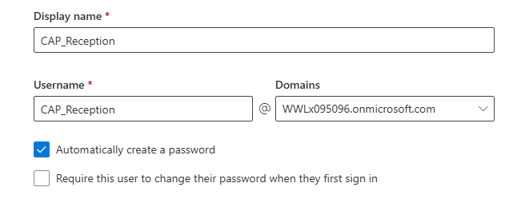
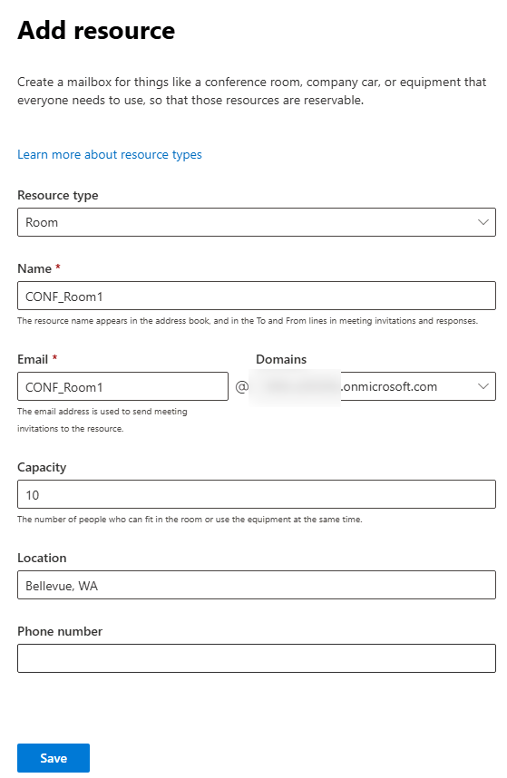
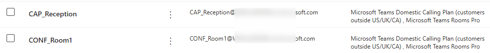
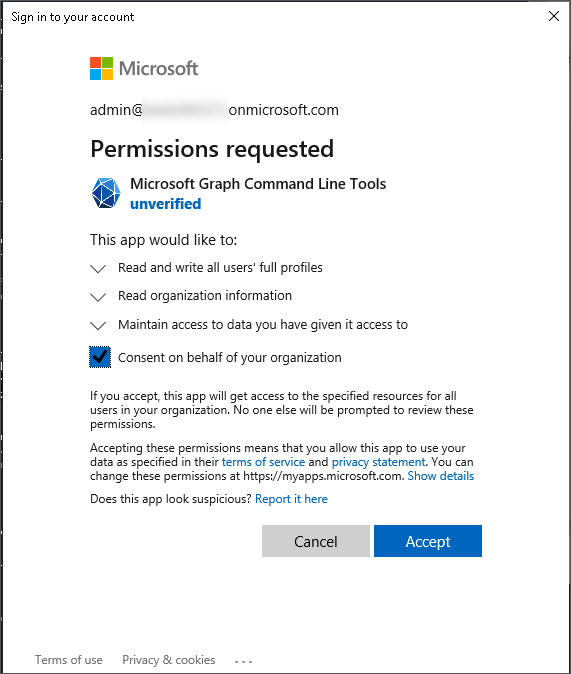
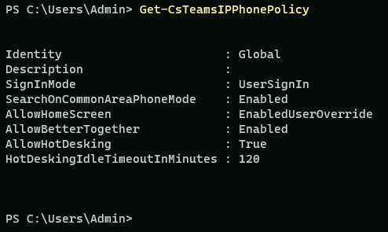
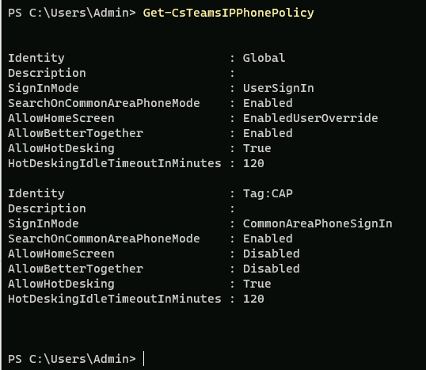
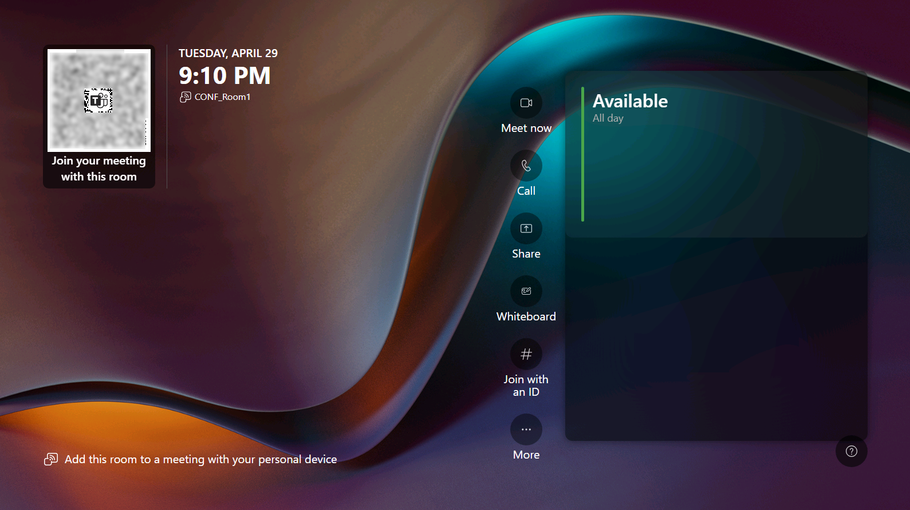
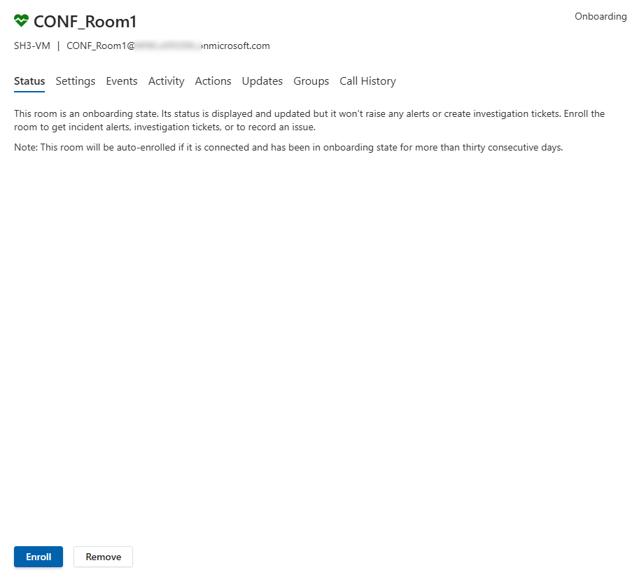
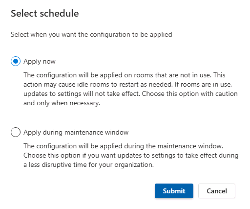
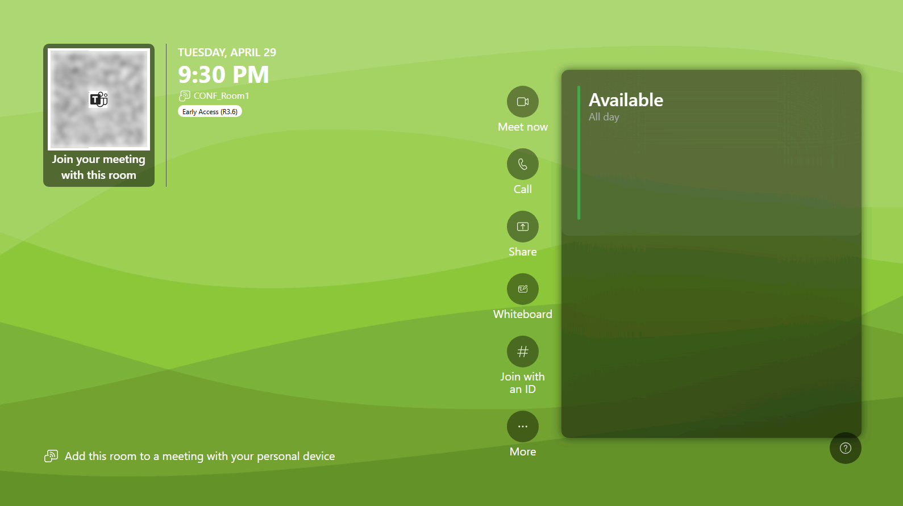

---
lab:
  title: 'Lab 05: Manage Microsoft Teams Devices'
  type: Answer Key
  module: 'Learning Path 02: Manage Teams collaboration communications systems'
  description: In this lab, you will configure, deploy, and manage Microsoft Teams devices, including shared devices, Teams Rooms, and Surface Hub. The scenario covers account setup, licensing, device policies, and remote management for Teams-enabled hardware.
  duration: 120 minutes
  level: 400
  islab: true
  primarytopics:
    - Microsoft Teams
---

> **Abstract:**  
> In this lab, you will configure, deploy, and manage Microsoft Teams devices, including shared devices, Teams Rooms, and Surface Hub. The scenario covers account setup, licensing, device policies, and remote management for Teams-enabled hardware.

# Lab 05: Manage Microsoft Teams Devices
# Student lab answer key

## Lab Scenario

As part of the expanding business, the organization has began deploying various types of Microsoft Teams devices in their organization. You need to manage the deployment of these devices.

## Lab Duration

  - **Estimated Time to complete**: 120 minutes

## Instructions

> [!IMPORTANT]
> This lab continues in the Lab 1 and Lab 2 lab launch, in the same Microsoft 365 tenant that Lab 3 uses. You don't need Lab 3 or the SBC except for the optional Direct Routing task.
>
> - **Tenant domain:** Replace &lt;TENANT NAME&gt; with your tenant's name (for example, WWLx012345 in WWLx012345.onmicrosoft.com). The resource accounts you create in this lab use this domain.
> - **Lab domain:** lab&lt;LAB NUMBER&gt;.o365ready.com from Lab 3 is for Direct Routing users and the SBC. Don't use it for the resource accounts in this lab.

## Exercise 1: Configuring Teams Shared Device and Room Resource Accounts

### Exercise Duration

  - **Estimated Time to complete**: 30 minutes

In this exercise, you create accounts for a shared phone and a Teams Room. You don't need a phone number or an SBC.

### Task 1 - Create a resource account for Teams Shared Devices (Common Area Phones)

In this task, you create a user account for a Microsoft Teams shared device.

1. Connect to **MS721-CLIENT01** and sign in as **Admin**. 

1. In **Microsoft Edge**, browse to the Microsoft 365 admin center at [**https://admin.microsoft.com**](https://admin.microsoft.com/).

1. If prompted, sign in as **Allan Deyoung** with the credentials provided to you.

1. When a **Save password** dialog is displayed, select **Never**.

1. When a **Stay signed in?** dialog is displayed, select **No**.

    > NOTE: You may get a prompt to **Let's keep your account secure**. Click **Next** on this prompt and setup 2-Factor Authentication with the Microsoft Authenticator app. 

1. In the left navigation, select **Users**, select **Active Users**, and then **Add a user**

1. Use the following parameters for this task and then click **Next**:

	- **Display Name:** CAP_Reception

	- **Username:** CAP_Reception

	- **Automatically create a password:** Uncheck this box and enter the "User Password" for your Microsoft 365 user accounts.

	- **Require this user to change their password when they first sign in:** Uncheck this box

    

1. On the licensing page, assign a **Microsoft Teams Shared Devices** license to the shared phone account if your tenant has one, and then select **Next**.

    > [!NOTE]
    > If this license isn't available in your tenant, create the account without it and continue. Don't substitute a Teams Rooms Pro license.

1. Continue clicking **Next** until you get the username and password presented to you. Write these down for future use. Keep the browser open for the next task.

You have created an account that will be used on a common area phone.

### Task 2 - Create a Microsoft 365 Resource Account for Teams Rooms

In this task, you create a room resource account for a Microsoft Teams Room.

1. You are still signed in to MS721-CLIENT01 as “Admin” and in the **Microsoft 365 admin center** as **Allan Deyoung**.

1. In the left navigation, select **Resources**, select **Rooms & equipment**, and then **Add resource**.

1. Use the following parameters for this task and then click **Save**:

	- **Resource type:** Room

	- **Name:** CONF_Room1

	- **Email:** CONF_Room1

	- **Capacity:** 10

    - **Location:** Bellevue, WA

    

1. In the left navigation, select **Users**, select **Active Users**, and then select the **CONF_Room1** account. 

1. Select **Licenses and Apps** on the user card, assign a **Microsoft Teams Rooms Pro** license to the room account, and then select **Save changes**.

1. While still in the user card, select **Reset Password** and set the password to the **User password** for your Microsoft 365 account, then close the user card.

    > [!IMPORTANT]
    > The Teams Rooms account must sign in without an interactive multifactor authentication (MFA) prompt. If MFA or Conditional Access blocks **CONF_Room1**, tell your instructor. Don't disable MFA for the whole tenant.

1. In the **Microsoft 365 Admin Center** under **Active Users** you should see two accounts matching the following:

    

The room account is licensed and ready for configuration. The shared-phone account is licensed only if your tenant has the Microsoft Teams Shared Devices license.

### Task 3 - Disable password expiration on the accounts

In this task, you use Microsoft Graph PowerShell to turn off password expiration for both accounts. If a Teams Rooms account's password expires, the device signs out and can't sign in again without manual intervention.

1. You are still signed in to MS721-CLIENT01 as **Admin** with the password provided to you.

1. Open **Windows PowerShell as Administrator**. In the **User Account Control** dialog box, select **Yes**.

1. Make sure you have the latest Microsoft Graph PowerShell module installed with the following cmdlet. If you receive an **Untrusted repository** prompt, select **[A] Yes to all**.

    > NOTE: This command can take several minutes to complete, wait for the prompt in PowerShell to return or not all the Graph sub-modules will install.

    ```powershell
    Install-Module Microsoft.Graph -Force -AllowClobber

    ```

1. Connect to Microsoft Graph with User.ReadWrite.All permissions:

    ```powershell
    Connect-MgGraph -Scopes "User.ReadWrite.All"

	```

1. When prompted, sign in as **MOD Administrator**.

1. When prompted for permissions, select **Consent on behalf of your organization** and then select **Accept**.

    

1. Run the following commands to turn off password expiration for each account. Replace &lt;TENANT NAME&gt; with your tenant's name.

    ```powershell
    Update-MgUser -UserId CAP_Reception@<TENANT NAME>.onmicrosoft.com -PasswordPolicies DisablePasswordExpiration
    Update-MgUser -UserId CONF_Room1@<TENANT NAME>.onmicrosoft.com -PasswordPolicies DisablePasswordExpiration

	```

The accounts now have password expiration disabled and are ready to have additional configurations applied.

### Task 4 - Optional: assign Direct Routing numbers to the accounts

Complete this task **only if** you completed Lab 3. Otherwise, skip to Exercise 2.

1. You are still signed in to MS721-CLIENT01 as **Admin** with the password provided to you.

1. Open Windows PowerShell and connect to Microsoft Teams. When prompted for credentials, sign in as **Allan Deyoung**:

    ```powershell
    Connect-MicrosoftTeams
    ```

1. Grant the `NA-National` voice routing policy to both accounts:

    ```powershell
    Grant-CsOnlineVoiceRoutingPolicy -Identity CAP_Reception@<TENANT NAME>.onmicrosoft.com -PolicyName "NA-National"
    Grant-CsOnlineVoiceRoutingPolicy -Identity CONF_Room1@<TENANT NAME>.onmicrosoft.com -PolicyName "NA-National"
    ```

1. Assign a Direct Routing phone number to each resource account:

    ```powershell
    Set-CsPhoneNumberAssignment -Identity CAP_Reception@<TENANT NAME>.onmicrosoft.com -PhoneNumber "+14255551201" -PhoneNumberType DirectRouting
    Set-CsPhoneNumberAssignment -Identity CONF_Room1@<TENANT NAME>.onmicrosoft.com -PhoneNumber "+14255551202" -PhoneNumberType DirectRouting
    ```

1. Confirm the assignments by running:

    ```powershell
    Get-CsOnlineUser CAP_Reception | Select DisplayName, LineUri, OnlineVoiceRoutingPolicy
    Get-CsOnlineUser CONF_Room1 | Select DisplayName, LineUri, OnlineVoiceRoutingPolicy
    ```

1. Close the PowerShell window.

If you completed this task, the readback shows each account's phone number and voice routing policy.

## Exercise 2: Deploy Microsoft Teams Common Area Phones

### Exercise Duration

  - **Estimated Time to complete**: 30 minutes

In this exercise, you create an IP phone policy for common area phones and assign it to the CAP_Reception account.

### Task 1 - Configure Microsoft Teams IP Phone Policies

In this task, you create an IP phone policy that locks a common area phone to calling only. Users can't easily sign out of the phone or open other apps.

1. You are still on **MS721-CLIENT01** where you are still signed in as “Admin”.

1. Select the Windows symbol in the task bar, type **PowerShell** and open a regular PowerShell window.

1. In Windows PowerShell, enter the following cmdlet to connect to Teams in your tenant:

    ```powershell
    Connect-MicrosoftTeams

    ```

    > NOTE: If you get an error stating that the MicrosoftTeams PowerShell module is not installed, run **Install-Module MicrosoftTeams** as an administrator.

1. In the PowerShell prompt, sign in as **Allan Deyoung** with the credentials provided to you.

1. Run the following command to list the IP phone policies. The Global policy gives users who sign in to a phone the full **UserSignIn** experience.

    ```powershell
    Get-CsTeamsIPPhonePolicy

    ```
    
    

1. Run the following command to create the **CAP** policy. It uses the common area phone sign-in experience and turns off the home screen and Better Together.

    ```powershell
   New-CsTeamsIPPhonePolicy -Identity CAP -SignInMode CommonAreaPhoneSignIn -AllowHomeScreen Disabled -AllowBetterTogether Disabled

    ```

1. Run the following command to list the policies again:

    ```powershell
    Get-CsTeamsIPPhonePolicy

    ```

1. Verify that the output shows the Global and CAP policies.

    

1. Leave the PowerShell window open for the next task.

### Task 2 - Assign Teams IP Phone Policies to users

In this task, you assign the CAP policy to the CAP_Reception account. You can only create and assign IP phone policies in PowerShell.

1. You have an active PowerShell window on **MS721-CLIENT01** where you are still signed in as “Admin”.

1. Run the following command to assign the policy. Replace &lt;TENANT NAME&gt; with your tenant's name.

    ```powershell
    Grant-CsTeamsIPPhonePolicy -PolicyName CAP -Identity CAP_Reception@<TENANT NAME>.onmicrosoft.com

    ```

1. The cmdlet does not provide any output. When you are back on the command prompt, close the PowerShell window.

You have successfully provisioned an account for use with a Common Area Phone in Microsoft Teams.

## Exercise 3: Deploy Microsoft Teams Rooms on Windows & Surface Hub 3

### Exercise Duration

  - **Estimated Time to complete**: 120 minutes

In this exercise, you finish configuring the room resource account, sign it in to a virtual Surface Hub 3, and manage the room from the Teams Rooms Pro Management portal.

### Task 1 - Configure the Room Resource Account's Calendar Processing Settings

In this task, you use Exchange Online PowerShell to set how the room mailbox processes meeting invitations.

1. You are still on **MS721-CLIENT01** where you are still signed in as “Admin”.

1. Select the Windows symbol in the task bar, type **PowerShell** and open a Administrator-elevated PowerShell window.

1. In Windows PowerShell, check whether the Exchange Online Management module is already installed:

    ```powershell
    Get-Module -ListAvailable ExchangeOnlineManagement
    ```

    If the command returns no installed module, run `Install-Module ExchangeOnlineManagement`. If a version is already installed, use it for the next step. You don't need to uninstall an existing version.

1. In Windows PowerShell, enter the following cmdlet to connect to Exchange Online Management:

    ```powershell
    Connect-ExchangeOnline

    ```

1. In the PowerShell prompt, sign in as **Allan Deyoung** with the credentials provided to you.

1. Run the following command so the room automatically accepts or declines meeting invitations based on its calendar:

    ```powershell
    Set-CalendarProcessing -Identity "CONF_Room1" -AutomateProcessing AutoAccept -AddOrganizerToSubject $false -AllowRecurringMeetings $true -DeleteAttachments $true -DeleteComments $false -DeleteSubject $false -ProcessExternalMeetingMessages $true -RemovePrivateProperty $false -AddAdditionalResponse $true -AdditionalResponse "This is a Microsoft Teams Meeting room!"

    ```

    > [!TIP]
    > To test booking later, invite **CONF_Room1** to a near-term meeting from a licensed user. The organizer should receive an automatic acceptance, and the meeting should appear on the room's home screen.

1. Close the PowerShell window.

You have successfully setup calendar processing on a Teams Rooms Account.

### Task 2 - Setup Surface Hub 3

In this task, you sign the room account in to a virtual Surface Hub 3 running Teams Rooms on Windows.

1.  Connect to **MS721-SH3** under the **Resources** in the lab. You will see a **Welcome to Microsoft Teams! A happier place for teams to work together** message. Click **Get Started.**

    

    > [!NOTE]
    > If the device can't reach the internet, confirm that **MS721-RRAS01** is running, and then restart the Surface Hub.

1. On the next page click **Accept** to the **End User Agreement** and then click **Manual Setup**. Enter the following credentials:

	- **Email:** CONF_Room1@&lt;TENANT NAME&gt;.onmicrosoft.com

	- **Password:** Type the **User password** from the **Resources** section directly into the password field. If you use **Type Text User Password**, it can drop characters, so check the result.

1. Wait for the Teams Rooms home screen shown below. Don't continue to Task 3 until it appears.

    

    > [!TIP]
    > If the device shows **Unable to sign in**, open **Settings > Account** on **MS721-SH3**. Clear the saved password, type the **User password** manually, and select **Save and exit**. Don't use the MOD Administrator password. If sign-in still fails, check Event ID **1098** in Event Viewer under **Applications and Services Logs > Microsoft > Windows > AAD > Operational**, and see [Fix Teams Rooms resource account sign-in issues](https://learn.microsoft.com/troubleshoot/microsoftteams/teams-rooms-and-devices/teams-rooms-resource-account-sign-in-issues).

After the home screen appears, the room account is signed in to the virtual Surface Hub 3.

### Task 3 - Manage Surface Hub 3 & Teams Rooms on Windows with the Pro Management Portal

In this task, you manage the Surface Hub 3 from the Teams Rooms Pro Management Portal. The room can take up to an hour to appear in the portal after it signs in.

1. Switch to **MS721-CLIENT01**.

1. In **Microsoft Edge**, open a new tab and browse to the Pro Management Portal at [**https://portal.rooms.microsoft.com**](https://portal.rooms.microsoft.com/).

1. If prompted, sign in as **Allan Deyoung** with the credentials provided to you.

1. Once signed in, navigate to **Rooms** and select the room signed in as **CONF_Room1** when it appears. If the room card shows **Onboarding** and offers **Enroll**, select **Enroll**. Otherwise, continue to the room settings.

    

    > [!NOTE]
    > If the room doesn't appear after an hour, run `Get-Tpm` in an elevated PowerShell window on **MS721-SH3**. Pro Management enrollment requires a Trusted Platform Module (TPM). If `TpmPresent` or `TpmReady` is `False`, tell your instructor; you can't complete this task on that VM. If the TPM is ready, see [Troubleshoot an unmonitored Teams Rooms device](https://learn.microsoft.com/microsoftteams/devices/pmpsignal-unmonitored-offline) and the [required network endpoints](https://learn.microsoft.com/microsoftteams/rooms/enroll-a-device#urls-required-for-communication).

1. Under the room card, select **Settings**, then **Theming**, and then change the theme to something else and then click **Apply.**

1. A **Select Schedule** window will appear. On this window, click **Apply Now** and then click **Submit.**

    

1. Within 5-10 minutes the room will show the theme change that was requested.

    

You have successfully setup a Microsoft Teams Room and configured settings in the room with the Pro Management Portal.