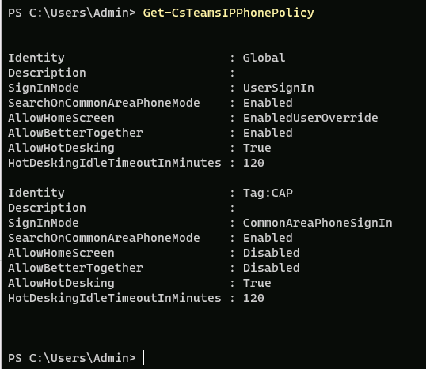

---
lab:
    title: 'Lab 05: Manage Microsoft Teams Devices'
    type: 'Answer Key'
    module: 'Learning Path 02: Manage Teams collaboration communications systems'
---

# Lab 05: Manage Microsoft Teams Devices
# Student lab answer key

## Lab Scenario

As part of the expanding business, the organization has began deploying various types of Microsoft Teams devices in their organization. You need to manage the deployment of these devices.

## Lab Duration

  - **Estimated Time to complete**: 120 minutes

## Instructions

> [!IMPORTANT]
> Throughout this lab, you will use PowerShell cmdlets that must be customized for your specific lab configuration. In the instructions below, when you see &lt;LAB NUMBER&gt; in a PowerShell command, you should replace it with the LAB NUMBER obtained in Lab 3, Exercise 1, Task 2.
> You will also see &lt;TENANT NAME&GT; used in PowerShell commands and should replace it with the Microsoft 365 TENANT NAME (e.g. M365x01234567) for your Microsoft 365 account.

## Exercise 1: Configuring Teams Shared Device and Room Resource Accounts

### Exercise Duration

  - **Estimated Time to complete**: 30 minutes

In this exercise, you will configure accounts for Teams Shared Devices and Rooms.

### Task 1 - Create a resource account for Teams Shared Devices (Common Area Phones)

In this task, you will sign into the Microsoft 365 admin center and will create a user account for use with a Microsoft Teams Shared Device.

1. Connect to **MS721-CLIENT01** and sign in as **Admin**. 

1. In **Microsoft Edge**, browse to the Microsoft 365 admin center at [**https://admin.microsoft.com**](https://admin.microsoft.com/).

1. On the **Sign in** screen, enter the credentials of the Global Admin account of the **MOD Administrator** with the username and password provided to you.

1. When a **Save password** dialog is displayed, select **Never**.

1. When a **Stay signed in?** dialog is displayed, select **No**.

    > [!NOTE]
    > You may get a prompt to **Let's keep your account secure**. Click **Next** on this prompt and setup 2-Factor Authentication with the Microsoft Authenticator app. 

1. In the left navigation, select **Users**, select **Active Users**, and then **Add a user**

1. Use the following parameters for this task and then click **Next**:

	- **Display Name** CAP_Reception

	- **Username** CAP_Reception

	- **Automatically create a password** Check the box

	- **Require this user to change their password when they first sign in** Uncheck this box


1. On the licensing page, assign both a **Microsoft Teams Rooms Pro** and a **Microsoft Teams Domestic Calling Plan** license to the user account, and then click **Next.**

    > [!NOTE]
    > The lab environment does not have the proper **Teams Shared Devices** licensing avaliable. For what we need, this license will do for lab purposes.

1. Continue clicking **Next** until you get the username and password presented to you. Write these down for future use. Keep the browser open for the next task.

You have created an account that will be used on a common area phone.

### Task 2 - Create a M365 Resource Account for Teams Rooms

In this task, you will sign into the Microsoft 365 admin center and will create a rooom resource account for use with a Microsoft Teams Room.

1. You are still signed in to MS721-CLIENT01 as “Admin” and in the **Microsoft 365 admin center** as **MOD Administrator**

1. In the left navigation, select **Resources**, select **Rooms & equipment**, and then **Add resource**3

1. Use the following parameters for this task and then click **Save**:

	- **Resource type** Room

	- **Name** CONF_Room1

	- **Email** CONF_Room1

	- **Capacity** 10

    - **Location** Bellevue, WA


1. In the left navigation, select **Users**, select **Active Users**, and then select the **CONF_Room1** account. 

1. Select **Licenses and Apps** on the user card, assign both a **Microsoft Teams Rooms Pro** and a **Microsoft Teams Domestic Calling Plan** license to the user account, and then click **Save changes.**

1. While still in the user card, select **Reset Password** and set the password to that of the **MOD Administrator**, then close the user card.

1. In the **Microsoft 365 Admin Center** under **Active Users** you should see two accounts matching the following:


The accounts are now licensed and ready for configuration steps.

### Task 3 - Disable Password Expiration on the accounts

In this task, you will sign into the Microsoft Graph PowerShell Module and disable Password Expiration on the accounts. Based on organization policies, resource account passwords may be set to expire automatically after a period of time. If the resource account password expires, the Teams Rooms device with sign out and can't sign in again without manual intervention.

1. You are still signed in to MS721-CLIENT01 as **Admin** with the password provided to you.

1. Open **Windows PowerShell as Administrator**. In the **User Account Control** dialog box, select **Yes**.

1. Make sure you have the latest Microsoft Graph PowerShell module installed with the following cmdlet. If you receive an **Untrusted repository** prompt, select **[A] Yes to all**.

    > [!NOTE]
    > This command can take several minutes to complete, wait for the prompt in PowerShell to return or not all the Graph sub-modules will install.

    ```powershell
    Install-Module Microsoft.Graph -Force -AllowClobber

    ```

1. Connect to Microsoft Graph with User.ReadWrite.All permissions:

    ```powershell
    Connect-MgGraph -Scopes "User.ReadWrite.All"

	```

1. When prompted, enter the **Microsoft 365 Administrator** email address and password. Do not use the credentials for Allan Deyoung, because we need additional permissions to work with Microsoft Graph.

1. Set the password to never expire for each resource account. NOTE: Replace <Lab Domain> in each of the below commands with that of your lab environment.

    ```powershell
    Update-MgUser -UserId CAP_Reception@<LAB Domain>.onmicrosoft.com -PasswordPolicies DisablePasswordExpiration -PassThru
    Update-MgUser -UserId CONF_Room1@<LAB Domain>.onmicrosoft.com -PasswordPolicies DisablePasswordExpiration -PassThru

	```
The accounts anow have password expiration disabled and are ready to have additional configurations applied.

### Task 4 - Aquire phone numbers to assign to the resource accounts

In this task, you will sign into the Microsoft Teams admin center and will aquire two phone numbers for each resource account.

1. You are still signed in to MS721-CLIENT01 as “Admin” and in the **Microsoft Teams admin center** as **MOD Administrator**

1. In the **Microsoft Teams admin center**, select **Voice** on the left menu, then select **Phone numbers**.

1. Under **Numbers**, select **Add**.

1. At the top of the page, enter a name for your order **Numbers for Resource Accounts**.

1. For **description** enter **Numbers for Resource Accounts**.

1. Select **United States** as **Country or region**.

1. For Number Type, select **User (subscriber)**.

1. For Operator, select **Microsoft**.

1. The Quantity field will now appear, enter **2**.

1. For **Search for new numbers** select **Search by area code** and enter **206**.

> [!NOTE]
> The phone numbers that are available in different regions will vary and **206** numbers may not be available. Try other area codes in the US and Canada, such as **308** in Nebraska.  The area code of the phone number does not need to match the emergency address location.

1. When all fields are complete, select **Next**. Microsoft will now reserve phone numbers in the chosen area code. If there are no numbers available for your selected State/City combination, select another State/City and try again.

1. Verify the area code and phone number, then select **Place Order**.

1. You will see “Thank you, your order has been placed!”, select **Finish**.

1. In the voice, under **phone numbers**, you should see your number. Note in some cases this may take 5-10 minutes to appear.

1. Leave the browser window open at the end of the task.

You have successfully ordered a User (subscriber) phone number through the Teams admin center.

### Task 5 - Assign a phone number to each resouce account

In this task, you will sign into the Microsoft Teams admin center and will assign a phone number to each previously created account.

1. You are still signed in to MS721-CLIENT01 as “Admin” and have the **Microsoft Teams admin center** open as **MOD Administrator**.

1. Select **Voice** and the **Phone numbers** tab.

1. Select the new user phone number we ordered in Task 2 for the room accounts.

1. Select **Edit** from the top table menu.

1. Enter **CAP_Reception** in the **Assigned To** field, then select **Assign**.

1. Under **Emergency location**, select **Search by city**, and then enter **Bellevue** and select the address you verified earlier.

1. Select **Apply**, then repeat for **CONF_Room1**, and then close any additional windows.

1. The phone number is now assigned to the accounts.

You have successfully assigned a phone number to the resource accounts.

## Exercise 2: Deploy Microsoft Teams Common Area Phones

In this exercise, you will create policies for Common Area Phones, apply the policy to the previously created user, and enable the phone for Teams Voice.

### Task 1 - Configure Microsoft Teams IP Phone Policies.

In this task, you will connect to Microsoft Teams PowerShell and create an IP Phone Policy for Common Area Phones. This policy removes the default user experience and locks the phone down so that it cannot be easily signed out of, and restricts the device to make and recieve calls. Access to other apps on the phone is prohibited.

1. You are still on **MS721-CLIENT01** where you are still signed in as “Admin”.

1. Select the Windows symbol in the task bar, type **PowerShell** and open a regular PowerShell window.

1. In Windows PowerShell, enter the following cmdlet to connect to Teams in your tenant:

    ```powershell
    Connect-MicrosoftTeams

    ```

	> [!NOTE]
    > If you get an error stating that the MicrosoftTeams PowerShell module is not installed, run **Install-Module MicrosoftTeams** as an administrator.

1. In the PowerShell prompt, sign in as **MOD Administrator** with the credentials provided to you.

1. In Windows Powershell, enter the following and then press **Enter**. By running the command you will see that the tenant has a default policy that is assigned to all users by default. When a user signs into a phone, they will get the **UserSignIn** experience which is fully featured.

    ```powershell
    Get-CsTeamsIPPhonePolicy

    ```


1. Run the New-TeamsIPPhonePolicy cmdlet. This command creates a per-user online IP Phone Policy that will lock down the phone to the CommonAreaSignIn experience. It also disables the home screen and the better together functionality with the Teams client.

    ```powershell
   New-CsTeamsIPPhonePolicy -Identity CAP -SignInMode CommonAreaPhoneSignIn -AllowHomeScreen Disabled -AllowBetterTogether Disabled

    ```

1. Run the Get-CsTeamsIPPhonePolicy command. The command will show the Global and the newly created policy

    ```powershell
    Get-CsTeamsIPPhonePolicy

    ```

1. Review the output of the command. You will see the Global and the CAP policy created previously.



1. Leave the PowerShell window open for the next task.

### Task 2 - Assign Teams IP Phone Policies to users

In this task, you will connect to Microsoft Teams PowerShell and assign the previously created policy to a user. This policy can only be assigned, managed, and created in PowerShell.

1. You have an active PowerShell window on **MS721-CLIENT01** where you are still signed in as “Admin”.

1. Run the Grant-CsTeamsIPPhonePolicy command. The command will apply the policy to the user created previously. Make sure you replate <LAB DOMAIN> with the UPN associated to the user in the lab.

    ```powershell
    Grant-CsTeamsIPPhonePolicy -PolicyName CAP -Identity CAP_Reception@<LAB Domain>.onmicrosoft.com

    ```
1. The cmdlet does not provide any output. When you are back on the command prompt, leave the window open for the next exercise.

You have successfully provisioned an account for use with a Common Area Phone in Microsoft Teams.

## Exercise 3: Deploy Microsoft Teams Rooms on Windows & Surface Hub 3

### Exercise Duration

  - **Estimated Time to complete**: 60 minutes

In this exercise, you will deploy finish configuration of a room resource account for Microsoft Teams Rooms on Windows and Surface Hub 3. You will then test the account and sign into a virtual Surface Hub 3 virtual machine and then manage the room from the Teams Rooms Pro Portal.

### Task 1 - Configure the Room Resource Account

In this task, you will sign into Microsoft Exchange PowerShell and configure the mailbox for the room resource account as a Room and Modify Calendar Processing.

1. You are still on **MS721-CLIENT01** where you are still signed in as “Admin”.

1. Select the Windows symbol in the task bar, type **PowerShell** and open a Administrator-elevated PowerShell window.

1. In Windows PowerShell, enter the following cmdlet to connect to install the Exchange Online Management PowerShell Module:

    ```powershell
    Install-Module ExchangeOnlineManagement

    ```

1. In Windows PowerShell, enter the following cmdlet to connect to Exchange Online Management:

    ```powershell
    Connect-ExchangeOnline

    ```

1. In the PowerShell prompt, sign in as **MOD Administrator** with the credentials provided to you.

1. In Windows Powershell, enter the following and then press **Enter**. By running the command, the room resource account will automatically process or deny meeting invites when the room is invited to a meeting based on the room calendar.

    ```powershell
    Set-CalendarProcessing -Identity "CONF_Room1" -AutomateProcessing AutoAccept -AddOrganizerToSubject $false -AllowRecurringMeetings $true -DeleteAttachments $true -DeleteComments $false -DeleteSubject $false -ProcessExternalMeetingMessages $true -RemovePrivateProperty $false -AddAdditionalResponse $true -AdditionalResponse "This is a Microsoft Teams Meeting room!"

    ```

### Task 2 - Setup Surface Hub 3.

In this task, you will sign into the Microsoft Teams admin center and blah.

1. Blah

### Task 3 - Manage Surface Hub 3 with the Pro Management Portal.

In this task, you will sign into the Microsoft Teams admin center and blah.

1. Blah

https://portal.rooms.microsoft.com/