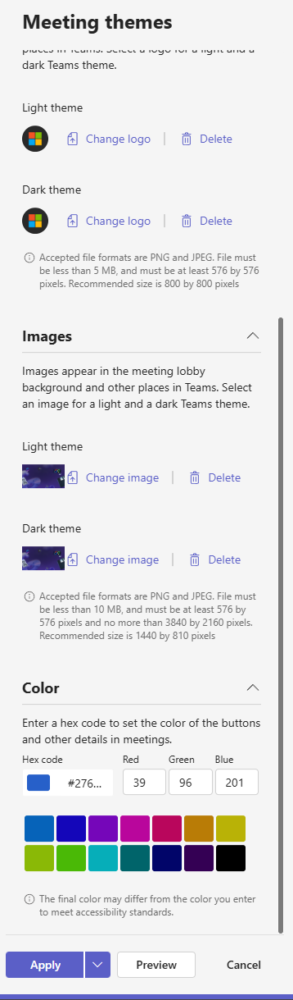
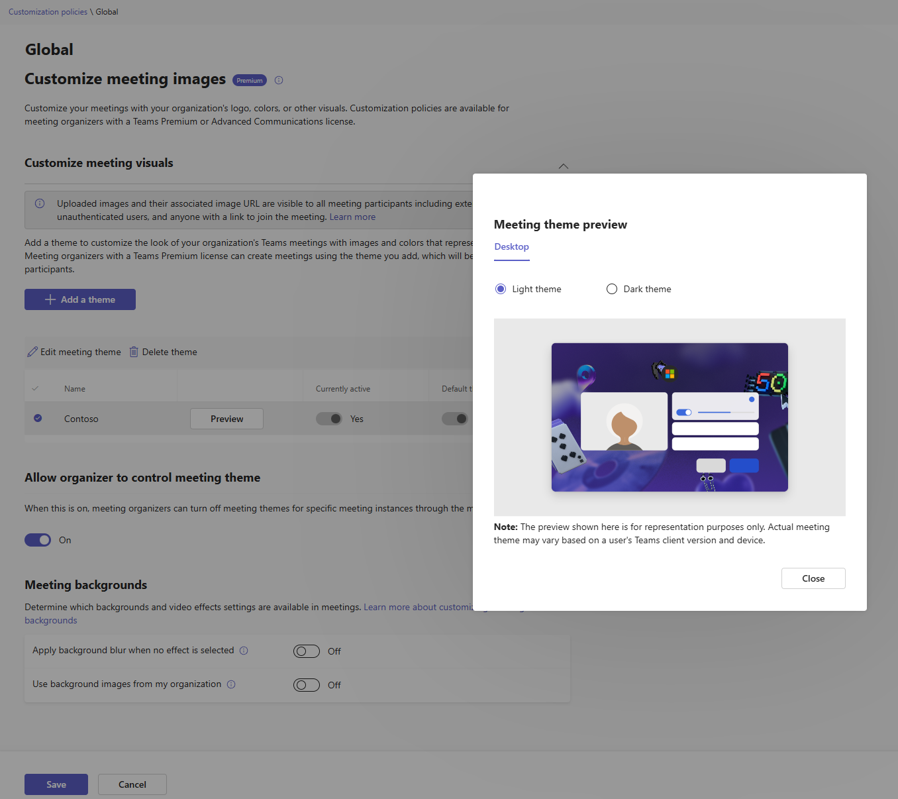
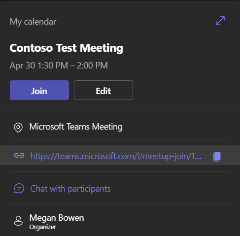
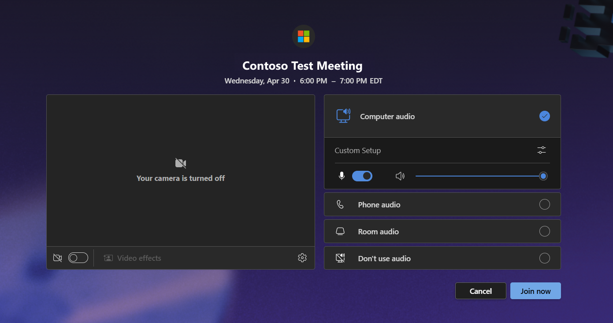

---
lab:
    title: 'Lab 06: Manage Microsoft Teams Premium'
    type: 'Answer Key'
    module: 'Learning Path 02: Manage Teams collaboration communications systems'
---

# Lab 06: Manage Microsoft Teams Premium
# Student lab answer key

## Lab Scenario

As part of the expanding business, the organization has began needing access to more specialized areas of Microsoft Teams for different departments.

## Lab Duration

  - **Estimated Time to complete**: 120 minutes

## Instructions

> [!IMPORTANT]
> Throughout this lab, you will use PowerShell cmdlets that must be customized for your specific lab configuration. In the instructions below, when you see &lt;LAB NUMBER&gt; in a PowerShell command, you should replace it with the LAB NUMBER obtained in Lab 3, Exercise 1, Task 2.
> You will also see &lt;TENANT NAME&GT; used in PowerShell commands and should replace it with the Microsoft 365 TENANT NAME (e.g. M365x01234567) for your Microsoft 365 account.

## Exercise 1: Setup and Configure the Queues App and Voice Application Policies

### Exercise Duration

  - **Estimated Time to complete**: 45 minutes

In this exercise, you will enable users for access to the queues app and control permissions for end-users access to Auto Attendants & Call Queues with Voice Application policies.

### Task 1 - Assigning Teams Premium Licenses

In this task, you will sign into the Microsoft 365 admin center and Assign a Teams Premium license to a user that will later use the Queues App.

1. Connect to **MS721-CLIENT01** and sign in as **Admin**. 

1. In **Microsoft Edge**, browse to the Microsoft 365 admin center at [**https://admin.microsoft.com**](https://admin.microsoft.com/).

1. On the **Sign in** screen, enter the credentials of the Global Admin account of the **MOD Administrator** with the username and password provided to you.

1. When a **Save password** dialog is displayed, select **Never**.

1. When a **Stay signed in?** dialog is displayed, select **No**.

    > NOTE: You may get a prompt to **Let's keep your account secure**. Click **Next** on this prompt and setup 2-Factor Authentication with the Microsoft Authenticator app. 

1. In the left navigation, select **Users**, select **Active Users**, and then select **Megan Bowen.**

1. Select **Licenses and Apps** on the user card, assign the **Microsoft Teams Premium** license to the user account, and then click **Save changes.**

You have assigned a Teams Premium license to a user

### Task 2 - Creating Resource Accounts for Voice Applications

In this task, you will sign into the Microsoft Teams admin center and create a resource account for a Call Queue that you will later build. All Call Queues that will have a phone number assigned to them will require an underlying Resource Account. We will then license this account.

1. You are still signed in to MS721-CLIENT01 as “Admin” and signed into the **Microsoft Teams admin center** as **MOD Administrator**.

1. In the **Microsoft Teams admin center**, select **Voice** on the left menu, then select **Resource Accounts.**

1. Click **+ Add**, enter the following information, and then click **Save**:

	- **Display Name:** CQ_MainLine

	- **Unique Username:** CQ_MainLine@<Lab Domain>.onmicrosoft.com

	- **Resoure Account Type:** Call Queue

    

1. In **Microsoft Edge**, browse to the Microsoft 365 admin center at [**https://admin.microsoft.com**](https://admin.microsoft.com/).

1. In the left navigation, select **Users**, select **Active Users**, and then select **CQ_MainLine.**

1. Select **Licenses and Apps** on the user card, assign the **Microsoft Teams Phone Resource Account** license to the account, and then click **Save changes.**

You have successfully created a Teams Phone Resource Account for a Call Queue and licensed it accordingly.

### Task 3 - Creating a Call Queue

In this task, you will sign into the Microsoft Teams admin center and create a Auto Attendant.

1. You are still signed in to MS721-CLIENT01 as “Admin” and signed into the **Microsoft Teams admin center** as **MOD Administrator**.

1. In the **Microsoft Teams admin center**, select **Voice** on the left menu, then select **Call Queues.**

1. Click **+ Add** and set the following parameters across multiple pages:

  - **General Info Tab**

	  - **Add a name for your call queue:** CQ_MainLine

	  - **Resource Accounts:** CQ_MainLine@<Lab Domain>.onmicrosoft.com

	  - **Language:** English (Untied States)

  - **Call Answering Tab**

	  - **Users:** Megan Bowen

	  - **Conference Mode:** Toggle On

  - **Agent Selection Tab**

	  - **Presence-based routing** Toggle Off

  - **Authorized Users Tab**

	  - **Add** Megan Bowen

1. Click **Submit** to create the Call Queue.

You have successfully created a Call queue and added an authorized user to the queue.

### Task 4 - Configuring Voice Application Policies

In this task, you will sign into the Microsoft Teams admin center and create a Auto Attendant.

1. You are still signed in to MS721-CLIENT01 as “Admin” and signed into the **Microsoft Teams admin center** as **MOD Administrator**.

### Task 5 - Assigning Voice Application Policies

In this task, you will sign into the Microsoft Teams admin center and create a Auto Attendant.

1. You are still signed in to MS721-CLIENT01 as “Admin” and signed into the **Microsoft Teams admin center** as **MOD Administrator**.

## Exercise 2: Using the Queues App

### Exercise Duration

  - **Estimated Time to complete**: 30 minutes

In this exercise, you will test the Queues app.

### Task 1 - Accessing the Queues App

In this task, you will sign into the Microsoft Teams client and access the Queues App.

1. You are still signed in to MS721-CLIENT01 as “Admin” and signed into the **Microsoft Teams admin center** as **MOD Administrator**.

## Exercise 3: Customizing Meetings with Teams Premium

### Exercise Duration

  - **Estimated Time to complete**: 15 minutes

In this exercise, you will create custom meeting templates for users that have Microsoft Teams Premium licensing. This will customize the meeting join experience for members of the meeting.

### Task 1 - Create a Meeting Customization Policy

In this task, you will sign into the Microsoft Teams admin center and modify the Global Meeting Customization policy so that organizers with a Teams Premium license can brand their Teams meeting join experience with their company's branding.

1. You are still signed in to MS721-CLIENT01 as “Admin” and signed into the **Microsoft Teams admin center** as **MOD Administrator**.

1. In the **Microsoft Teams admin center**, select **Meetings** on the left menu, then select **Customization Policies.**

1. Click on the **Global (Org-wide default)** policy, click the **+ Add a theme** button, set the following parameters, and then click **Save**:

	- **Meeting theme name:** Contoso

	- **Logo Light Theme:** [Logo.png](https://github.com/MicrosoftLearning/MS-721T00-Collaboration-Communications-Systems-Engineer/tree/main/Instructions/Labs/Labfiles/Logo.png)

	- **Logo Dark Theme:** [Logo.png](https://github.com/MicrosoftLearning/MS-721T00-Collaboration-Communications-Systems-Engineer/tree/main/Instructions/Labs/Labfiles/Logo.png)

  - **Images Light Theme:** [Theme.png](https://github.com/MicrosoftLearning/MS-721T00-Collaboration-Communications-Systems-Engineer/tree/main/Instructions/Labs/Labfiles/Theme.png)

	- **Images Dark Theme:** [Theme.png](https://github.com/MicrosoftLearning/MS-721T00-Collaboration-Communications-Systems-Engineer/tree/main/Instructions/Labs/Labfiles/Theme.png)

	- **Color Hex Code:** #2760C9

    

1. Back in the Global Meeting Customization policy, select **Preview** next to the Contoso meeting theme. You will now see what the meeting join experience will look like for your organizers that have a Teams Premium license. Click **Close** and then **Save** to apply to policy to all users.

    

You have successfully modified the Global meeting customization policy and applied it to users with Teams premium licensing.

### Task 2 - Create a Meeting as a Teams Premium User and validate the branding has applied.

In this task, you will sign into the Microsoft Teams client, create a meeting, and validate that the theming has been applied for those joining the meeting. 

> [!IMPORTANT]
> Please allow at least 30 minutes before performing these tasks as it takes time for the policies to propagate down to a user.

1. You are still signed in to MS721-CLIENT02 as “Admin” and signed into Microsoft Teams as **Megan Bowen**

1. In the Microsoft Teams client, click on **Calendar** and then click **New Meeting**. Create a Meeting with any name you would like and then click **Save**.

1. Click once on the meeting and then click the **Copy** button to the right of the meeting join URL.

    

1. Open a new **In-Private Microsoft Edge browser window** by right-clicking on the Microsoft Edge icon in the taskbar and selecting **New InPrivate Window** and then navigate to the copied meeting join URL. When there click on **Join in this Browser**

1. You should now see the meeting join page has the customizations applied previously.

    

> [!NOTE]
> If you do not see the customizations, wait 30 minutes and retry **Task 2** again.

You have successfully created a meeting as a Teams Premium user and validated that your organization's meeting customization policy has taken effect.

Advanced Meeting Protections???