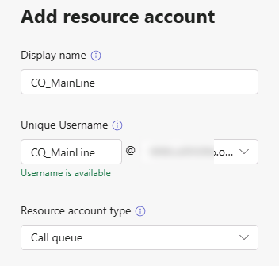
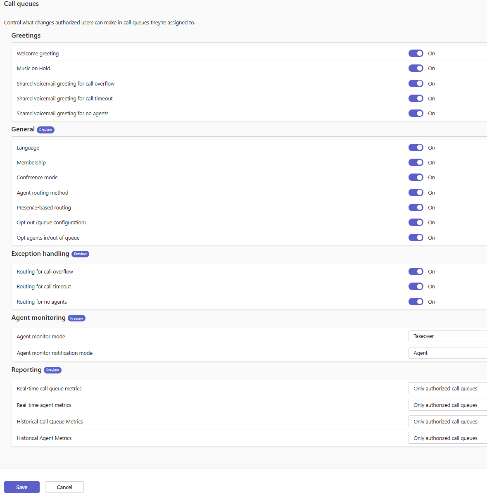
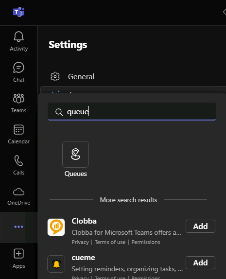
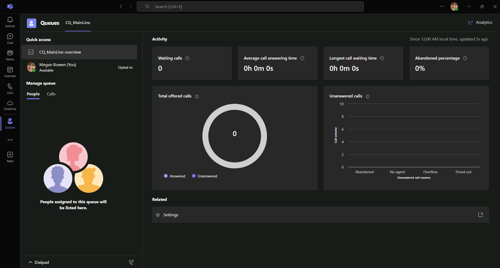
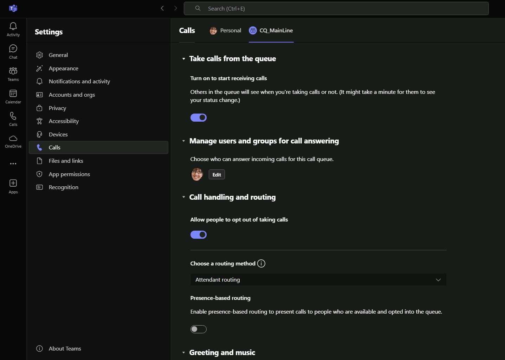
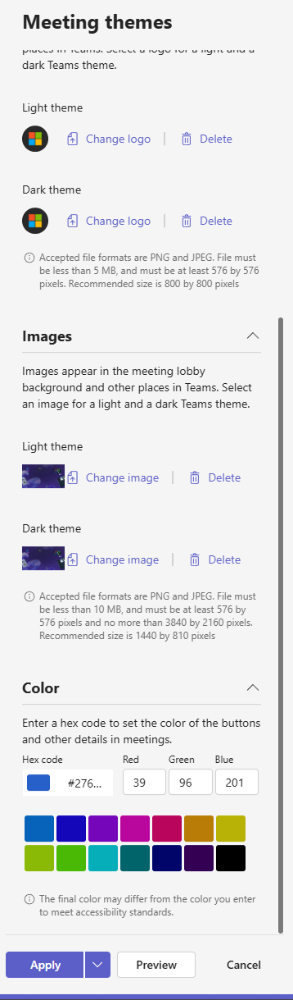
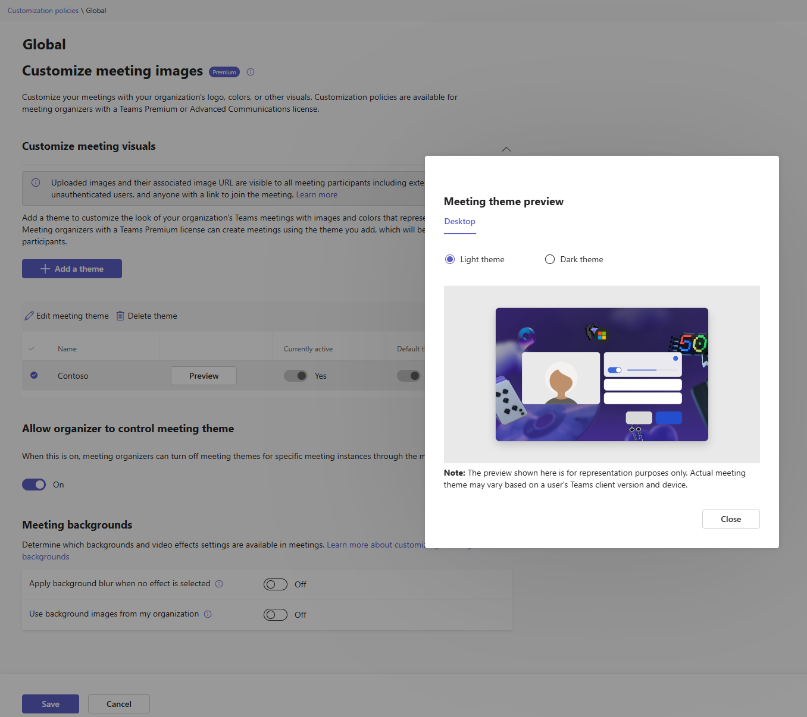
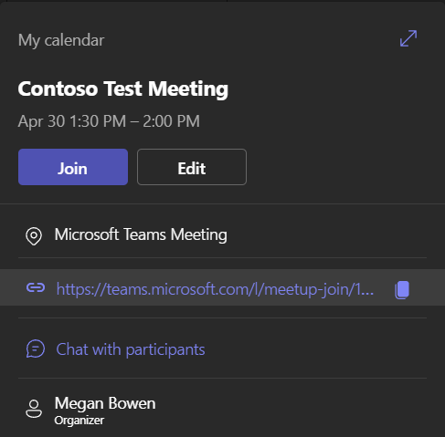
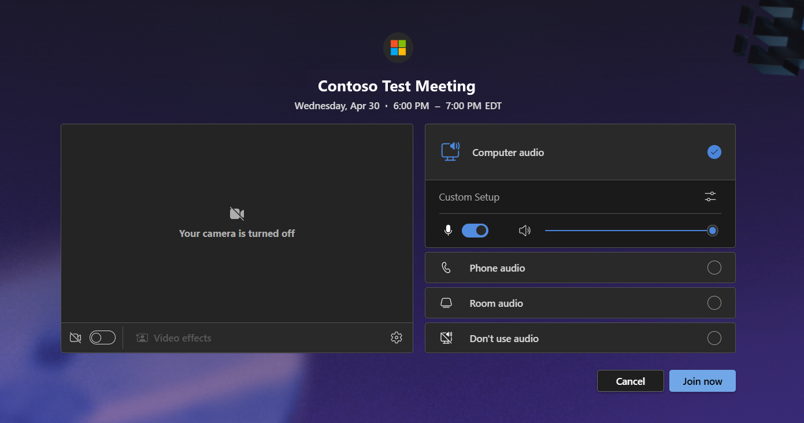

---
lab:
  title: 'Lab 06: Manage Microsoft Teams Premium'
  type: Answer Key
  module: 'Learning Path 02: Manage Teams collaboration communications systems'
  description: This lab explores advanced Teams Premium features, including configuring the Queues app, voice application policies, and meeting customization. The scenario demonstrates how to enable, assign, and validate premium capabilities for specialized Teams experiences.
  duration: 120 minutes
  level: 300
  islab: true
  primarytopics:
    - Microsoft Teams
---

> **Abstract:**  
> This lab explores advanced Teams Premium features, including configuring the Queues app, voice application policies, and meeting customization. The scenario demonstrates how to enable, assign, and validate premium capabilities for specialized Teams experiences.

# Lab 06: Manage Microsoft Teams Premium
# Student lab answer key

## Lab Scenario

As part of the expanding business, the organization has began needing access to more specialized areas of Microsoft Teams for different departments.

## Lab Duration

  - **Estimated Time to complete**: 120 minutes

## Instructions

> [!IMPORTANT]
> This lab runs independently of Lab 3 and doesn't require an SBC or a PSTN number. Replace &lt;LAB DOMAIN&gt; in account names with the domain shown in **Microsoft 365 admin center > Users > Active users**. Replace &lt;TENANT NAME&gt; in any PowerShell commands with your Microsoft 365 tenant name (for example, M365x01234567).

## Exercise 1: Setup and Configure the Queues App and Voice Application Policies

### Exercise Duration

  - **Estimated Time to complete**: 45 minutes

In this exercise, you will enable users for access to the queues app and control permissions for end-users access to Auto Attendants & Call Queues with Voice Application policies.

### Task 1 - Assigning Teams Premium Licenses

In this task, you will sign into the Microsoft 365 admin center and Assign a Teams Premium license to a user that will later use the Queues App.

1. Connect to **MS721-CLIENT01** and sign in as **Admin**. 

1. In **Microsoft Edge**, browse to the Microsoft 365 admin center at [**https://admin.microsoft.com**](https://admin.microsoft.com/).

1. On the **Sign in** screen, enter the credentials of the Global Admin account of the **MOD Administrator** with the username and password provided to you.

1. When a **Save password** dialog is displayed, select **Never**.

1. When a **Stay signed in?** dialog is displayed, select **No**.

    > NOTE: You may get a prompt to **Let's keep your account secure**. Click **Next** on this prompt and setup 2-Factor Authentication with the Microsoft Authenticator app. 

1. In the left navigation, select **Users**, select **Active Users**, and then select **Megan Bowen.**

1. Select **Licenses and Apps** on the user card, assign the **Microsoft Teams Premium** license to the user account, and then click **Save changes.**

1. In the Microsoft Teams admin center, select **Users** > **Manage users** > **Megan Bowen** > **Account**.

1. Under **Assigned phone number**, turn on **Enterprise Voice**, select **Enable**, and verify that the setting shows **On**. Megan must be Enterprise Voice-enabled to appear in the call queue agent picker. A phone number isn't required for this step.

You have assigned a Teams Premium license and enabled Megan for call queue agent selection.

### Task 2 - Creating Resource Accounts for Voice Applications

In this task, you will sign into the Microsoft Teams admin center and create a resource account for a Call Queue that you will later build. All Call Queues that will have a phone number assigned to them will require an underlying Resource Account. We will then license this account.

1. You are still signed in to MS721-CLIENT01 as “Admin” and signed into the **Microsoft Teams admin center** as **MOD Administrator**.

1. In the **Microsoft Teams admin center**, select **Voice** on the left menu, then select **Resource Accounts.**

1. Click **+ Add**, enter the following information, and then click **Save**:

	- **Display Name:** CQ_MainLine

	- **Unique Username:** CQ_MainLine@&lt;LAB DOMAIN&gt;.onmicrosoft.com

	- **Resoure Account Type:** Call Queue

    

1. In **Microsoft Edge**, browse to the Microsoft 365 admin center at [**https://admin.microsoft.com**](https://admin.microsoft.com/).

1. In the left navigation, select **Users**, select **Active Users**, and then select **CQ_MainLine.**

1. Select **Licenses and Apps** on the user card, assign the **Microsoft Teams Phone Resource Account** license to the account, and then click **Save changes.**

1. Return to **Voice** > **Resource accounts** in the Microsoft Teams admin center and verify that **CQ_MainLine** shows **Licensed**. If the new account doesn't appear in **Active users** or the license hasn't appeared in Teams yet, allow time for directory synchronization and refresh before continuing.

You have successfully created a Teams Phone Resource Account for a Call Queue and licensed it accordingly.

### Task 3 - Creating a Call Queue

In this task, you will sign into the Microsoft Teams admin center and create a Call Queue.

1. You are still signed in to MS721-CLIENT01 as “Admin” and signed into the **Microsoft Teams admin center** as **MOD Administrator**.

1. In the **Microsoft Teams admin center**, select **Voice** on the left menu, then select **Call Queues.**

1. Select **+ Add**, and then select **Advanced setup**. Set the following parameters across the wizard pages, and then select **Submit** to create the call queue:

  - **General Info Tab**

	  - **Add a name for your call queue:** CQ_MainLine

      - **Language:** English (United States)

	  - **Resource accounts:** Select **Add**, search for the beginning of **CQ_MainLine@&lt;Lab Domain&gt;.onmicrosoft.com**, select the account, and confirm **Add** in the picker.

	  

  - **Call Answering Tab**

	  - **Choose users and groups:** Select **Add users**, search for **Megan Bowen**, select **Add** beside her name, and confirm **Add** in the picker.

	  - **Conference mode:** On

  - **Agent Selection Tab**

	  - **Presence-based routing** Toggle Off

  - **Authorized Users Tab**

	  - **Add:** Megan Bowen. Select **Add** beside her name, and confirm **Add** in the picker.

Reopen the queue after submitting it and verify that **Megan Bowen** appears under **Call answering** and **Authorized users**.

### Task 4 - Configuring Voice Application Policies

In this task, you will create a voice application policy which will give users rights to edit different parameters of Auto Attendants and Call Queues without requiring access to the Microsoft Teams Admin Center. This allows them to make these changes right within their Microsoft Teams client.

1. You are still signed in to MS721-CLIENT01 as “Admin” and signed into the **Microsoft Teams admin center** as **MOD Administrator**.

1. In the **Microsoft Teams admin center**, select **Voice** on the left menu, then select **Voice applications policies.**

1. Select **Add**, set the following parameters, and then select **Save** to create the voice applications policy:

  - **Name:** Managers
  
  - **Call Queue Greetings:** Toggle All Settings **On**

  - **Call Queue General:** Toggle All Settings **On**

  - **Call Queue Exception Handling:** Toggle All Settings **On**
  
  - **Call Queue Agent Monitoring:**
  
    - **Agent Monitor Mode:** Takeover
    
    - **Agent Monitor Notification Mode:** Agent
  
  - **Call Queue Reporting:** Set all four metrics to **Only authorized call queues**.

    

You have successfully created a Voice Application Policy. You are now ready to assign this to a user.

### Task 5 - Assigning Voice Application Policies

In this task, you assign the Managers voice applications policy to Megan Bowen. A PSTN voice routing policy is not required.

1. You are still signed in to MS721-CLIENT01 as “Admin” and signed into the **Microsoft Teams admin center** as **MOD Administrator**.

1. In the **Microsoft Teams admin center**, select **Users** on the left menu, then select **Manage Users.**

1. Select **Megan Bowen**, select **Policies**, and then select **Edit.**

1. Scroll down to **Select Voice Applications Policy**, select the **Managers** policy created earlier, then click **Apply** and **Confirm.**

    Confirm that **Voice applications policy** shows **Managers** for Megan. A voice routing policy such as `NA-National` is not required for this lab.

You have successfully applied a Voice Application policy to a user.

## Exercise 2: Using the Queues App

### Exercise Duration

  - **Estimated Time to complete**: 30 minutes

In this exercise, you will test the Queues app.

### Task 1 - Accessing the Queues App

In this task, you will sign into the Microsoft Teams client and access the Queues App.

1. On MS721-CLIENT02, remain signed in to Windows as **Admin**. In Microsoft Teams, sign out as **Isaiah Langer**, and then sign in as **Megan Bowen**.

1. In the Teams desktop client, select **More apps** (**...**) on the left app bar, search for **Queues**, and open it. The Queues app isn't supported in Teams on the web.

    

1. On the **CQ_MainLine** overview, confirm that **Megan Bowen (You)** appears as an opted-in agent. Review the queue metrics and the available management controls. Without an incoming call to the queue, the metrics don't validate call delivery.

    

You have successfully accessed the Teams Queues App as Megan Bowen.

### Task 2 - Modifying Call Queue Parameters from within the Teams client

In this task, you use Megan's assigned voice applications policy and authorization for CQ_MainLine to edit a permitted call queue setting without being a Teams administrator.

1. Remain signed in to MS721-CLIENT02 as **Admin** and to the Teams desktop client as **Megan Bowen**.

1. In Teams, select **Settings and more** (**...**) in the upper right, then select **Settings** > **Calls**.

1. At the top of the **Calls** settings, select **CQ_MainLine**. The settings you can change depend on Megan's assigned voice applications policy.

    

1. Under **Call handling and routing**, turn **Presence-based routing** **On**. Select the **Personal** tab, return to **CQ_MainLine**, and confirm that the setting remains **On**.

    > [!NOTE]
    > This verifies the authorized-user setting change, not call delivery. An inbound call test requires a working phone number and calling configuration for the queue.

You have successfully edited the call queue from within the Microsoft Teams client.

## Exercise 3: Customizing Meetings with Teams Premium

### Exercise Duration

  - **Estimated Time to complete**: 15 minutes

In this exercise, you will create custom meeting templates for users that have Microsoft Teams Premium licensing. This will customize the meeting join experience for members of the meeting.

### Task 1 - Create a Meeting Customization Policy

In this task, you will sign into the Microsoft Teams admin center and modify the Global Meeting Customization policy so that organizers with a Teams Premium license can brand their Teams meeting join experience with their company's branding.

1. You are still signed in to MS721-CLIENT01 as “Admin” and signed into the **Microsoft Teams admin center** as **MOD Administrator**.

1. In the **Microsoft Teams admin center**, select **Meetings** on the left menu, then select **Customization Policies.**

1. Open the **Global (Org-wide default)** policy, select **Add a theme**, and set the following parameters:

	- **Meeting theme name:** Contoso

	- **Logo Light Theme:** [Logo.png](https://github.com/MicrosoftLearning/MS-721T00-Collaboration-Communications-Systems-Engineer/tree/main/Instructions/Labs/Labfiles/Logo.png)

	- **Logo Dark Theme:** [Logo.png](https://github.com/MicrosoftLearning/MS-721T00-Collaboration-Communications-Systems-Engineer/tree/main/Instructions/Labs/Labfiles/Logo.png)

  - **Images Light Theme:** [Theme.png](https://github.com/MicrosoftLearning/MS-721T00-Collaboration-Communications-Systems-Engineer/tree/main/Instructions/Labs/Labfiles/Theme.png)

	- **Images Dark Theme:** [Theme.png](https://github.com/MicrosoftLearning/MS-721T00-Collaboration-Communications-Systems-Engineer/tree/main/Instructions/Labs/Labfiles/Theme.png)

	- **Color Hex Code:** #2760C9

    

    > [!NOTE]
    > On MS721-CLIENT01, the image files are available in `C:\LabFiles`. Select `Logo.png` for both logo uploads and `Theme.png` for both image uploads. The theme pane uses **Apply** before the policy's separate **Save** action.

1. In the **Meeting themes** pane, select **Preview** to review the light and dark theme options, then select **Close** and **Apply**. In the Global policy, verify that **Contoso** appears as the active theme. Select **Save** to apply the policy. Reopen the policy to confirm that the theme remains active.

    

You have successfully modified the Global meeting customization policy and applied it to users with Teams premium licensing.

### Task 2 - Create a Meeting as a Teams Premium User and validate the branding has applied

In this task, you will sign into the Microsoft Teams client, create a meeting, and validate that the theming has been applied for those joining the meeting. 

> [!IMPORTANT]
> Please allow at least 30 minutes before performing these tasks as it takes time for the policies to propagate down to a user.

1. You are still signed in to MS721-CLIENT02 as “Admin” and signed into Microsoft Teams as **Megan Bowen**

1. In the Teams desktop client, select **Calendar** > **New**. In the **New event** form, enter a name, choose a future time, turn **Teams meeting** **On**, and select **Save**. The new event form can have **Teams meeting** turned off by default.

    > [!IMPORTANT]
    > If Teams can't create a meeting link, select **Don't Send** rather than saving an invitation without a join link. Retry after the service is available. An instant **Meet now** meeting isn't a substitute for validating the theme on a scheduled meeting.

1. Open the saved meeting and select **Copy** beside its Teams meeting join URL. Confirm that the meeting has a join URL before continuing.

    

1. Open a new Microsoft Edge **InPrivate** window, paste the copied meeting join URL, and select **Join in this browser**. If the browser displays an audio and video prompt, select **Continue without audio or video**.

1. On the anonymous prejoin page, compare the background with `Theme.png` and the logo with `Logo.png`. You don't need to enter a name or join the meeting to check the prejoin branding.

    

> [!NOTE]
> If you do not see the customizations, wait 30 minutes and retry **Task 2** again.

You have successfully created a meeting as a Teams Premium user and validated that your organization's meeting customization policy has taken effect.